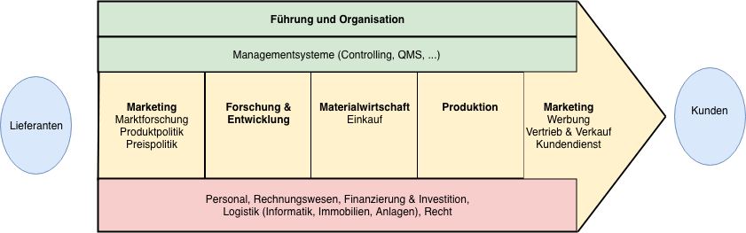
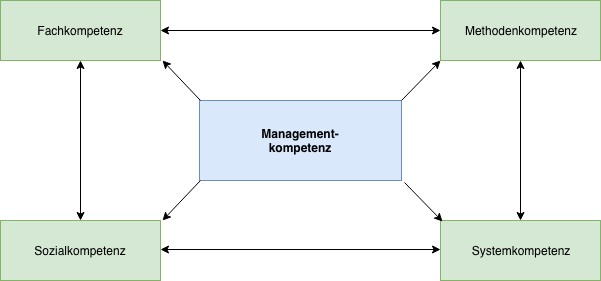

# Grundbegriffe

## Betriebswirtschaft

* **Betrieb**: Produktibe Wirtschaftseinheit, erstellt Leistungen (Güter / Dienstleistungen) zur Bedürfnisbefriedigung Dritter.
* **Wirtschaft**: Beschreibt die Gesamtheit der Einrichtungen und Massnahmen zur planvollen Deckung menschlichen Bedarfs.

## Ökononomisches Prinzip

1. Knappe Güter
2. Ökonomischer Umgang:
   - _Minimum-Prinzip_: minimaler Input, fixer Output
   - _Maximum-Prinzip_: fixer Input, maximaler Output
   - _Optimum-Prinzip_: Kombination von Min&Max

## Bedürfnisse & Bedarf

Bedürfnisse nach Maslov:

1. _Existenzbedürfnisse_: Nahrung, Schlaf, Unterkunft
2. _Grundbedürfnisse_: Arbeit, Mobilität, Internet
3. _Luxusbedürfnisse_: Luxusauto, Rolex

* **Wahlbedürfnis**: Bedürfnisse werden gegeneinander abgewägt aufgrund eines beschränkten Budgets. Die meisten Bedürfnisse sind Wahlbedürfnisse.
* **Individualbedürfnisse**: Wird durch Einzelnen gedeckt
* **Kollektivbedürfnis**:  Wird von der Gruppe gedeckt (bsp. Strassenbau)

Bedarf und Nachfrage:

$$ Bedarf = Bedürfnis + Geld vorhanden$$

$$Nachfrage = Bedarf + Kaufwille$$

Die Aufgabe der Wirtschaft ist es, der _Nachfrage_ ein _Angebot_ (Güter & Dienstleistungen) entgegenzustellen.

# Wertschöpfungskette

$$ Wertschöpfung = Preis - Vorleistung \ (\ne Gewinn) $$

### Steuerung Wertschöpfung (PEAK)

* **P** - Planung
* **E** - Entscheidung
* **A** - Aufgabenübertragung
* **K** - Kontrolle

# Managementkompetenz

Managementkompetenz setzt sich zusammen aus:

* Fachkompetenz
* Methodenkompetenz
* Sozialkompetenz
* Systemkompetenz

# Problemlösung- und Enscheidungsprozesse

## Problemlösungsprozesse

1. **Problemerfassung**
   1. Problemerkennung (_Symptom oder Ursache?_)
   2. Problembeschreibung
   3. Problembeurteilung
2. **Problembearbeitung**
   1. Zielbestimmung
   2. Massnahmenplanung
   3. Festlegung der Ressourcen
3. **Entscheidung (Nutzwertanalyse)**
4. **Durchführung**
5. **Evaluation der Resultate**

# Unternehmen und Umwelt

_Systemtheorie_: Gesellschaft als System aus Subsystement

## Unternehmen als System

- Besteht aus Elementen
- Soziotechnisch (_Mensch & Maschine_)
- Zweckorientiert (_Gewinn, Arbeitsplätze schaffen etc._)
- Autonom
- Dynamisch (_Anpassungsfähigkeit, Innovation_)
- Offen (_Schnittstellen zu Kunden, Lieferanten, Staat_)

# St. Galler Management Modell
