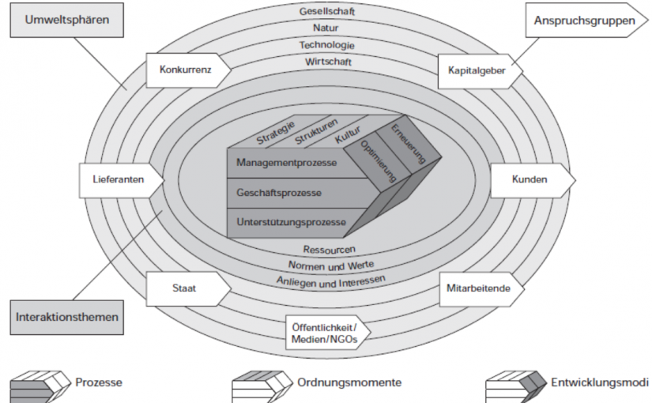

# Grundbegriffe

## Betriebswirtschaft

**Betrieb**: Produktibe Wirtschaftseinheit, erstellt Leistungen (Güter / Dienstleistungen) zur Bedürfnisbefriedigung Dritter.

**Wirtschaft**: Beschreibt die Gesamtheit der Einrichtungen und Massnahmen zur planvollen Deckung menschlichen Bedarfs.

## Ökononomisches Prinzip

1. Knappe Güter
2. Ökonomischer Umgang:
  - _Minimum-Prinzip_: minimaler Input, fixer Output
  - _Maximum-Prinzip_: fixer Input, maximaler Output
  - _Optimum-Prinzip_: Kombination von Min & Max

## Bedürfnisse & Bedarf

Bedürfnisse nach Maslov:

1. _Existenzbedürfnisse_: Nahrung, Schlaf, Unterkunft
2. _Grundbedürfnisse_: Arbeit, Mobilität, Internet
3. _Luxusbedürfnisse_: Luxusauto, Rolex

* **Wahlbedürfnis**: Bedürfnisse werden gegeneinander abgewägt aufgrund eines beschränkten Budgets. Die meisten Bedürfnisse sind Wahlbedürfnisse.
* **Individualbedürfnisse**: Wird durch Einzelnen gedeckt
* **Kollektivbedürfnis**:  Wird von der Gruppe gedeckt (bsp. Strassenbau)

Bedarf und Nachfrage:

    Bedarf = Bedürfnis + Geld vorhanden
    Nachfrage = Bedarf + Kaufwille

Die Aufgabe der Wirtschaft ist es, der _Nachfrage_ ein _Angebot_ (Güter & Dienstleistungen) entgegenzustellen.

# Wertschöpfungskette

    Wertschöpfung = Preis - Vorleistung  (!= Gewinn)

## Steuerung Wertschöpfung (PEAK)

* **P** - Planung
* **E** - Entscheidung
* **A** - Aufgabenübertragung
* **K** - Kontrolle

# Managementkompetenz

Managementkompetenz setzt sich zusammen aus:

* Fachkompetenz
* Methodenkompetenz
* Sozialkompetenz
* Systemkompetenz

# Problemlösung- und Enscheidungsprozesse

## Problemlösungsprozesse

1. **Problemerfassung**
   1. Problemerkennung (_Symptom oder Ursache?_)
   2. Problembeschreibung
   3. Problembeurteilung
2. **Problembearbeitung**
   1. Zielbestimmung
   2. Massnahmenplanung
   3. Festlegung der Ressourcen
3. **Entscheidung (Nutzwertanalyse)**
4. **Durchführung**
5. **Evaluation der Resultate**

# Unternehmen und Umwelt

_Systemtheorie_: Gesellschaft als System aus Subsystement

## Unternehmen als System

- Besteht aus Elementen
- Soziotechnisch (_Mensch & Maschine_)
- Zweckorientiert (_Gewinn, Arbeitsplätze schaffen etc._)
- Autonom
- Dynamisch (_Anpassungsfähigkeit, Innovation_)
- Offen (_Schnittstellen zu Kunden, Lieferanten, Staat_)

# St. Galler Management-Modell

**Vorteile**

* Vereinfachte Abbildung der Wirklichkeit
* Einheitliche Begriffe & Bezeichnungen
* Konzentration aufs Wesentliche

**Nachteile**:

* Vereinfachung der Realität

## Anspruchsgruppen / Stakeholder

| Stakeholder | Ansprüche |
|---|---|
|*Eigentümer* | Gewinn, Ruf, Selbstverwirklichung, Macht|
|*Management* | Wirtschaftlichkeit, Ruf, Macht, Einkommen|
|*Mitarbeiter* | Arbeit, Arbeitsklima, Lohn, Sicherheit, Aufstiegschancen|
|*Fremdkapitalgeber* | Finanzierungsplan, Strategie, Gewinne, Ausfälle minimieren|
|*Kunden* | Qualität, Service, Geschwindigkeit|
|*Konkurrenz* | Fairness, kein Lohn- / Preisdumping, keine Absprachen|
|*Staat / Gesellschaft* | Einhaltung von Gesetzen, Arbeitsplätze, Steuern, Nachhaltigkeit|

## Umweltsphären

*Ziel*: Trends erkennen, Wandel von Kundenbedürfnissen:

* **Gesellschaft**: Nachhaltigkeit, digitale Medien, Outsourcing, Home Office
* **Natur**: Ressourcenschonend, _going green_
* **Technologie**: Automatisierung, schnelllebigkeit
* **Wirtschaft**: Finanzkrise, Währungskrise, Globalisierung

## Austauschbeziehungen

Zwischen Unternehmen und Anspruchsgruppen:

* **Normen & Werte**:  Gesetze, Kultur, Glaubwürdigkeit, Nachhaltigkeit
* **Anliegen & Interessen**: --> siehe _Stakeholder_
* **Ressourcen**: Beschaffung und Nutzen

# Arten von Gütern

Verschiedene Arten von Gütern, anhand eines Beispiels (_Druckerei_):

Einteilung nach der Stellung im Produktionsprozess:

* **Input**: _Papier_
* **Output**: _Zeitung_

Einteilung nach Art der Nutzung. _Verbrauchsgüter_ werden bei der Nutzung aufgebraucht, _Gebrauchsgüter_ können mehrmals verwendet werden:

* **Investitionsgut / Produktionsgut**: Gebraucht für Endprodukt, über mehrere Jahre
* **Umlaufgut**: _Druckmaschine_
* **Konsumgut**: _Gelesene Zeitung_
* **Verbrauchsgut**: Nicht direkt am Produktionsprozess beteiligt: _Schmiermittel, Strom_
* **Gebrauchsgut**: über mehrere Jahe, wird nicht verbraucht: _Drucker_
* **Betriebsmittel**: Schmiermittel, Strom, Werkzeuge, Geld
* **Werkstoffe**: Farbe, Leim

Einteilung nach physischer Beschaffenheit:

* **Materiell**: Physisch vorhanden
* **Immatriell**: Gedankengut, Patente, Dienstleistungen

Einteilung in Beziehung zu anderen Gütern:

* **Substitutionsgüter**: Ersetzen ein anderes Gut (_Butter & Margarine_)
* **Komplementärgüter**: Güter, die gemeinsam nachgefragt werden (_Wurst & Senf_)

Einteilung nach Fertigstellungsgrad:

* **Halbfabrikate**
* **Fertigfabrikate**

Einteilung nach Verfügbarkeit:

* **Knappe Güter**: Begrenzt, besitzen einen Preis
* **Freie Güter** Sind kostenlos und unbegrenzt verfügbar (_Sonnenlicht_)

# Ordnungsformen

> "Structure follows stategy"

## Strategie

**Strategie**: Entscheidend für den langfristigen Erfolg.

* **Kostenführerschaftsstrategie**: Prmär über den Preis definert (_Grosseinkäufer_, _Aldi_, _Lidl_)
* **Differenzierungsstrategie**: Eintigartigkeit (_Apple_, _Victorinox_)
* **Nischenstrategie**: Spezifisch, kleiner Markt, wenig Konkurrenz (_Hersteller von Trachten_)

## Struktur

* **Aufbaustruktur**:
  * Nach Funktion gegliedert (Verkauf, Marketing, Produktion, etc.)
  * Divisional (nach Produkt)
  * Matrix (Kombination)

# Kennzeichen einer Unternehmung

## Sektor

* **Primär** (3-5%): *Landwirtschaft, Bergbau, Fischerei*
* **Sekundär** (20%): *Industrie, Bau, Handwerk*
* **Tertiär** (54%): *Dienstleistung, Bank, Handel, Verkehr, Kultur*
* **Quartär**: Informationen
* **Quintär**: Entsorgung

## Gewinnorientierung

* **Non-Profit**: Kostendeckend, spendensammelnd (_Stiftungen, Vereine_)
* **Profitorientiert**

## Grösse

* Nach Vermögen
* Nach Umsatz
* Nach Mitarbeiterzahlen

|  | MA | Bilanz | Umsatz |
| ---|---|---|---|
| **Klein** | < 50 | < 1 Mio | < 5 Mio |
| **Mittel** | 50 - 1000 | 1 -25 | 5 - 50 |
| **Gross** | > 1000 | > 25 | > 50 |

Anteil grosser Unternehmen in der CH: ~0.8%

## Geografische Ausbreitung

* **Lokal**
* **National**
* **International** (Produktionsstandort CH)
* **Multinational** (Produktionsstandorte weltweit)

## Rechtsform

* **GmbH**: Kapital 20'000.-
* **Einzelunternehmung**: Persönliche Haftung
* **AG**: Gehört den Aktionären
* **Genossenschaft**

# Ziel einer Unternehmung

## Formalziele (Erfolgsziele)

Müssen berechenbar sein und betreffen den Gewinn / Umsatz / Erfolg des Unternehmens:

* **Effizienz**: Verhältnis Input/Outout, relative Grösse
* **Effektivität**: Ziel erreicht?
* **Produktivität**: Effitienzgrösse, absoluter Wert (_Verkaufte Autos / Tag_)
* **Wirtschaftlichkeit**: Monetäre Effizienzgrösse (Ertrag / Aufwand)
* **Rentabilität**: Form der Wirtschaftlichkeit (Gewinn / Kapital)

## Sachziele

Konkrete Ziele, um Formziele zu erreichen.

## Zielereichungsgrad

* **Komplementär**: _Qualität & Kundenzufriedenheit_
* **Neutral**: _Energieverbrauch & Kundenzufriedenheit_
* **Konkurrierend**: _Qualität & Sparen_

 Seite 8