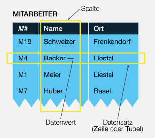

# Datenbanktheorie

## Begriffe

### Daten

**Daten** sind _rohe_, _unverarbeitete_ Informationen, die alleine noch keine Aussagekraft, Struktur oder Beziehung zu anderen Daten haben. Sie können _manipuliert_, _abgespeichert_ und _geteilt_ werden.

**Informationen** sind Daten, die in Beziehungen / Kontext mit anderen Daten. Dadurch erhalten sie eine Bedeutung. Informationen können _erstellt_, _gespeichert_, _kategorisiert_ und _weiterverarbeitet_ werden.

**Erkenntnisse** sind Informationen, die mit Wissen verknüpft werden. Dadurch entstehen Zusammenhänge.

    Erkenntnis = Wissen + Information
    Information = Daten + Beziehungen 

### Datenbank

**Informationssysteme** bestehen aus _Wissens_-, _Methoden_- und _Daten_banken gekoppelt mit einem Sofwaresystem zur Benutzerführung inklusive Abfragesprache und Rechtesystem.

Eine **Datenbank** (_Datenbanksystem_) ist eine _selbständige_, _dauerhafte_, _flexible_ und _sichere_ Datenorganisation mit einem Datenbestand (_Datenbasis_) und einer Datenverwaltung (_Datenbankverwaltungssystem_).

Das **Datenbankverwaltungssystem (DBMS)** ist ein leistungsfähiges Programm für die flexible Speicherung und Abfrage strukturierter Daten

    Datenbank = Datenbasis + DBMS

## Abgrenzung zu Dateisystemen

In einem Dateisystem kann jedes Anwenderprogramm _direkt_ auf die Daten zugreifen. Im Datenbanksystem erfolgt der Zugriff ausschliesslich über das DBMS.

Die _Persistierung_, _Stukturierung_ und _Organisation_ von Daten ist auch mit Dateien (in einem Dateisystem) möglich. Ein DBMS ermöglicht aber zusätzlich:

* **Mehrbenutzerbetrieb**: Transaktionsmanagement
* **Zugriff und Manipulation** von Datensätzen
* **Konsistenz und Integrität** der Daten
* **Sicherheit** der Daten
* **Effizienz** bei Applikationsentwicklung durch Wiederverwendung
* **Einfachere Wartung** durch Kapselung der Daten (Trennung von Anwendung und Daten)

## Relationale Datenbanksysteme

Daten und Beziehungen sind in Tabellen gespeichert, Metadaten in Systemtabellen. Die Abfrage und Manipulation der Daten erfolgt mit der Abfragesprache _SQL_.

* Daten werden in **Tabellen** gespeichert
* Die Tabellen bestehen aus **Datensätzen** (_Zeilen_, _Tupel_)
* Datensätze bestehen aus **Datenwerten**

## Big Data

Die Qualität und Quantität von Daten hat in letzer Zeit eine neue Dimension angenommen, was als _Big Data_ bezeichnet wird. Dies ist oft über die _drei V_ definiert:

* **Volume**: Umfang im Tera- oder Zetabereich
* **Variety**: Vielfalt; die Speicherung strukturierter, semi-strukturierter und unstrukturierter Mulitimedia-Daten.
* **Velocity**: Geschwindigkeit; die Auswertung und Analsye von Daten in Echtzeit

SQL ist nicht für Big Data ausgerichtet. Aus diesem Grund werden vermehrt NoSQL-Datenbanksysteme eingesetzt.

Der Begriff NoSQL beschreibt nicht-relationale Ansätze im Datenmanagement, welche Daten nicht in Tabellen abspeichern und nicht SQL verwenden.

NoSQL-Datenbankmodelle:

* Key/Value Store
* Document Store
* Graphdatenbanken

## Lernziele

1. Das Konzept Datenbank definieren und erklären
2. Die Gründe für den Einsatz von Datenbanken beschreiben
3. Das Konzept der Relationalen Datenbank erklären und definieren
4. Den Begriff Big Data definieren (3V)
5. Das Konzept NoSQL-Datenbanken definieren und erklären
