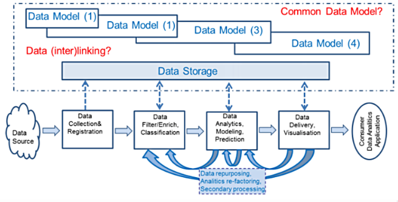

# 1. Datenbanktheorie

## Begriffe

**Informationssysteme** bestehen aus _Wissens_-, _Methoden_- und _Daten_banken gekoppelt mit einem Sofwaresystem zur Benutzerführung inklusive Abfragesprache und Rechtesystem.

Eine **Datenbank** (_Datenbanksystem_) ist eine _selbständige_, _dauerhafte_, _flexible_ und _sichere_ Datenorganisation mit einem Datenbestand (_Datenbasis_) und einer Datenverwaltung (_Datenbankverwaltungssystem_).

Das **Datenbankverwaltungssystem (DBMS)** ist ein leistungsfähiges Programm für die flexible Speicherung und Abfrage strukturierter Daten

    Datenbank = Datenbasis + DBMS

## Abgrenzung zu Dateisystemen

In einem Dateisystem kann jedes Anwenderprogramm direkt auf die Daten zugreifen. Im Datenbanksystem erfolgt der Zugriff ausschliesslich über das DBMS.

Die _Persistierung_, _Stukturierung_ und _Organisation_ von Daten ist auch mit Dateien (in einem Dateisystem) möglich. Ein DBMS ermöglicht aber zusätzlich:

* Mehrbenutzerbetrieb: Transaktionsmanagement
* Zugriff und Manipulation von Datensätzen
* Konsistenz und Integrität der Daten
* Sicherheit der Daten
* Effizient bei Applikationsentwicklung durch Wiederverwendung
* Einfachere Wartung durch Kapselung der Daten (Trennung von Anwendung und Daten)

## Relationale Datenbanksysteme

Daten und Beziehungen sind in Tabellen gespeichert, Metadaten in Systemtabellen. Die Abfrage und Manipulation der Daten erfolgt mit der Abfragesprache _SQL_.

## Big Data

Die Qualität und Quantität von Daten hat in letzer Zeit eine neue Dimension angenommen, was als _Big Data_ bezeichnet wird. Dies ist oft über die _drei V_ definiert:

* **Volume**: Umfang im Tera- oder Zetabereich
* **Variety**: Vielfalt; die Speicherung strukturierter, semi-strukturierter und unstrukturierter Mulitimedia-Daten.
* **Velocity**: Geschwindigkeit; die Auswertung und Analsye von Daten in Echtzeit

SQL ist nicht für Big Data ausgerichtet. Aus diesem Grund werden vermehrt NoSQL-Datenbanksysteme eingesetzt.

Der Begriff NoSQL beschreibt nicht-relationale Ansätze im Datenmanagement, welche Daten nicht in Tabellen abspeichern und nicht SQL verwenden.

NoSQL-Datenbankmodelle:

* Key/Value Store
* Document Store
* Graphdatenbanken

## Lernziele

1. Das Konzept Datenbank definieren und erklären
2. Die Gründe für den Einsatz von Datenbanken beschreiben
3. Das Konzept der Relationalen Datenbank erklären und definieren
4. Den Begriff Big Data definieren (3V)
5. Das Konzept NoSQL-Datenbanken definieren und erklären

# 2. Datenmanagement Praxis

## Eckpfeiler

Die vier Eckpfeiler des Datenmanagements:

### Datenarchitektur

* **Ziele**:Formulieren und Pflegen der unternehmensweiten Datenarchitektur und das Festlegen der Datenschutzkonzepte
* **Werkzeuge**: Datenanalyse, Entwurfsmethodik, rechnergestützte Informationsmodellierung

### Datenadministration

* **Ziele**: Verwalten von Daten und Methoden mit Standardisierungsrichtlinen und internationalen Normen; Beratung von Entwicklern und Benutzern
* **Werkzeuge**: Data Dictionary Systeme, Verwendungsnachweis

### Datentechnik

* **Ziele**: Installieren, reorganisieren, sicherstellen von Datenbeständen; Festlegen von Verteilungskonzept und Replikation; Katastrophenvorsorge
* **Werkzeuge**: Dienste der Datenbanksysteme, Leisungsoptimierung; Monitoring-Systeme, Recovery-Werkzeuge

### Datennutzung

* **Ziele**: Datenanalyse und -interpretation; Wissengenerierung; Mustererkennung und Prognosen
* **Werkzeuge**: Auswertungswerkzeuge, Reportgeneratoren, Datamining und Visualisierungstechniken

## Aufgaben 

Die Aufgaben des Datenmanagements (vor Big Data):

* **Data Governance**: Planung, Überwachung, Kontrolle von Datenverwaltung und Nutzung
* **Data Architecture Management**: Datenmodellierung als integraler Teil der Unternehmensarchitektur
* **Data Development**: Analyse, Design, Programmierung, Testing, Deploying und Wartung
* **Database Operations Management**: strukturierte, physische Datenressourcen
* **Data Security Management**: Privatsphäre, Vertraulichkeit, Zugriffsschutz
* **Refence & Master Data Management**: Steuerung von Originalen, Versionen und Replikaten
* **Data Warehousing & Business Intelligence Management**: Zugand zu Daten für Entscheidungsunterstützung
* **Document & Content Management**: Speichern, schützen, indexieren, bereitstellen von unstrukturierten Daten
* **Meta Data Management**: Integration, Steuerung und Bereitstellung von Datenbeschreibungen
* **Data Quality Management**: Deifineren, Überwachen und Verbessern von Datenqualität

## Big Data Lifecycle

# 3. Entity Relationship Modelle

Ein **Entity-Relationship-Schema** ist ein konzeptuelles Schema zur Modellierung eines Ausschnittes der realen Welt mittels _Entitäten_, _Attributen_, _Beziehungen_ und _Assoziationen_.

