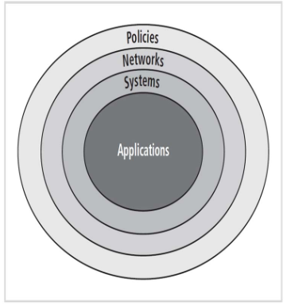

# Information Security Management

Eine kleine Zusammenfassung der HSLU.I Vorlesung _Managementaspekte der Information Security_ (MANSEC), basierend auf den Folien von _Prof. Dr. Bernhard M. Hämmerli Security Experte_.

# Einführung

## CIA

Grundziele IT-Security_

* **Confidentiality**: Vertraulichkeit
* **Integrity**: Integrität
* **Availability**: Verfügbarkeit

## Triple A

Triple A (_Authentication, Authorization, Accounting)

## Dimensionen von IT-Sicherheitsfragen

* Rechtlich
* Organisatorisch
* Menschlich
* Technisch

## Management

Ziele und Aufgaben des Managements:

* **POSDC** (Traditionell): _planning, **organizing**, staffing, directing, controlling_
* **POLC** (Wichtig für CISO): _ planning, organizing, **leading**, controlling_

Die Planung erfolgt auf _strategischer_, _taktischer_ und _operativer_ Ebene.

## Entwicklung 

Aufgaben und Trends in der Information Security:

* **bis 1985**: Verfügbarkeit optimieren. man war froh, wenns läuft
* **bis 1992** : IT Security = Encryption, ein Problem der Techniker
* **bis 1995**: Sache des Security Officers, Delegation von Tasks
* **bis 1999**: IT-Security ist Chefsache (Risk Owner)
* **ab 2000**: Risiko Management
* **ab 2003**: Sparmassnahmen, IT-Security reduziert auf gesetzliche Anforderungen; digitale Forensik kommt auf
* **ab 2008**: Konstante Attacken
* **ab 2011**: Cyber defense plans
* **ab 2012**: Outsourcing, Cloud computing; Rolle des CISO muss neu definiert werden

## Conclusions Folien SW01

* IT Security hat sich verändert mit neuen Technologien
* Standards und Frameworks gewinnen an Bedeutung
* Organisatorsche Probleme: **Risk Management**, **Governance** und **Compliance**
* Technische Probleme: Komplexere Tools, Integration ins Gesamtsystem 
* Aufgaben Security Officer: coach, communicator, promoter and police
* Security Officer wird vom Technokraten zum Manager
* Rechtliche Aspekte gewinnen an Bedeutung
* Outsourcing wird unvermeidbar für KMUs und teilweise auch grössere Unternehmen
* Messbarkeit auch von "soft factors" wichtig für Erfolg
* Rolle des CISO ändert sich mit cloud computing, mehr menschliche und organisatorische Aufgaben

# Information Security Policy

## Lernziele

### **_Information Security Policy_ definieren können:**

* Sicherheitsrichtlinie, beschreibt den angestrebten Sicherheitsanspruch in einer Organisation.

* Policies sind eine Sammlung von organisatorischen Richtlinien, die das Verhalten in einer Organisation vorgeben.

* Bestimmen, **was** gemacht werden darf, andere Dokumente befassen sich eher mit dem **wie**

* Damit sie effektiv sind müssen Policies _definiert_, _verstanden_, _anerkannt_ und _durchgesetzt_ werden

* Policies müssen ständig angepasst werden

### **Die drei Arten von _Information Security Policies_ beschreiben können:**

1. **EISP**: Enterprise Information Security Programm Policy

High-Level, bestimmt die strategische Ausrichtung, den Umfang und den allgemeinen Grundton aller Sicherheitsmassnahmen. Wird auch als _InfoSec Policy_ oder _Security Program Policy_ genannt.

 Weist Verantwortungen zu und regelt die Entwicklung, Einführung und Managementansprüche an die Informationssicherheit.

Die EISP beinhaltet einen Überblick über die Grundeinstellung der Unternehmung im Bezug auf IT-Security, Informationen zur Struktur und Personen der IT-Security, Verantwortungsbereiche für Angestellte, Kunden usw.

2. **IISP**: Issue-specific Information Security Policy

* Werden auch _fair and responsible use policy_ genannt
* Eine Richtlinie mit detaillierten Anweisungen für die Verwendung einer bestimmten Ressource oder Technologie.
* Beinhaltet Informationen zu der erwarteten Verwendung und der Kontrolle eines eingesetzten Systems.

Beispiele: E-Mail, Whatsapp und andere Kommunikation; Verwendung des Internets; Persönliche Verwendung von Unternehmensgeräten; Zugangsberechtigungen; ... 

3. **SISP**: System-specific policies

Anweisungen des Managements zur Implementation und Konfiguration von Systemen, wie beispielsweise Zugriffsberechtigungen (ACLs, Firewall-Konfiguration).

Werden definiert für Technologien, welche die CIA von Informationen betreffen und informieren über die Absichten des Managements

* **Konfiguration** und **Zugriffsrechte** als Liste oder Matrix. Regelt das _wer_, _was_, _wann_, _wo_ & _wie_

### **Erklären, was für eine erfolgreiche Policy notwendig ist:**

Damit eine Policy effektiv sein kann muss sie:

* definiert
* gelesen
* verstanden
* akzeptiert
* einheitlich durchgesetzt werden

### **Prozess der Entwicklung, Umsetzung und Unterhalt von _Information Security Policies_:**

    TODO

## Gründe für Policies

Policies sind der Grundstein effektiver Informationssicherheit. Eine gute Policy sollte:

* Zum Erfolg des Unternehmens beitragen
* Sinnvolle Aufteilung der Verantwortung vornehmen
* Benutzer sollten bei der Festlegung von Policies involviert werden

## The Bullseye Model

## Begriffe

* **Policy**: Policies sind eine Sammlung von organisatorischen Richtlinien, die das Verhalten in einer Organisation vorgeben.

* **Standard**: Detaillierte Beschreibung aller Tätigkeiten, die notwendig sind, um eine Policy zu erfüllen.

* **Richtlinie**: Nicht zwingende Empfehlung, dient als Referenz für das Verhalten der Angestellten

* **Prozeduren**: Schrittweise Anleitungen mit dem Ziel, Angestellten zu helfen, den Policies zu folgen

* **Praktiken**: Beispiele von Handlungen, die Übereinstimmung mit den Policies demonstrieren

## Effektive Policies

Anforderungen für effektive Policies:

1. Entwickelt mit Instriestandard / akzeptierten Praktiken und vom Management abgesegnet
2. Verteilt und bekanntgemacht werden mit allen angemessenen Mitteln
3. Von allen Angestellten gelesen
4. Formelles Einverständnis der Angestellten
5. Einheitlich angewendet und durchgesetzt werden.

### Entwicklung

Policy-Development wird oft als Prozess mit drei Schritten betrachtet:

1. **Designen und Schreiben** (oder Umschreiben) einer Policy
2. **Review** durch einen Chef / Senior Manager und formale Absegnung
3. Managementprozesse zur **Festlegung und Umsetzung**

Der erste Schritt benötigt gutes _Projektmanagement_, die anderen zwei gute _Business Practices_.

### Verteilung

Erfolg _physisch_ oder _elektronisch_. Die Verteilung der Policy ist wichtig, da sie nicht durchgesetzt werden kann, wenn nicht nachgewiesen ist, das diese dem Endbenutzer bekannt war. Vertrauliche Policies erfordern besondere Massnahmen wie besondere Kennzeichnung, Zerstörung von Vorgängerversionen und so weiter.

### Lesen

* Sprachkenntnisse und Analphabeten berücksichtigen
* Sehbehindertenfreundliche Versionen
* Übersetzungen

Eventuell prüfen mit Tools und Test (Flesch Reading Ease Tests). Leseniveau eines Oberstufenschülers ist das Maximum.

### Verstehen

* Sinnvolles Sprachniveau (siehe oben), minimale Verwendung technischer Fachbegriffe und _Manager Slang_
* Assessments durchführen, um das Verständnis zu prüfen über das grundlegende Ziel der Policy
* Mittels Tests den Schulungsbedarf einzelner Mitarbeiter ermitteln

### Policy Compliance

Muss entweder **Agreed by confimation**sein oder **Agreed by act**: Eine Handlung ist erforderlich, mit der das Verständnis einer Policy bestätigt wird bevor eine Technologie oder Ressource verwendet werden kann.

Das Verweigern des Einverständnisses wird als Arbeitsverweigerung ausgelegt und ist somit **Grund zur Terminierung**.

### Durchsetzung

Die Durchsetzung von Policies muss einheitlich und unparteiisch erfolgen und auch externer Überprüfung standhalten. Strafen und andere Massnahmen, die aus Missachtungen resultieren müssen diesen auf diese Aspekte überprüft werden können.

## Automatisierung mit Tools

Es existieren Tools zur Hilfe bei der Entwicklung, Implementation und Unterhalt von Policies, beispielsweise zur sicheren, passwortgeschützten Bereitstellung oder zur Überwachung, welche Mitarbeiter die Policies gelesen und akzeptiert haben.

Beispielsweise _VigilEnt Policy Center_ (VPC) Server, welche Dokumente, Quizzes und Informationen zur Verfügung stellen.

## SecSDLC

Wie bei anderen Projekten ist auch bei der Policy Entwicklung eine rigorose Planung wichtig. Eine Möglichkeit, dies zu erreichen ist die Verwendung eines _System Development Life Cycles_ (SDLC). Dies definiert sechs Phasen:

1. **Investigation Phase**: Unterstützung von Management, IT-Management sicherstellen, Ziele definieren, Beteiligte und Betroffene ermitteln und einbeziehen, Scope und Kosten festlegen
2. **Analysis Phase**: Ein aktuelles Risikoassessment oder ein Audit, welches die aktuellen InfoSec-Bedürfnisse der Organisation dokumentiert, wichtiges Referenzmaterial sammeln (beispielsweise bestehende Policies)
3. **Design Phase**: Dokumententwurf erstellen, Reviews und Anpassungen bis _Manager Approval &trade;_
4. **Implementation Phase**: Plan zur Verteilung und der Überprüfung der Verteilung erstellen, Bestätigungen einholen (z.B. Unterschrift und Datum)
5. **End User License Agreement**
6. **Maintenance Phase**: Überwachung, Aufrechterhaltung und Anpassungen der Polices, Mechanismen zum Melden von Problemen (idealerweise anonym), periodische Reviews

## Policy Administrator

Policies brauchen einen _Champion_und einen und Manager. Werden diese beiden Positionen kombiniert, nennt man das Ergebnis **Policy Administrator**. Dieser ist Verantwortlich für die Erstellung, Revision, Verteilung und Aufbewahrung der Policy.
# Review Schedule, Procedures & Practices

### Schedule

Periodische Überwachung zur Sicherstellung der Effektivität. Folgende Punkte sollten geprüft werden:

* Aktualität
* Genauigkeit
* Vollständigkeit

Diese Reviews sollten im vornherein festgelegt werden und mindestens ein mal jährlich durchgeführt werden.

### Prozeduren und Praktiken

Der **Policy Administrator &copy;** sollte dafür sorgen, das einfach Rückmeldungen gemacht werden können mittels Mail und anonymer _drop box_. Diese Rückmeldungen sollten idealerweise auch gelesen werden.

Eine Policy sollte immer ein Veröffentlichungsdatum und die Daten der Revisionen enthalten, um Unklarheiten bezüglich Aktualität und Gültigkeit zu vermeiden. Je nach Inhalt ist es auch sinnvoll, das Ende der Gültigkeit festzuhalten, sofern dies vorhersehbar ist (_sunset clause_).

## Conclusions Security Policy

Policies dienen hauptsächlich dazu, Angestellte zu informieren, welches Verhalten akzeptabel ist und welches nicht. Die _meisten_ Angestellten wollen sich korrekt verhalten. Deshalb sich Informationen und Schulung das effektivste Mittel zur Sicherstellung der Policies.

* InfoSec beginnt und endet mit Policies
* Policies sind ein Management-Problem, die technischen Aspekte kommen erst nach der Festlegung der Policies
* Policies sind die günstigste, aber die Massnahme die am schwierigsten zu implementieren ist.
* Policies dürfen nicht mit dem Gesetz in Konflikt stehen und müssen vor Gericht _verheben_, falls angefochten.
* Endbenutzer sollten in die Erstellung einbezogen werden.
* Sollten beschreiben was gemacht werden muss, nicht gemacht werden darf und was die Konsequenzen bei Fehlverhalten sind.
* Policies müssen **geschrieben, verteilt, gelesen, verstanden, zugestimmt UND durchgesetzt** werden 
* Drei Arten: Enterprise InfoSec Policy, Issue-Specific Policy, System-specific Policy

# Human Factor

W5: https://elearning.hslu.ch/ilias/goto.php?target=file_3675384_download&client_id=hslu

Organisationen sind im Wandel von stark strukturierten, von internen Beziehungen _Maschinen_ zu schwächer strukturierten, mehr von externen Beziehungen geprägten Beziehungen geprägten _Organsimus_.

## Security Culture

Charakteristiken für eine gesunde Sicherheitskultur:

* Empowerment
* Trust
* Openness
* Responsibility
* ...

### Awareness, attitude & behaviour

* **Awareness**: ist auf kreative Kommunikation angewiesen
* **Behavior**: ist geprägt von Wahrnehmung, Erfahrungen
* **Attitudes**: sind langfristig und schwer zu ändern

**Awareness** kann Zwischenfälle verhindern. Massnahmen zur Verbesserung (_sticky factors_):

* Ansprechende / provokante Bilder
* Einbeziehung des Publikums
* Einfache und klare Kommunikation
* Beschränkung auf das Wesentliche
* Kontinuierliche Verbesserung

Ein Awareness-Programm beginnt mit einer Vision und dem Messen der aktuellen Situation Anschliessend müssen Prozesse zur Generierung neues Wissens, Einstellungen, Verhalten, Rollen, Umgebungen, Systeme usw. geschaffen werden. und mit _sticky factors_ versehen werden. Anschliessend muss der neue Status gemessen werden, damit Aussagen über die Effektivität der Massnahmen getroffen werden können.

**Verhalten** kann von vielen Faktoren geprägt werden:

* Medienberichte
* Erfahrungen
* Umfeld, Umwelt & Umgebung
* Regeln und Prozeduren
* Beobachtungen
* Konsequenzen, Belohnungen & Bestrafung

Eine veränderte Welt mit steigender Mobilität, IoT und Clouds führt zu einer ständigen Vernetzung und somit auch zu Veränderungen in der InfoSec:

* Das Ende der Privatsphäre
* Identitätsbestimmung per Verhaltensanalyse im _Cyberspace&trade;_
* Security mehr _probabilistisch_ statt _deterministisch_
* Benutzer sind mächtiger, aber auch verwundbarer
* _We must learn to harness the power of the community_ - Bernie Hammers

Das verlangt eine mobilere, abstraktere und vielfältigere IT-Security und andere Adjektive in denen _Security Dudes_ traditionellerweise nicht so besonders stark sind.

## Corporate Security Model

1. Vision /Strategie
2. Security Policy
3. Bedrohungsanalyse, Risikoanalyse
4. Gegenmassnahmen, einzelne Sicherheitsvorkehrungen

Elemente der Dokumentation:

* Vision, Mission, Strategie
* Bedrohungs- und Verwundbarkeitsprofil
* Verschiedene Risikoanalysen, Risikomanagement
* Aufgabenbeschreibung _Information Security Officer_
* Management: Sicherheits-Policies, -Konzepte, -Kultur...
* Technologie: Disaster Recover, Firewall, Backup...
* Rechtliches: Verträge, relevante Gesetze, Nachweisbarkeit...
* Sicherheitsprojekte definieren

Die Dokumentation sollte sich an Frameworks und Normen orientieren wie ISO 2700x, CObIT etc.

