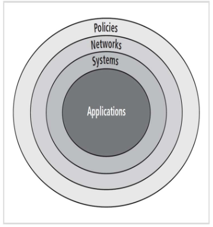

# Repetitionsblatt ManSec: Policies

**1. Erklären Sie das «Bull Eye» Modell:**

> Das Bullseye-Modell besteht aus konzentrischen Kreisen, welche die verschiedenen _Layers_ der InfoSec beschreiben. Aussehen tut das ganze dann so:

**2. Erklären sie die vier Begriffe «Standards, Policies, Procedures, Guidelines» und ordnen Siediese in eine Pyramide (zuoberst das verbindlichste Element)**

> Reihenfolge (von oben nach unten) und Beschreibung:
> 
> 1._Policies: _Sammlungen verbindlicher organisatorischer Richtlinien, um das Verhalten zu steuern._
> 2. Standards: _Detaillierte Beschreibung aller Tätigkeiten, die notwendig sind, um eine Policy zu erfüllen._
> 3. Richtlinie: _Unverbindliche Empfehlung, dient als Referenz für das Verhalten der Angestellten._
> 4. Praktiken: _Beispiele von Handlungen, die Übereinstimmung mit den Policies demonstrieren._

**3. Wie häufig müssen Policies überprüft und erneuert werden, und welche Typen von Policies kennen Sie?**

> Policies sollten alle 6 bis 12 Monate geprüft werden. Die Typen sind:
>
> 1. EISP: _Enterprise InfoSec Policy_
> 2. IISP: _Issue-specific InfoSec Policy_
> 3. SSISP: _System-specific InfoSec Policy_

**4) Wer unterschreibt die EISP?**

> Der Verwaltungsratspräsident und der CEO.

**5) An wen richtet sich eine EISP? Und welchen Zweck hat die EISP?**

> Richtet sich an _alle_ IT-User und soll Rechtssicherheit geben darüber geben, welche Art von Nutzung und Verhalten erlaubt ist.

**6) Was sind die wesentlichsten Inhalte?**

> * Verantwortungen und Rollen festlegen
> * Entwicklung beschreiben
> * Implementation und Management des InfoSec-Programms
> * Spezifische Sicherheitsfunktionen wie z.B. eine Incident Reporting Stelle

**7) Welchen Bezug hat die Information Security Policy zu Corporate High Level Documents, wie z.B. Mission?**

> Die EISP unterstützt die Firma in ihrer Mission und sollte festlegen, inwiefern sie zur Erfüllung der gesamtunternehmerischen Ziele beiträgt.

**8) Weshalb ist es wichtig, dass die Philosophie der Sicherheit erklärt wird?**

> Es hilft dem Leser bei der Selbstbeurteilung und sorgt dafür, das der Inhalt länger präsent bleibt.

**9) Nennen Sie je ein Typisches Beispiel für die ISSP und SSISP:**

> * IISP: _Email und Application Security Policy_
> * SSISP: _Windows Access Right Management, Firewall Policy, usw._