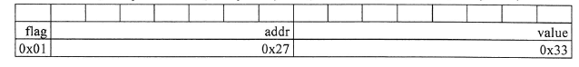
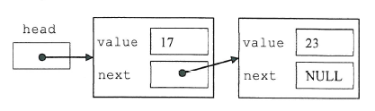

 
# Formativer Test (HS12)

## Aufgabe 1: Ausdrücke

Bestimmen Sie die Ausgabe folgender Zeilen:

```c
int a = 12;
unsigned int b = 16;
```

```c
printf("%d\n", ++a);
```
> 13

```c
printf("%d\n", b < 23);
```
> 1

```c
printf("%d\n", b >> 1);
```
> 8

```c
printf("%s\n", ((a < 20) ^ (b > 0)) ? "JA" : "NEIN");
```
> NEIN

## Aufgabe 2: Typdefinitionen und Bitfelder

a) Definieren Sie einen Typ `Header_t`, welcher folgendes Bitmuster aufweist:



```c
typedef struct Header {
    int flag : 1;
    int addr : 7;
    int value : 8;
} Header_t;
```

b) Definieren Sie eine Variable `h` mit Hilfe des neuen Typs und weisen Sie dieser Variable die in der Zeichnung vorgegebenen Werte zu.

```c
Header_t h;
h.flag = 0x01;
h.addr = 0x27;
h.value = 0x33;
```

## Aufgabe 3: Pointer auf Vektor

Schreiben Sie die Methode `createAndFillArray(...)`, welche einen Vektor von `n` int-Werten alloziert und ihn mit dem Werten `0`..`n-1` füllt. Die Methode liefert `SUCCESS` zurück, falls die Speicherallokation erfolgreich war, sonst `FAILURE`.

```c
enum FailureCode {SUCCESS, FAILURE};

enum FailureCode createAndFillArray(int n, int **pa);
main() {
    int i, *a;

    if(createAndFillArray(3, &a) == SUCCESS) {
        for (i = 0; i < 3; i++) {
            printf("%dter Wert: %d\n", i, a[i]);
        }
    }
}

enum FailureCode createAndFillArray(int n, int **pa) {
    int i;

    // Memory allozieren
    *pa = (int*) malloc(sizeof(int) * n);

    if (*pa) { // Fehlerbehandlung
        for(i = 0; i < n; i++) {
            (*pa)[i] = i; // oder: *(*(pa+i))
        }
        return SUCCESS;
    }
    return FAILURE;
}
```

## Aufgabe 4: Header- und Sourcecode-Dateien

Auf der nachfolgenden Seite finden Sie den Code zu einem Programm, welches einen Stack verwendet. Die Überprüfung des Stacks (Stack bereit, voll oder leer) wird mit Hilfe der Variable `stackState` gemacht.

Teilen Sie nun diesen Code gemäss 'best practice' in die zwei Dateien `stack.h` und `stack.c`auf, sodass der eingerahmte Code in der Datei `main.c` durch die  Anweisung `#include "stack.h"` ersetzt werden kann.

* `stack.h`

```c
#ifndef STACK_H
#define STACK_H

enum ErrorCode {READY, EMPTY, FULL};
extern enum ErrorCode stackState;

void push(int);
int pop(void);

#endif
```

* `stack.c`

```c
#include "stack.h"

#define SIZE 3

int stack[SIZE];
int pos = 0;
enum ErrorCode stackState = READY;

void push(int e) {
    if(pos < SIZE) {
        stack[pos++] = e;
        stackState = READY;
    } else {
        stackState = FULL;
    }
}

int pop(void) {
    int r = -1;

    if(pos > 1) {
        r = stack[pos--];
        stackState = READY;
    } else {
        stackState = EMPTY;
    }
    return r;
}
```

* `main.c`

```c
#include <stdio.h>
#include "stack.h"

int main(int argc, char** argv) {
    //...
    r = pop() + pop();
    if (stackState == READY) {
        printf("Resultat = %d\n", r);
    } else {
        printf("Fehler: Zu wenig Operanden auf Stack\n");
    }
    //...
}
```

## Aufgabe 5: Strukturen

Zur Speicherung beliebig vieler Werte setzen Sie eine einfach-verkettete Liste ein. Ein Knoten in dieser Liste hat neben der Referenz auf das nächste Element (`next`) ein int-Attribut `value` für den Wert.



Definieren Sie einen Datentyp `NodePtr_t` für  einen Zeiger auf einen Knoten.

```c
typedef struct Node_t* NodePtr_t;
```

Definieren Sie einen neuen Datentyp `Node_t` für den Knoten.

```c
typedef struct Node {
    int value;
    NodePtr_t next;
} Node_t;
```

Kreieren (allozieren) SIe dynamisch einen neuen Knoten und weisen Sie dessen Referenz der Wurzel `head`zu.

```c
NodePtr_t head = (NodePtr_t) malloc(sizeof(Node_t));
```

Schreiben Sie eine Methode `printList(...)`, welche alle Werte der Liste ausgibt.

```c
void printList(NodePtr_t node) {
    if (node != NULL) {
        printf("%d\n", node->value);
        printList(node->next);
    }
}
```

## Aufgabe 6: Zeiger auf Funktionen

Deklarieren Sie eine Variable `f` als Zeiger auf Funktion. Die Funktion erwartet zwei Parameter vom Typ Zeichenkette (Zeiger auf `char`) und gibt einen `float`Wert zurück.

```c
float (*f) (char*, char*);
```

Implementieren Sie die setter-Funktion `void serF(...)` mit einem Parameter, der die Variable `f` setzt.

```c
void setF(float (*func) (char*, char*)) {
    f = func;
}
```

Rufen Sie die gesetzte Funktion in der `update()` Funktion auf. Als aktuelle Parameter übergeben Sie die Werte von `s1` und `s2`.

```c
void update() {
    char* s1 = "Hello";
    char* s2 = "World";
    float result;
    setF(...);
    result = f(s1,s2);
}
```