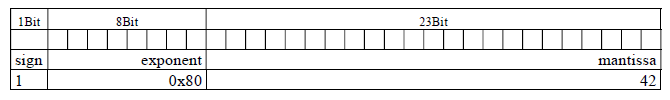
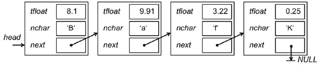

# Formativer Test (HS15)

## Aufgabe 1: Ausdrücke

Bestimmen Sie die Ausgabe folgender Zeilen:

```c
int          c = 128;
unsigned int d = 17;
```

```c
printf("%d\n", --(d));
```
> 16

```c
printf("%d\n", d >= (23-4));
```
> 0

```c
printf("%c\n", 'A' + (c >> 6));
```
> C

```c
printf("%s\n", ((c < 128) ^ (d > 15)) ? "JA" : "NEIN");
```
> JA

## Aufgabe 2

Die Float-Zahl -2.00001 wird in IEEE 754 in `sign` (1Bit), `exponent` (8Bit) und `mantissa` (23Bit)
wie in der folgenden Grafik gezeigt gespeichert.
Definieren Sie einen Typ `theFloat_t`, welcher folgendes Bitmuster aufweist:



```c
typedef struct {
    unsigned int sign : 1;
    int exponent : 8;
    int mantissa : 23;
} theFloat_t;
```

Deklarieren Sie eine Variable `h` mit Hilfe des neuen Typs und weisen Sie dieser Variable die in der Zeichnung vorgegebenen Werte zu:

```c
theFloat_t h;
h.sign = 1;
h.exponent = 0x80;
h.mantissa = 42;
// oder
theFloat_t h = {2, 0x80, 42}; 
```

# Aufgabe 3: Zeichenvektor

Schreiben Sie eine Funktion `concatenate(...)`, welche in einen neu allokierten Zeichenvektor die beiden übergebenen Zeichenketten aneinanderhängt.

```c
char* concatenate(char* s1, char* s2) {
    int i = 0;
    int j = 0;
    int size = strlen(s1) + strlen(s2);

    char* r = (char*) malloc(sizeof(char) * size + 1);
    if (r != NULL) {
        while (s1[i] != '\0') {
            r[j++] = s1[i++]; 
        }
        i = 0;
        while (s2[i] != '\0') {
            r[j++] = s2[i++]; 
        }
        r[j] = '\0'; 
    }
    return r;
}
```

## Aufgabe 4: Header- und Sourcecode-Dateien

Auf der nachfolgenden Seite finden Sie den Code zu einem Programm, welches einen Stack
verwendet. Die Überprüfung des Stacks (Stack bereit, voll oder leer) wird mit Hilfe der globalen
Variable `stackState` gemacht.

Teilen Sie nun diesen Code gemäss ‚best practice‘ in die zwei Dateien `stack.h` und `stack.c`
auf, so dass der eingerahmte Code in der Datei `main.c` durch die Anweisung
`#include "stack.h"` ersetzt werden kann.

* `stack.h`

```c
#ifndef STACK_H
#define STACK_H

enum ErrorCode { READY, EMPTY, FULL };
void push(int e);
int pop(void);

#endif
```

* `stack.c`

```c
#define SIZE 3

enum ErrorCode stackState = READY;

int stack[SIZE];
int pos = 0;

void push(int e) {
    if (pos < SIZE) {
        stack[pos++] = e;
        stackState = READY;
    } else {
        stackState = FULL;
    }
}

int pop(void) {
    int r = -1;
    if (pos > 0) {
        r = stack[pos--];
        stackState = READY;
    } else {
        stackState = EMPTY;
    }
    return r;
}
```

* `main.c`

```c
#include <stdio.h>
#include "stack.h"

int main(int argc, char** argv) {
    //…
    r = pop() + pop();
    if (stackState == READY) {
        printf("Resultat = %d\n", r);
        push(r);
    } else {
        printf("Fehler: Zu wenig Operanden auf Stack\n");
    }
    //…
}
```

## Aufgabe 5: Strukturen

Zur Speicherung von Temperaturwerten und zugehörigem Buchstaben wird eine einfach-verkettete Liste eingesetzt.
Ein Knoten in dieser Liste hat neben der Referenz auf das nächste Element (`next`),
ein `float`-Attribut `tfloat` für die Temperatur und ein `char`-Attribut `nchar` für den
Buchstaben.



Definieren Sie einen neuen Datentyp `NodePtr_t` für einen Zeiger auf einen Knoten.

```c
typedef struct node* NodePtr_t;
```

Definieren Sie einen neuen Datentyp `Node_t` für den Knoten. Die Struktur beinhaltet die drei
oben beschriebenen Felder `tfloat`, `ncha`r und `next`. Verwenden Sie den definierten neuen Datentyp `NodePtr_t`.

```c
typedef struct node {
    float tfloat;
    char nchar;
    NodePtr_t next;
} Node_t;
```

Kreieren (allokieren) Sie dynamisch einen neuen Knoten und weisen Sie dessen Referenz der
Wurzel `head` zu.

```c
NodePtr_t head = (NodePtr_t) malloc(sizeof(Node_t));
```

Mit der Annahme die Liste sei mit den Werten wie in der obigen Abbildungen schon gefüllt:
Schreiben Sie eine Methode `printList(…)`, welche die Werte in der Liste ausgibt (mit
`printf(…)`) und dabei für jeden Knoten eine neue Zeile schaltet.

```c
void printList(NodePtr_t node) {
    while (node != NULL) {
        printf("%c\t%2.2f\n", node->nchar, node->tfloat);
        node = node->next;
    }
}
```

## Aufgabe 6: Zeiger auf Funktion

Deklarieren Sie eine Variable `f` als Zeiger auf Funktion. Die Funktion erwartet zwei Parameter
vom Typ Zeichenkette (Zeiger auf `char`) und gibt einen `float` Wert zurück.

```c
float (*f)(char* s1, char* s2);
```

Implementieren Sie die setter-Funktion void `setF(…) mit einem Parameter, der die
Variable `f` setzt.

```c
void setF( float(*f)(char* s1, char* s2) ) {
    f = func;
}
```

Rufen Sie die gesetzte Funktion in der `update()` Funktion auf. Als aktuelle
Parameter übergeben Sie die Werte von `s1` und `s2`.

```c
void update() {
    char* s1 = "Hello";
    char* s2 = "World";
    float result;

    result = f(s1,s2);
}
```

