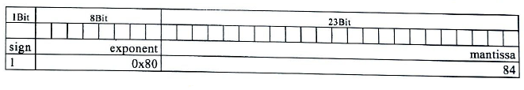

# Formativer Test (HS16)

## Aufgabe 1: Ausdrücke

Bestimmen Sie die Ausgabe folgender Zeilen.

```c
int             a = 0x37;
unsigned int    b = 16;
unsigned int    c = 3;
```

```c
printf("%d\n", a > 37);
```
> 1

```c
printf("%d\n", ++a);
```
> 56

```c
printf("%d\n", b / c);
```
> 5

```c
printf("%s\n", (a & (1 << c)) ? "JA" : "NEIN");
```
> "NEIN" // mit a=0x37

## Aufgabe 2: Typdefinitionen und Bitfelder

Eine Float-Zahl z.B. -2.00002 wird in IEEE 754 in `sign` (1 Bit), `exponent` (8 Bit) und `mantissa` (23 Bit) wie in der folgenden Grafik gezeigt gespeichert.

Definieren Sie einen Typ `theFloat_t`, welcher folgendes Bitmuster aufweist:



```c
typedef struct theFloat {
    unsigned int sign : 1;
    int exponent : 8;
    int mantissa : 23;
} theFloat_t;
```

Deklarieren Sie eine Variable `h` mit Hilfe des neuen Typs und weisen Sie dieser Variable die in der Zeichnung oben vorgesehenen Werte zu.

```c
theFloat_t h = {1,0x80,84};
// oder
theFloat h;
h.sign = 1;
h.exponent = 0x80;
h.matissa = 84;
```

## Aufgabe 3: Pointer auf Vektor

Schreiben Sie die Methode `createAndFillArray(...)`, welche einen Vektor von `n` int-Werten allokiert und ihn mit den Werten `0` .. `n-1` füllt. Die Methode liefert `SUCCESS` zurück, falls die Speicherallokation  erfolgreich war, ansonsten `FAILURE`.

```c
enum FailureCode {SUCCESS, FAILURE};

main() {
    int i;
    int *a;

    if (createAndFillArray(3, &a) == SUCCESS) {
        for (i = 0; i < 3; i++) {
            printf("%dter Wert: %d\n", i , a[i]);
        }
    }
}

enum FailureCode createAndFillArray(int n, int **pa) {
    int i;

    //Memory allokieren
    *pa = (int*) malloc(sizeof(int) * n);

    if (*pa != NULL) { // Fehlerbehandlung
        for(i = 0; i < ; i++) {
            (*pa)[i] = i;
        }
        return SUCCESS;
    } else {
        return FAILURE;
    }
}
```

## Aufgabe 4: Header- und Source-Dateien

Auf der nachfolgenden Seite finden Sie den Code zu einem Programm, welches Zufallszahlen verwendet. Teilen Sie nun diesen Code gemäss 'best practice' in die zwei Dateien `random.h` und `random.c` auf.

* `random.h`

```c
#ifndef RAMDOM_H
#define RANDOM_H

typedef signed short rand_t;
typedef enum seedingMethode_ {
    WEEK_SEEDING, KOMPLEX_SEEDING
} seedingMethode_t;

extern rand_t last_random

void srand(unsigned long seed);
void setSeedingMethode(seedingMethode_t methode);
rand_t rand(void);

#endif
```

* `random.c`

```c
#include "random.h"
#define RAND_MAX 0x7FFF;

unsigned long next = 1;
seedingMethode_t seedingMethode = WEEK_SEEDING;
rand_t lastRandom;

rand_t rand(void) { /*...*/}
void setSeedingMethode(seedingMethode_t methode) { /*...*/ }
void srand(void) { /* ... */ }
```

* `main.c`

```c
#include <stdio.h>
#include <time.h>
#include "random.h"

int main(int argc, char** argc) {
    srand(time(NULL));
    setSeedingMethode(KOMPLEX_SEEDING);

    for (int i = 0; i < 10; i++) {
        printf("Random: %hd\n", rand());
    }
    printf("Last calculated random: was %hd\n", lastRandom);
}
```

## Aufgabe 5: Strukturen

Zur Speicherung einer unbestimmten Anzahl einzelner Buchstaben wird eine doppelt verkettete Liste verwendet.

Ein Knoten in dieser Liste besitzt eine Referenz auf das vorherige und das nachfolgende Element (`next`, `prev`) und ein `char*`-Zeiger auf einen einzelnen Buchstaben.

Definieren Sie einen neuen Datentyp `NodePtr_t` für einen Zeiger auf einen Knoten.

```c
typdef struct Node* NodePtr;
```

Definieren Sie einen neuen Datentyp `Node_t` für den Knoten.

```c
typedef struct Node {
    char* c;
    NodePtr_t next;
    NodePtr_t next;
} Node_t;
```

Kreieren (allokieren) Sie dynamisch einen neuen Knoten und weisen Sie dessen Referenz der Wurzel `head` zu.

```c
NodePtr_t head = (NodePtr_t)malloc(sizeof(Node_t));
```

Schreiben Sie eine Methode `printList(...)`, welche alle Werte der Liste ausgibt.

```c
void printList(NodePtr_t node) {
    while(node != NULL) {
        printf("%c\n", node->c);
        node = node->next;
    }
}
```

## Aufgabe 6: Zeiger auf Funktionen

Deklarieren Sie eine Variable `f` als Zeiger auf eine Funktion. DIe Funktion erwartet zwei Parameter vom Typ Zeichenkette (Zeiger auf `char`) und gibt einen `float`zurück.

```c
float (*f)(char*,char*);
```

Implementieren Sie die setter-Funktion `void setF(...)` mit einem Parameter, der die Variable setzt.

```c
void setF(float (*func)(char*,char*)) {
    f = func;
}
```

Rufen Sie die gesetzte Funktion in der `update`-Funktion auf. Als aktuelle PArameter übergeben Sie die Werte von `s1` und `s2`.

```c
void update() {
    char* s1 = "Hello";
    char* s2 = "World";
    float result;

    result = f(s1, s2);
    //...
} 
```