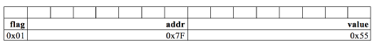

# Formativer Test (HS17)

## Aufgabe 1: Ausdrücke

Bestimmen Sie die Ausgabe folgender Zeilen auf der Console.

```c
int a = 33;
unsigned int b = 32;
char* pText = "C-PROG";
```

```c
printf("%d\n", --a);
```
>32

```c
printf("%c\n", *(pText+2));
```
>P

```c
printf("%d\n", b << 2);
```
> 128

```c
printf("%s\n", ((a > 33) && (b > 32)) ? "YES" : "NO");
```
> NO

## Frage 2 - Typendefinition und Bitfelder

Es soll ein neuer Datentyp `Header_t` definiert, welcher folgendes Bitmuster aufnimmt.



```c
typedef struct {
    int flag    : 1;
    int addr    : 7;
    int value   : 8;
} Header_t;
```

Die Variable h im main entsprechend der Abbildung setzen:

```c
main() {
    Header_t* pth = malloc(sizeof(Header_t));
    pth->flag = 0;
    pth->addr = 127;
    pth->value = 0x55;
}
```

## Aufgabe 3: Zeiger

Vervollständigen Sie die Funktion `createAndfillArray( )`, welche einen Vektor von `n` int-Werten alloziert und
Ihnen die Werte `0`.. `n-1` zuweist. Die Funktion liefert `SUCCESS` zurück, falls die Speicherallokation erfolgreich
war, ansonsten `FAILURE`.

```c
/* Programm-Code startet hier */
enum FailureCode {SUCCESS, FAILURE};
main() {
    int i, *a;
    if (createAndfillArray(3, &a) == SUCCESS) {
        for (i = 0; i < 3; i++) {
            printf("%dter Wert: %d\n", i, a[i]);
        }
    }
}

/* Creates and fills a vector, @param n Number of elements of the vector @param pa Reference of the
vector to create and fill */

//Funktions-Kopf von createAndfillArray( )
enum FailureCode createAndFillArray(int n, int** pa) {
    int i;
    // dynamische Memory Allokation
    *pa = (int*)malloc(sizeof(int) * n);
    //falls Memory Zeile vorher alloziert werden konnte - sonst Fehlerbehandlung -> else
    if(*pa != NULL) {
        for (i = 0; i < n; i++) {
            //Werte zuweisen
            (*pa)[i] = i; // oder: *(*pa+i) = i
        }
        return SUCCESS;
    } else {
        return FAILURE;
    }
}
```

# Aufgabe 4: Header- und SourceCode-Dateien

Untenstehend finden Sie den Code zu einem Programm, welches einen Stack verwendet. Die Überprüfung
des Stacks (Stack bereit, voll oder leer) wird mit Hilfe der globalen Variable `stackState` gemacht.

Teilen Sie diesen Code gemäss ‚best practice‘ in die zwei Dateien `stack.h` und `stack.c` auf, so dass der
eingerahmte Code in der Datei `main.c` durch die Anweisung `#include "stack.h"` ersetzt werden kann.

* `stack.h`

```c
#ifndef _STACK_H
#define _STACK_H

enum ErrorCode { READY, EMPTY, FULL }
extern enum ErrorCode stackState;

void push(int e);
int pop(void);

#endif 
```

* `stack.c`

```c
#include "stack.h"

#define SIZE 3

static int stack[SIZE];
static int pos = 0;
enum ErrorCode stackState = READY;

void push(int e) { /*...*/ }
int pop(void) { /*...*/ }

```

* `main.c`

```c 
#include <stdio.h>
#include "stack.h"

int main(int argc, char** argv) {
    //...
    r = pop() + pop();
    if (stackState == READY) {
        printf("Resultat = %d\n", r);
        push(r);
    } else {
        printf("Fehler: Zu wenig Operanden auf Stack\n");
    }
}
```

## Aufgabe 5: Strukturen

Zur Speicherung von float-Werte wird eine doppelt verkettete Liste verwendet wie im Bild unten als Beispiel
ersichtlich. Ein Knoten in dieser Liste hat einen Zeiger auf den float-Wert sowie Zeiger auf den Knoten vorher
(`prev`) und auf jenen nachher (`next`).

1. Definieren Sie einen neuen Datentyp `NodePtr_t` für einen Zeiger auf einen Knoten.
2. Definieren Sie einen neuen Datentyp `Node_t` für den Knoten. Die Struktur beinhaltet die beiden Zeiger
`prev` und `next` sowie einen Zeiger `fPtr` auf einen float-Wert.
3. Allozieren Sie dynamisch einen neuen Knoten und weisen Sie diesen Knoten einer neuen deklarierten
Zeiger-Variable `head` zu.
4. Wie im Bild unten werden Sie Ihrem ersten Knoten mit dem Zeiger `head` den Wert
`12.3` zuweisen. Achtung: Achten Sie auf den Speicherbereich, welchen Sie beschreiben.

```c
// 1.
typedef struct Node* NodePtr_t;
//2.
typedef struct Node {
    float* fPtr;
    Node_ptr prev;
    Node_ptr next;
} Node_t;
//3.
NodePtr head = malloc(sizeof(Node_t));
float f = 12.3;
head->fPtr = &f;
```

## Aufgabe 6: Zeiger auf Funktionen

Deklarieren Sie eine Variable `f` als Zeiger auf Funktion.
Die Funktion erwartet zwei Parameter `p1` und `p2` vom Typ Zeichenkette (Zeiger auf `char`) und gibt einen `float` Wert zurück.

```c
float (*f)(char* p1, char* p2);
```

Implementieren Sie die setter-Funktion void `setF(…)` mit einem Parameter `p` vom Typ 'Zeiger auf Funktion',
der die oben deklarierte Variable `f` vom Typ 'Zeiger auf Funktion' setzt.

```c
void setF(float (*p)(char* p1, char* p2)) {
    f = p;
}
```

Rufen Sie die Funktion `f` in der `update()` Funktion auf.
Als aktuelle Parameter übergeben Sie die Werte von `s1` und `s2`.

```c
void update() {
char* s1 = "Hello";
char* s2 = "World";
float result;
result = f(s1,s2);
//...
```