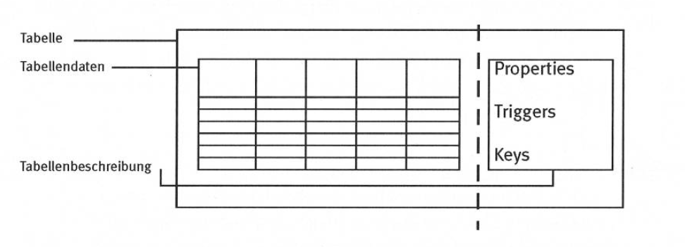

<style>
kbd {
  background: lightgray;
  padding: 3px;
  border: 1px solid gray;
  box-shadow: 2px 1px darkgray;
  border-radius: 3px;
  font: monospace;
}
</style>


# Einleitung

Dieses Dokument beschreibt das Erstellen und Verändern von Forms, Tabllen und Reports in Navision&nbsp;5 sowie das Programmieren mit _C/AL_ in der _C/SIDE_ Entwicklungsumgebung und orientiert sich hauptsächlich auf folgenden Dokumenten:

* [Navision Attain Programming I](./dokumente/Navision_Attain_Programming_I.pdf)
* [Navision Attain Programming II](./dokumente/Navision_Attain_Programming_II.pdf)
* [Application Designer's Guide](./dokumente/Application_Designers_Guide.pdf)


## Weitere Informationen

* [msdn.microsoft](https://msdn.microsoft.com/en-us/library/dd355277.aspx)
* [Wikipedia (Microsoft Dynamics NAV)](https://de.wikipedia.org/wiki/Microsoft_Dynamics_NAV)
* [Wikipedia (C/AL)](https://en.wikipedia.org/wiki/C/AL)

## Online-Hilfe

* [mibuso.com](https://forum.mibuso.com/)
* [dynamics.com](https://community.dynamics.com/nav/f)
* [stackoverflow.com](https://stackoverflow.com/questions/tagged/navision)
* [dynamicuser.com](https://dynamicsuser.net/nav/f/developers/94583/programming-microsoft-dynamics-nav---faq---hot-links)

## Konventionen

Die Verwendung der Menüleiste wird wie folgt dargestellt:

> Datei > Speichern

Tastatureingaben:

<kbd>Ctrl</kbd> + <kbd>S</kbd>

# Navision Allgemein

## Objekte

In Navision gibt es folgende Arten von Objekten:

| Objekt      | Beschreibung                                             |
|-------------|----------------------------------------------------------|
| _Table_     | DB-Tabelle                                               |
| _Form_      | Eingabemaske für Tabellen                                |
| _Report_    | Bericht; Darstellung verschiedener Daten, z.B. als Beleg |
| _Dataport_  | Daten-Import/Export als CSV                              |
| _XMLport_   | Daten-Import/Export als XML                              |
| _Codeunit_  | Code                                                     |
| _Menusuite_ | Anpassungen am Menü                                      |

Alle Objekte im Navision können mit dem _Object Designer_ angezeigt werden. Mit _Run_ können sie ausgeführt und mit _Design_ geändert werden.

## Wichtige Tastenkombination

| Tastaturbefehl                  | Funktion                                |
|---------------------------------|-----------------------------------------|
| <kbd>F5</kbd>                   | C/AL Symbols Menu                       |
| <kbd>F9</kbd>                   | C/AL Code                               |
| <kbd>Ctrl</kbd> + <kbd>F2</kbd> | Designer öffnen                         |
| <kbd>Ctrl</kbd> + <kbd>F8</kbd> | Zoom (Alle Werte tabellarisch anzeigen) |

Mehr Infos: [Tastenkombinationen und Eingabehilfen](./tastenkombinationen-und-eingabehilfen.md)

# Table Design

Tabellen sind die grundlegenden Objekte einer Datenbank und enthalten alle Informationen, welche über Formulare und Berichte abgerufen werden können.

Jede Tabelle besteht aus Spalten und Zeilen. Jede Zeile ist ein Datensatz und jede Spalte entspricht einem Feld. Jede Tabelle hat einen Primärschlüssel, mit dem ein einzelner Datensatz eindeutig identifiziert werden kann.



Sowohl die Tabelle wie auch die einzelnen Felder und Schlüssel besitzen nebst den eigentlichen Werten **Properties**, die deren Verhalten beschreiben.

Bestimme Ereignisse in einer Tabelle wie beispielsweise das Einfügen oder Verändern von Daten lösen vordefinierte Funktionen, sogenannte **Triggers** aus. In diesen kann C/AL Code hinterlegt werden, der ausgeführt wird wenn ein Trigger ausgelöst wird.

## Erstellen einer Tabelle

Tabellen werden wie alle Navision-Objekte in **Object Designer** erstellt:

> Extras > Object Designer

Im Object Designer werden alle Objekte angezeigt. Über die Schaltfläche _Table_ können alle vorhandenen Tabellen aufgelistet werden. Für die Vergabe von ID-Nummern gelten folgende Konventionen:

| Nummernkreis         | Verwendung                    |
|----------------------|-------------------------------|
| 1..9'999             | Standardtabellen von Navision |
| 10'000..49'999       | Länderspezifische Anpassungen |
| 50'000..99'999       | Kundenspezifische Anpassungen |
| 100'000..999'999'999 | Zusatzmodule                  |

Mit der Schaltfläche _New_ kann wird der **Table Designer** geöffnet. Darin können die einzelnen Felder für die neue Tabelle definiert werden.

## Table Properties

Tabellenproperties können über 

> Ansicht > Properties

geöffnet werden. Jede Tabelle hat unter anderem folgende Properties:

| Property | Beschreibung           |
|----------|------------------------|
| ID       | ID Nummber der Tabelle |
| Name  | Name der Tabelle |
| Caption | Beschriftung der Tabelle, entspricht dem Anzeigenamen |
| CaptionML | Caption mit Multilanguage-Funktionalität. Caption wird in der Benutzersprache angezeigt, falls hier definiert |
| Description | Kurze Beschreibung der Tabelle |
| DataPerCompany | Definert, ob die Tabelle Mandantenübergreifend verwendet wird |

## Field Properties

Analog zu den Table Properties hat auch jedes Feld und jeder Schlüssel eigene Properties, welche ebenfalls über 

> Ansicht > Properies 

angezeigt werden können. Standardwerte werden in spitzen Klammern angezeigt: `<Default>`


# Form Design

Formulare werden eingesetzt, um Daten strukturiert anzuzeigen. 

```
//TODO: Navision Attian Programming I Kapitel 4 ff 
```


# Report Design

```
//TODO
```
---

# Navision Programming

Für das Programmieren in Navision mit _C/AL_ auf Basis der _C/SIDE_ Entwicklungsumgebung wird eine Entwicklerlizenz benötigt. Dadurch erhält man die Möglichkeit, Anwendungsobjekte kundenspezifisch anzupassen. 

Änderungen im Navision werden nicht im Sourcecode der Anwendung vorgenommen, sondern in den in der Datenbank gespeicherten Objekten, welche unter anderem Tabellendefinitionen, Forms und Code-Einheiten enthalten können.

## Wichtige Begriffe

**C/AL** (_C/SIDE Application Language_) ist eine interne Programmiersprache für Navision die in der C/SIDE Etwicklungsumgebung primär zum Auslesen, Einfügen und Modifizieren von Datensätzen in einer Navision-Datenbank verwendet wird.

**C/SIDE** (_Client/Server Integrated Development Environment_) ist die Navision-Entwicklungsumgebung.

## Datentypen

In C/AL gibt es zahlreiche numerische Datentypen:

* `Byte`
* `Char`
* `Integer`
* `BigInteger`
* `Duration` (Differenz zwischen zwei `DateTime` in Milisekunden)
* `Option` (Aufzählungstyp, entspricht einem `enum` in C-ähnlichen Sprachen)
* `Decimal`

sowie String-Datentypen:

* `Text`
* `Code`

Beim Datentyp `Code` handelt es sich um ein spezielles String-Format, bei dem am Anfang und Ende alle Leerzeichen entfernt werden und alle Buchstaben in Grossbuchstaben umgewandelt werden.

Weitere Datentypen:

| Data Type | Beschreibung                                                                                     |
|-----------|--------------------------------------------------------------------------------------------------|
| `Record`  | Enthält einen einzelnen Datensatz                                                                |
| `Report`  | Enthält ein Report-Objekt                                                                        |
| `BLOB`    | _Binary Large Object_, grössere Dateien variabler Länge, beispielsweise Bemerkungen oder Bitmaps |
| `Variant` | Enthält einen beliebigen Datentyp                                                                |

Eine Übersicht aller C/AL-Datentypen gibt es auf [docs.microsoft.com](https://docs.microsoft.com/en-us/dynamics-nav/c-al-data-types).

## Einfache Codebeispiele

### Hello World

Da es in C/SIDE keine Konsole zum Ausgeben von Text gibt werden Dialogboxen verwendet:

```
MESSAGE('Hello World!');
```

### Filtern und Abrufen von Datensätzen

Variablen in C/AL werden nicht im Code definiert, sondern über das Menü _C/AL Globals_. Im folgenden Beispiel wird angenommen, die Variable _Item_ sei von Typ _Record_.

```
IF Item.GET('31260210') THEN
    MESSAGE(STRSUBSTNO('Item name is: %1',Item.Description));

  Item.RESET;
  Item.SETRANGE("No.",FromItem,ToItem);
  Item.FINDLAST;
```

### Datenmanipulation

```
  Item.RESET;
  Item.SETRANGE("Blocked",TRUE);
  IF Item.FINDSET THEN
    REPEAT
      IF Item."Profit %" < 20 THEN BEGIN
        Item."Profit %" := 20;
        Item.MODIFY(TRUE);
      END;
    UNTIL Item.NEXT = 0;
  Item.MODIFYALL("Blocked",FALSE);
```


---
TODO: In Dokument integrieren

* PDFs
* https://dynamicsuser.net/nav/w/navdev/8/what-is-c-side
* https://msdn.microsoft.com/en-us/library/dd355277.aspx
* https://de.wikipedia.org/wiki/Microsoft_Dynamics_NAV
* 