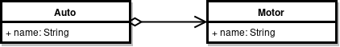
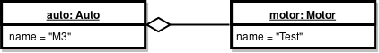

# Einleitung

Zusammenfassung Folien OOP / PLAB HSLU.I

# Einleitung

Ein **Programm** ist eine _Folge von Anweisungen_ für Computer, formuluiert in einer formalen Programmiersprache. Diese soll _präzise_, _verständlich_ und für Menschen gut lesbar sein.


## Kompilierung


Java Sourcecode wird kompiliert zu **Bytecode**, welcher von der **Java Virtual Machine** interpretiert wird.

## Getter und Setter

Zugriff auf Klassen-Attribute sollte nicht direkt erfolgen, sondern mit _Zugriffsmethoden_:

```java
private int number;
```

* **Lesend**: _Getter_, Query, Accessor

```java
public int getNumber() {
  return number;
}
```

* **Schreibend**: _Setter_, Mutator

```java
public void setNumber(int number) {
  this.number = number;
}
```

_Empfehlungen_: Getter & Setter `final`, Parameter Setter `final`.


## Boolsche Operatoren

| Operator | Bedeutung |
|--- |--- |
| && | AND |
| &#124;&#124; | OR |
| ^ | EXCLUSIVE OR |
| ! | NOT |

**Unterschied `&&` und `&`**:

`&&` ist optimiert, `&` nicht:

```c
false && notExecuted();
false & executed();
```

### Morgansche Gesetze:

```c
!(!a && !b) == a || b

!(!a || !b) == a && b
```

# Objektorientierte Programmierung

* Entstanden in den 1960ern, populär seit 1985 (C++).
* Daten und Funktionen werden zu Objekten zusammengefasst.

**Analogie Kuchen**: Klasse = Rezept, Objekt = Kuchen

## Klassen- und Objektdiagramme

**Klassen** sind _programmiert_ und dienen als Vorlage zur Instanzierung von Objekten.

Das **Klassendiagramm** ist eine statische Sicht auf ein Programm und stellt die Beziehungen zwischen Klassen dar:



**Objekte** werden zur Laufzeit generiert.

**Objektdiagramme** bieten eine dynamische Sicht und zeigen Objekte zu einem bestimmten Zeitpunkt.



## Synonyme

* **Objekt**: Instanz, Member
* **Klasse**: Klassentyp, Typ
* **Attribut**: Variable, Member (= Status des Objekts)
* **Methode**: Funktion, Operation (= Verhalten des Objekts)
