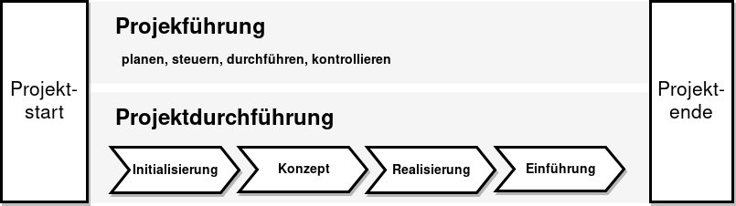
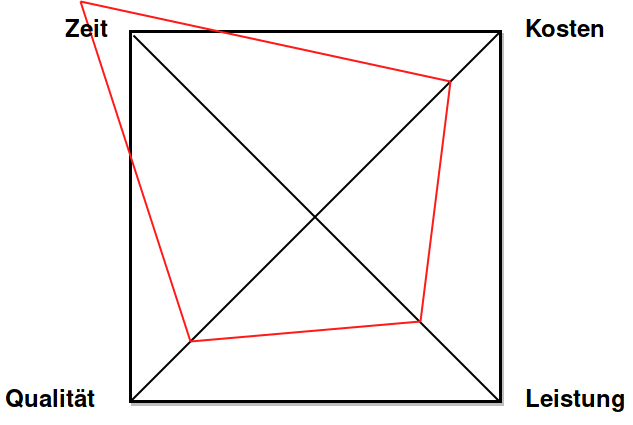
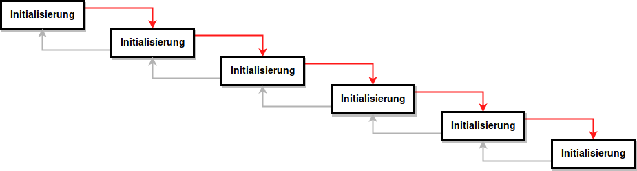
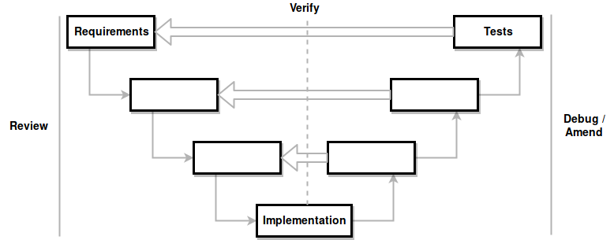
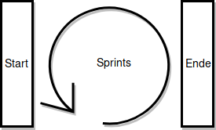

# Grundlagen

## Projekt

Ein Projekt ist ein

* abgegrenztes
* umfangreiches
* zeitlich begrenztes
* einmalig durchzuführendes

Vorhaben, deren Erfüllung eine Organisation bedingt. Projekte werden mit Projektmethoden

* geplant
* gesteuert
* durchgeführt
* kontrolliert

### Projektverständnis nach Jenny

Es wird unterschieden zwischen _Projektführung_ und _Projektdurchführung_.

**Projektdurchführung** beschreibt die verschiedenen Projektphasen:

* Initialisierung
* Konzeption
* Realisierung
* Einführung

**Projektführung** beschreibt einen Zyklus:

* planen
* steuern
* durchführen
* kontrollieren

Dieser wird für alle Projektphasen wiederholt.




### Projektziele

Ein **Ziel** ist eine angestrebter, zukünftiger Zustand, der nach Inhalt, Zeit und Ausmass genau bestimmt ist.

Ziele sollten kurz, prägnant und **_SMART_** sein:

* **S**pezifisch
* **M**essbar
* **A**ngemessen
* **R**ealistisch
* **T**erminiert

### Projektanforderungen

Eine **Anforderung** ist eine Aussage über eine Eigenschaft oder Leistung eines Produktes, Prozesses oder am Prozess beteiligter Personen.

Anforderungen sollten möglichst einfach kontrollierbar sein.

* **Anforderungskatalog (klassisch)**: Möglichst vollständige Liste aller Anforderungen, fixe Priorisierung, Änderungen restriktiv (→ _Arbeitspakete_)
* **Produktbacklog (agil)**: Wichtigste Anforderungen grob erfasst, Priorisierung wird laufend angepasst, Änderungen können jederzeit einfliessen (→ _User Stories_)


```
Beispiel: Aufbau Anforderungskatalog

Title:
Description:
Priority (1=High, 2=Medium, 3=Low):
Status (Proposed, Accepted, Postponed):
Source (Name of person or organisation):
Complexity:
Benefit:
```

### Projekterfolg

**Projekterfolg** bedeutet das Erreichen des vorgegenben Ziels ohne Überschreitung des Zeit- und Kostenrahmens.

Folgende Ziele bilden bei der Durchführung eines Projekts normalerweise einene Zielkonflikt:



Optimiert man einene dieser Faktoren ohne die Ressourcen zu erhöhen, nehmen die anderen in der Regel ab.

#### Projektresultate

**Projektresultate** sind _Arbeitsergebnisse_, die das Projekt abzuliefern hat. Resultate sind nicht das selbe wie Projektaktivitäten, sondern die daraus resultierenden Zustände.

Die Formulierung von Resultaten ist wichtig für

* Die Erstellung des _Meilensteinplans_
* Die Erstellung der _Arbeitspakete_ und _Auswandsabschätzung_
* Das _Projekt-Controlling_ (Aufwand und Erreichung der Resultate)
* Das Projektreporting

### Projektmanagement

Projektmanagement ist die Gesamtheit von

* Führungs*aufgaben*
* Führungs*organisation*
* Führungs*techniken*
* Führungs*mittel*

für die

* Initiierug
* Steuerung
* Abschluss

von Projekten.

**Projektinstitution**: Definert das institutionelle Projektmanagement, welches alle _aufbauorganisatorische Bereiche_ beinhaltet, die für das Projektmanagement notwendig sind.

## Projektorganisation

Grundformen der Projektorganisation:

* Reine Projektorganisation / **Linien-Projektorganisation**
* Projektkoordination / **Stab-Linienorganisation**
* **Matrix-Projektorganisation**
* Mischformen

Problemstellungen der Projektorganisation: Verantwortung des Projektleiters ist oft nicht genau definiert:

* **finanziell**
* **fachlich**
* **administrativ**
* **disziplinarisch**

## Projektdokumentation

Beim klassischen Projektmanagement entstehen die Pläne und Dokumente in der Initialisierungsphase (→ up front). Bei der agilen Entwicklung entstehen die Dokumente während der Realisierung.

## Meilenstein

Ein **Meilenstein** ist ein geplanter Punkt im Projektablauf, an dem vorher definierte, messbare Zwischenresultate vorliegen, die es erlauben, den Projektfortschritt festzustellen.

Merkmale von Meilensteinen:

* Unterschiedliche Abstände zwischen den Meilensteinen
* Nach aussen kommuniziert
* Projektresultate zeigen
* Zeitplan-Einhaltung erkennen

## Scope

Beschreibt, was zum Projekt gehört (→ _In-Scope_) und was nicht (→ _Out-Scope_).

Dient zum Schutz des Projektsleiters und dazu, um herauszufinden was gemacht werden muss und was nicht.

# Vorgehensmodelle

## Klassisch

### Sequentiell / Wasserfallmodell



### Sequentiell / V-Modell

Jede Phase auf der **Analyse/Konzept-Seite** hat eine Entsprechung auf der **Integrations/Test-Seite**. Die Phasen werden **iterativ** durchlaufen und die Anforderungen aufgrund der Tests angepasst. **Inkrekmentelles hinarbeiten auf das Ziel.



## Agil

### Scrum

Framework zur Entwicklung komplexer Projekte. Sogenannte Scrum-Teams liefern in regelmässigen Abständen (→ iterativ) und stufenweise erweiternd (→ inkrementell) Produkte aus. Dadurch wird sichergestellt, dass immer eine gebrauchsfertige Version des Produkts verfügbar ist.

Scrum ist:

* Agil
* Iterativ
* Inkrementell

**Sprints** Fixes, definiertes Zeitintervall, in dem ein neues Produktinkrement erstellt, getestet und umgesetzt wird.

**Product Owner**:  Entscheidet über

* das _Grooming_ (fortlaufende Pflege des Product Backlogs)
* ob und wann eine Anforderung realisiert wird
* Planung und Abschluss von Sprints

## Hybrid

Kombiniert Elemente klassischer und agiler Projektplanung. Bsp:

* Projektstart und -ende sind klassisch, mit einem fixen Termin
* Implementationsphase ist agil, mit Sprints


