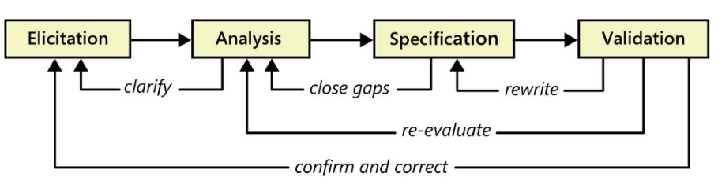
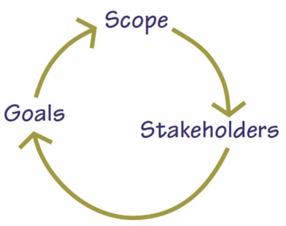
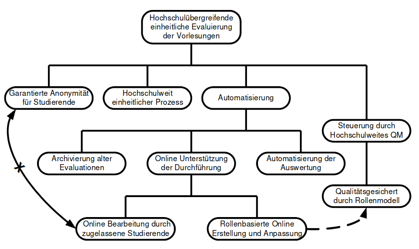
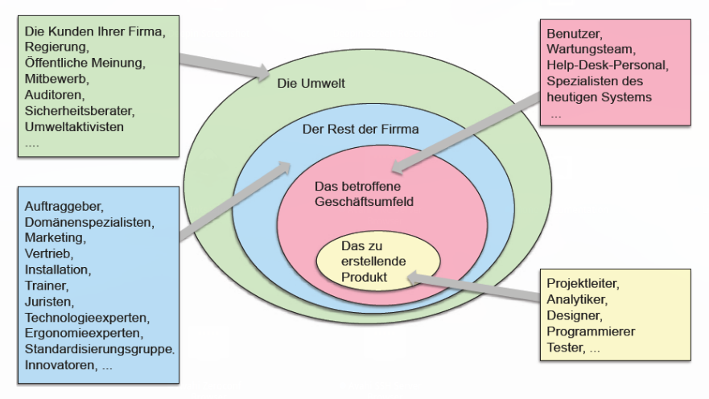
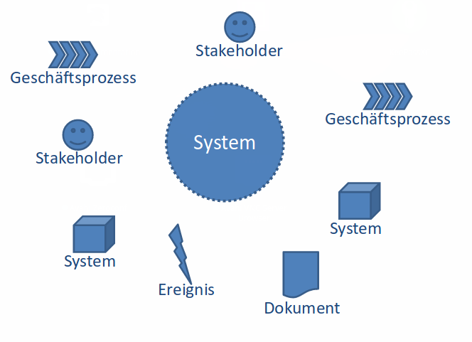
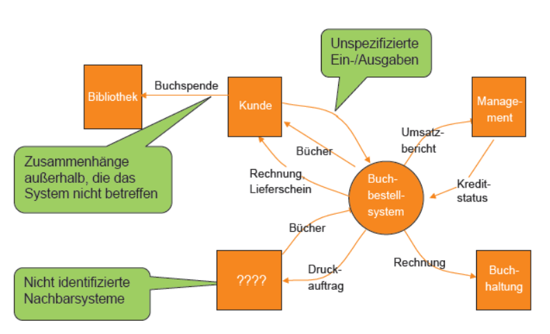

# Einführung

Requirements Engineering beinhaltet **Requirement Management** und **Requirement Development**,
das wiederum _Elicitation_, _Analysis_, _Specification_ und _Valididation_ beinhaltet.

## Business Analyst

Der Business Analyst muss die Anforderungen verschiedenster Zielgruppen (→ _Stakeholder_)
wie **Projekt-Sponsoren**, **Management**, **Entwicklung**, **Benutzer** und weiteren
berücksichtigen und gegeneinander abwägen.

## Setting

## Ziele

Ein Ziel ist ein **angestrebter Zustand** oder eine **erwünschte Wirkung**. Ziele sollten bekannt sein, bevor man die Anforderungen ermittelt. Jede Anforderung muss auf ein Ziel zurückführbar sein.

Beispiele von Zielen:

**Ziele der Geschäftsführung:**

* Kosten senken
* Schnelle Abwicklung eines Projekts
* Kein zusätzliches Personal

**Ziele Geschäftsstellenleiter:**

* Mehr Servicepersonal
* Qualifizierte Mitarbeiter
* Gute Kundenkenntnis beim Berater

**Ziele Mitarbeiter:**

* Gute Ausbildung bei den Produktentwicklung
* Gute Bezahlung
* Gleichmässiger Arbeitsanfall

**Ziele der Kunden:**

* Schnelle Abwicklung
* Hochwertige Beratung
* Niedrige Preise

## Zieldiagramm

# Stakeholder

Stakeholder sind alle Personen, die direkt oder indirekt Einfluss auf die Anforderungen haben.
Dies betrifft die Systementwicklung, den Einsatz und den Betrieb eines Produktes.
Und umfasst auch Personen, die das System zwar nicht entwickelt haben aber es benutzen, betreiben oder schulen.

Stakeholder können in _interne_ (Besitzer, Angestellte, Manager) und _externe_ Stakeholder (Kunden, Kreditoren, Zulieferer, Gesellschaft, ...) eingeteilt werden.

## Stakeholderanalyse

* Identifikation potentieller Stakeholder
* Sammeln von Informationen
* Strategische Einordnung
* Vorhersagen des Stakeholder-Verhaltens
* Massnahmen planen und umsetzen

Ziel ist es, die verschiedenen Interessen, Einflüsse und Wertvorstellungen zu ermitteln und festzulegen von welchen Gruppen und Individuen diese kommen.

## Stakeholderklassen

### Management

Sponsoren / Auftraggeber und Entscheider. Sorgen dafür, dass ein System die **Unternehmensziele** unterstützt
und mit der **Unternehmensphilosophie** konform ist.
Kommen i.d.R. erst im Genehmigungsverfahren mit dem Projektantrag im Kontakt.

Damit ein Projekt genehmigt wird müssen die Systemziele die Ziele des Managements unterstützen.
Auch deshalb ist es wichtig, das Management als potentielle Stakeholder in ein Projekt einzubeziehen.

### Anwender

Anwender liefern den Grossteil der **fachlichen Ziele**. Bei einer grossen Anzahl Benutzer können
besonders erfahrene Benutzer als Benutzerrepräsentanten ausgewählt werden.

Benutzer können noch in direkte (= Benutzer, die aktiv mit dem System arbeiten) und indirekte Benutzer (= Personen, die
vom System profitieren, z.B. Personen, die Belege aus dem System bekommen) unterteilt werden.

### Wartungs- und Servicepersonal

Formulieren die wesentlichen Ziele für die Wartung und den Service des Systems.
Dies beinhaltet beispielsweise **Anzeige von Fehlerzuständen**, Ansprüche an
**Ausfallsicherheit**, **Wiederherstellbarkeit** und **Transport**.

### Schulungs- und Trainingspersonal

Aspekte wie **Bedientbarkeit**, **Vermittelbarkeit**, **Dokumentation** und **Hilfesystem**.

### Käufer

Benutzer und Käufer sind nicht immer identisch. **Lizenzkonzept**, **Service- und Vertragskonditionen**, **Preis**.

### Marketing und Vertrieb

Interne Repräsentanten der externen Kunden, Ziel- und Anforderungsliefteranten in der Produktentwicklung.

### Entwickler

**Technologiespezifische Ziele**, **eingesetzte Technologien**.
Dienen der Zukunftssicherung und der Motivation des Entwicklerteams.

### Projekt- und Produktgegner

Potentielle Gegner, Konkurrenten berücksichtigen. Eventuell Überzeugungsarbeit oder Anpassung
der Projektziele, um Widerstände zu vermeiden.

### Produktbeseitiger

Personen, die mit der Beseitigung nach der Benutztung eines Produktes beauftragt sind.
Bestimmungen betreffend **Umweltschutz** bei Hardware, **Deinstallationsprogramme**
bei Software.

### Sicherheitsbeauftragte

Anforderungen betreffend absichtlichen oder unabsichtlichen **Fehlverhalten** anderer
Stakeholder und zweckwidrige Verwendung des Systems.

### Betriebsrat

Spielt vor allem in grösseren Unternehmen eine wichtige Rolle bei der Einführung neuer Systeme
und sollte deshalb früh in das Projekt integriert werden.

### Personen aus anderen Kulturkreisen

Rahmenbedingungen iwe **Darstellung** der Informationen, Verwendung von Symbolen und Begriffen.

### Gesetzgeber

Rechtliche Rahmenbedingungen wie **Gesetze**, **Vorschriften** und **Verordnungen**.
Beispielsweise das Datenschutzgesetz.

### Standardisierungsgremien

Externe oder firmeninterne Standards, Richtlinien, Sicherheitsstandards, Corporate Identity.

### Öffentliche Meinung

Meinungsführer wie marktdominierende Konkurrenz (Microsoft) oder öffentliche Meinung.
Ziel: optimeales Projektmarketing angepasst an unterschiedliche Gegenbenheiten
(USA, Asien, Europa).

### Prüfer und Auditoren

Prüfen das System auf Konformität mit Richtlinien / Zielen.

### Technische Experten

Personen mit technischem Fachwissen (Chemie, Werkstofftechnologie...). Überprüfen, ob ein
Produkt überhaupt umgesetzt werden kann. **Ziele** und **Grenzen** aufgrund **technologischer
Restriktionen** (z.B. elektromagnetische oder thermodynamische Anforderungen).

### Produzenten des Produkts

**Fertigungsanforderungen**, **End-of-line-Programmierung**, **Lieferbedingungen**, **Ausfallraten**.

### Produktdesigner

Anforderungen an das **Aussehen**, **Form** und **Ausbau** aus ästethischen und technischen Gründen.

### Prozessoptimierung und Arbeitsergonomie

Optimierung der **Benutzerschnittstelle**, **ergonomische Erfordernisse** (Lesbarkeit,
Darstellung), **ökonomische Arbeitsabläufe** (z.B. Menüführung).

### Experten für das Systemumfeld

Anforderungen und Rahmenbedingungen für die Verwendung und Einbettung des Systems
in dem dafür vorgesehenen Systemumfeld.

### Produktlinienverantwortliche

Einbettung in Produktfamilie, einheitliches Benutzerinterface, Farben, Logos,
Wiederverwendung von Systemteilen.

### Forschung und Entwicklung

**Innovationen** für neue Produkte.

### Controllingabteilung

Entscheidungsträger in internen Finanzabteilungen, **finanzielle Rahmenbedingungen**,
Anforderungen an die **Preisgestaltung**.

## Notation von Stakeholdern in einem Projekt

Zur Dokumentation von Stakeholdern sind folgende Informationen notwendig:

* Name
* Funktion / Rolle
* Personen- und Kontaktdaten
* zeitliche und räumliche Verfügbarkeit
* Relevanz
* Wissensgebiet und -umfang
* Ziele und Interessen
* ...

Stakeholder können beispielsweise tabellarisch erfasst werden:

| Rolle | Beschreibung | Konkrete Vertreter | Verfügbarkeit | Wissensgebiet | Begründung |
|---	|---		   |---                 |---            |---            |---         |
| ...   | ...          | ...                | ...           | ...           | ...        |

## Stakeholder-Map

# Kontextdiagramm

Im Kontextdiagramm wird das System und der Systemrelevante Kontext abgebildet. Ziel ist es klar zu definieren, was zum System gehört und was nicht, sowie Schnittstellen darzustellen.

## Aspekte des Systemkontexts

## Typische Fehler

