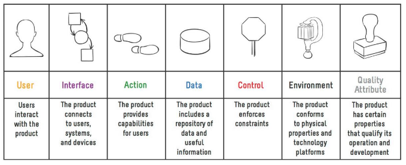

# Anforderungen ermitteln

* Bekanntes Wissen
* Unbekanntes Wissen
* Wissensbeschaffung & Erhebungstechniken
* Wissensdokumentation
* Validierung / Überprüfung von Wissen

Anforderungen können von verschiedenen Quellen kommen und sollten umfassend ermittelt, dokumentiert und bewertet werden.

## Anforderungsquellen

### Stakeholder

Stakeholderstimmen einordnen:

* _Business Requirement_
* _Functional Requirement_
* _Quality Attribute_
* _Data Definition_
* _Business Rule_
* _Use Case_
* etc.

### Die 7 Produktdimensionen

* **User**: Wer benutzt das System, wer erhält Output vom Produkt?
* **Interface**: Welche Interfaces senden Daten, Nachrichten zum oder vom Produkt?
* **Action**: Welche Aktionen erreichen die Ziele der Benutzer?
* **Data**: Was für Daten brauchen Benutzer vom Produkt?
* **Control**: Welche Policies, Regulationen und Regeln muss das Produkt einhalten?
* **Environment**: Wo wird das Produkt eingesetzt? Welche Software und Hardware wird verwendet für die Entwicklung und Benutzung des Produkts?
* **Quality Attribute**: Service Levels für Verfügbarkeit, Benutzung etc.

### Kano-Modell
Das _Kano-Modell der Kundenzufriedenheit_ teilt Kundenanforderungen in drei Kategorien ein:

* **Basisfaktoren**: Grundlegend und selbstverständlich(implizite Erwartungen), fallen erst bei Nichterfüllung auf. Nichterfüllung führt zu Unzufriedenheit:
  * _Bücher ausleihen in einer Bibliothek_
* **Leistungsfaktoren**: Explizite Erwartungen, beseitigen Unzufriedenheit oder schaffen Zufriedenheit, je nach Ausmass der Erfüllung
  * _Online-Reservation von Büchern, Benachrichtigung bei Ablauf der Ausleihfrist_
* **Begeisterungsfaktoren**: Nutzenstiftende Faktoren, die vom Kunden nicht erwartet werden, Abgrenzung von Konkurrenz
  * _Empfehlungen für ähnliche Bücher, Lieferdienst gekoppelt mit Pizza-Service_

Das Kano-Modell sagt, dass Leistungsfaktoren mit der Zeit zu Basisfaktoren werden und Begeisterungsfaktoren zu Leistungsfaktoren.

### Interview

* **Geschlossene Fragen**: Bewertung auf Skala, Multiple-Choice.
* **Offene W-Fragen**:
  * Aufgabenmerkmale
  Was / Wie: _Aufgabenverrichtung_
    * Woran: _Aufgaben-Objekt_
  * Merkmale der Aufgabenerfüllung
    * Wer: _Aufgabenträger_
    * Womit: _Sachmittel_
    * Wann, wie lange: _Zeit_
    * Wo, woher, wohin: _Ort_
    * Wie oft, wieviel: _Menge_

**Krokus-Regel**:

* **K**urze Fragen:
  * Interviewer kann Steuerungsfunktion besser gerechtwerden
  * Höhere Chance auf kurze Antworten
  * Befragter wird nicht überfordert
* **R**edundate Fragen vermeiden:
  * Geringere zeitliche Belastung für den Befragten
  * Erleichtert Dokumentation
  * Bessere Transparenz, roter Faden ersichtlich
* **O**ffene Fragen stellen:
  * Wecken Auskunftsbereitschaft
  * Geben Befragtem Zeit zum Nachdenken
  * Vermeidung von Manipulation und Spekulation
  * Fördern neue Gesichtspunkte
  * Engen Befragten nicht ein
* **K**onkrete Fragen stellen:
  * Straffen
  * Bremsen Vielredner
  * Fördern Verständnis
* **U**nterfragen und Kettenfragen vermeiden:
  * Jede Frage wird beantwortet
  * Befragter wird weniger verunsichert
* **S**uggestive Fragen vermeiden:
  * Befragter sagt, was er denkt und nicht, was erwartet wird
  * Weniger Widersprüche
