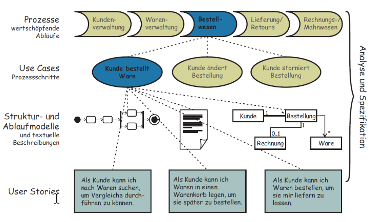
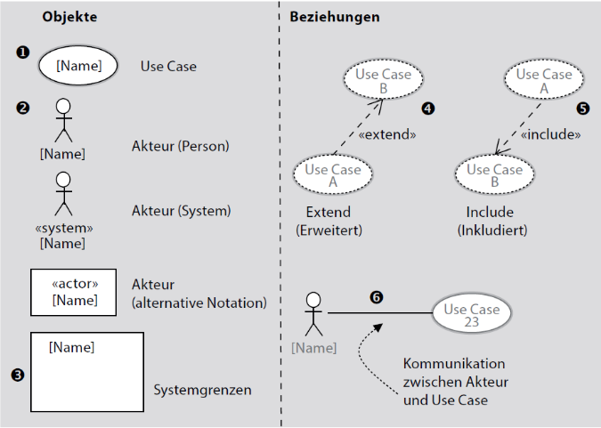
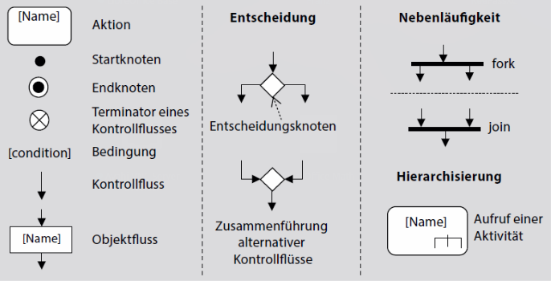
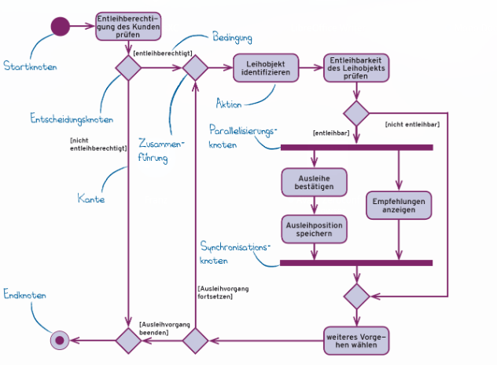
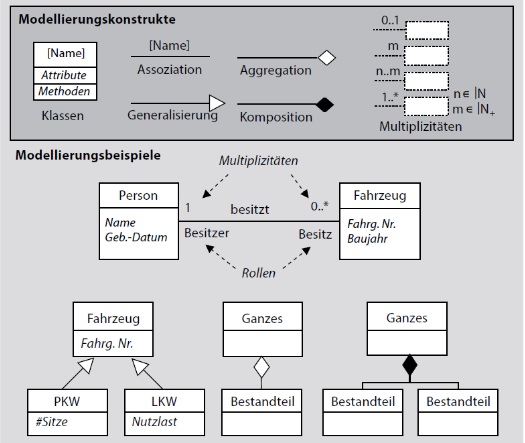
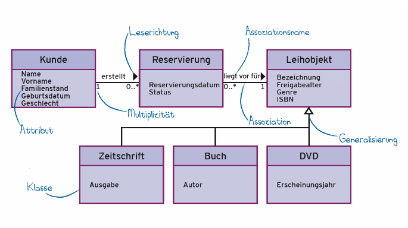
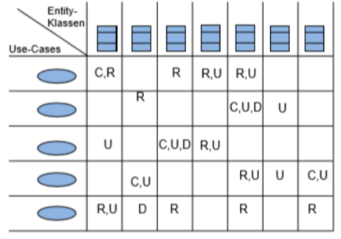
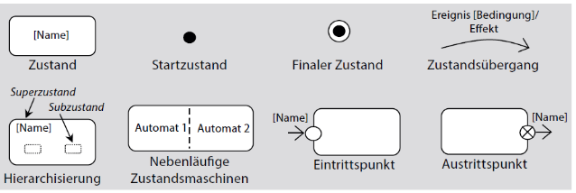
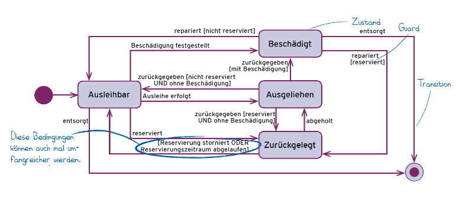

# Anforderungen modellieren

Modelle können _konkrete_ (Modelleisenbahn) oder _abstrakte_ (Atom-Modell, Finanzierungsmodell) Abbildungen realer Objekte sein. Der Verwendungszweck bestimmt, welches Modell geeignet ist.

Modelle sind entweder _Stuktur-_, _Funktions-_ oder _Verhaltens-_ Analogie für ein Original.

* **Struktur**: Relevante Objekte und ihre Beziehungen werden modelliert.
(→ Datenmodell)

* **Funktion**: Abläufe der Manipulation von Informationen werden modelliert.
(→ Aktivitätsdiagramm, Datenflussdiagramm)

* **Verhalten**: Erlaubte Systemzustände und Zustandsänderungen durch Ereignisse werden modelliert (→ Zustandsdiagramm)

# Diagramme in RE

Veschiedene Diagramme zur Darstellung verschiedener Perspektiven:

* **Struktur**: Klassendiagramm
* **Systemfunktionen**: USe Case Diagramm
* **Funktionsdetails**: Aktivitätsdiagramm
* **Verhalten**: Zustandsdiagramm, Sequenzdiagramm
* **System / Kontext**: Kontextdiagramm

## Use Case Diagramm

Use Case Diagramme müssen immer auch eine Use Case Beschreibung enthalten, beispielsweise als Liste oder Tabelle.

## Aktivitätsdiagramm

Modellelemente:

Beispiel:

## Klassendiagramm

Modellelemente:

Beispiel:

## CRUD-Matrix

Gegenüberstellung von UCs (Funktionen) und Klassen (Datenstrukturen).

## Zustandsdiagramm

Modellelemente:

Beispiel:

