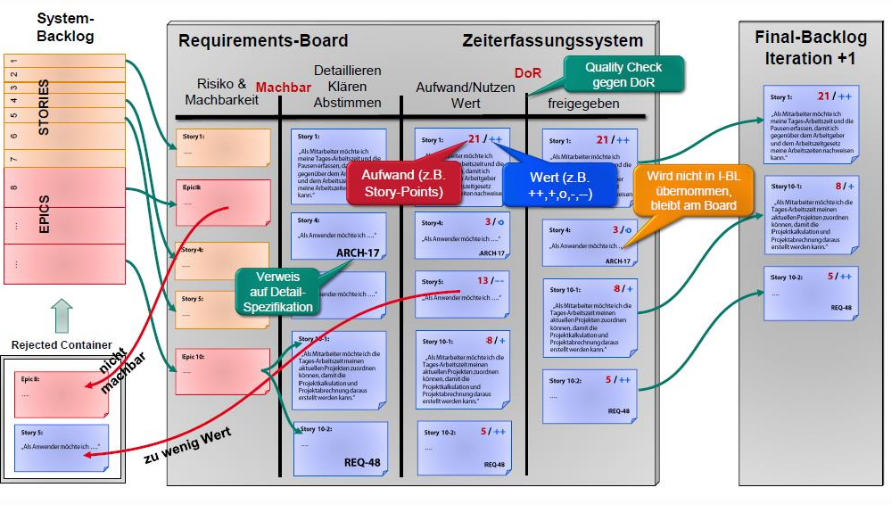

# Agiles Requirement Engineering

## Überblick

* **Requirements**: Anforderungen eines Stakeholders; jede Eigenschaft, die ein System besitzen soll.
* **Requirement-Spezifikation**: Jede Repräsentation eines oder mehrerer Requirements, unabhängig von Form und Granularität.
* Ebenen zur Strukturierung und Einordnung von Requirements:
  * High-Level Sichtweise: _Überblick über das Vorhaben_
  * Strukturierungsebene:  _Artefakte in Zusammenhang bringen_
  * Detailebene: _Feingranulate Inhalte_

Überblick über Requirement-Artefakte:

## Backlog Items

Backlog-Items erfüllen folgende Funktionen:

* Strukturierung und Einordnung von Requirements
* Release-Planung
* Speicher für detaillierte Anforderungen
* Aufwandschätzung (bei Zuteilung zu einem Sprint)

Bevor Backlog-Items verwendet werden können, ist eine Verfeinerung (_Refinement_) notwendig.

* Details hinzufügen
* Schätzungen erstellen
* Reihenfolge festlegen

Das _Refinement_ ist ein kontinuierlicher Prozess und wird vom _Product Owner_ zusammen mit dem Entwicklungsteam durchgeführt.

## Repräsentation von Anforderungen in agilen Projekten

### Features

Features sind eine zusammenfassende Menge von Anforderungen. Features beschreiben _funktionale_ und _nichtfunktionale_ Anforderungen.

* Unterstützen Dialog unter den Stakeholders
* Verbessern die Anwendungskenntnissse der Entwickler
* Fördern Kreativität und Innovation
* Regen zu weiterem Nachforschen an

Features werden oft auch in der Produktwerbung eingesetzt.

ZU beachten bei Features:

* Entwicklungsteam versteht Features wirklich
* Gewichtung nach Bedeutung für das System
* Priorisiertung für die Realisierung
* Hierarchisch strukturiert aufgeführt

### Scrum User Stories

Kurzer, narrativer Text, der eine Interaktion zwischen einem Benutzer und dem System beschreibt. Diese Beschreibung dient als Grundlage für die Kommunikation und Ausgangspunkt für die Umsetzung von Produktfunktionalitäten.

User Stories werden im _Scrum Produkt Backlog_ verwaltet und dienen als **Planungsinstrument** für die Sprints.

* **Name**:
  * prägnante Benennung der User Story
* **Beschreibung**:
  * Wer möchte was?
  * Durch welche Funktionalität wird der Nutzen realisiert?
* **Akzeptanzkriterien**:
  * Wie kann die Umsetzung den Anforderungen entsprechend festgestellt werden?
  * Was soll getestet werden?
* **Ergänzende Beschreibungen**:
  * Typischerweise als Link auf Use Case oder andere Anforderungsform

#### Formaler Aufbau

>**Name**: [_Aussagekräftiger Titel_]
>
>**Beschreibung**:
>
>**Als** [_Rolle / Akteur_] 
>**möchte ich** [_Funktionsbeschreibung_], 
>**damit** [Begründung].
>
>**Akzeptanzkriterien**:
>
>[Messbare Kriterien für korrekte Implementation]

#### Beispiel:

>**Name**: CSV-Export meiner Daten
>
>**Beschreibung**:
>
>Als Benutzer möchte ich _die Daten meiner Konten per CSV-File herunterladen können, um damit ausserhalb des Programms weitere Auswertungen und Berichte zu erstellen.
>
>**Akzeptanzkriterien**:
>
>* Ich kann die Daten für jedes meiner Konten herunterladen
>* Es sind alle Werte in der CSV-Datei enthalten
>* Ich kann die Daten für alle Berichtszeiträume ausgeben lassen

#### INVEST-Prinzip

Anforderungen an User Stories:

* **Independent**: Eine Story ist unabhängig von anderen Stories.
* **Negotiable**: Kunder und Entwickler erarbeiten und präzisieren die Stories gemeinsam. Kunde beschreibt die Funktionalität grob, die Entwickler arbeiten die Details aus.
* **Valuable**: Die Stories sollten einen erkennbaren Mehrwert liefern.
* **Estimable**: Eine Story muss so überschaubar sein, dass die Entwickler die Umsetzung schätzen können.
* **Small**: Mindestens einen halben, maximal zehn Personentage Aufwand.
* **Testable**: Test sind der Massstab für den erfolgreichen Abschluss. Deshalb müssen Stories testbar sein.

### Scrum Backlog Items

Backlog-Items in Scrum sind Strukturelemente für die Planung und haben unterschiedliche Ausprägungen:

Das Team verpflichtet sich, ausgewählte Backlog Items in einem Sprint vollständig umzusetzen.

#### Task

Tasks sind Teilaufgaben innerhalb eines Backlog Items und dienen zur Aufgabenteilung und Aufwandschätzung.

#### Epic

Epics sind grobgranulare Anforderungen, die zu komplex oder umfangreich sind, um sie in einem Sprint umzusetzen. Epics werden in andere Backlog Items zerlegt (_Story Splitting_), eine Aktivität innerhalb des RE in Scrum, Backlog Grooming)

Epics werden unterteilt in:

* Business Epics
  * Fachliche Anforderungen aus der Geschäftswelt
  * Organisations- oder prozessübergreifende Eigenschaften
* Architectural Epis
  * Weitreichende technische Vorgaben
  * Betreffen hauptsächlich Architekturfragen

Epics sind Anforderungen auf hoher Ebene und sollten deshalb kontinuierlich strukturiert und beschrieben werden.

**Beispiel (attributiertes Epic)**:

| Attribut | Beschreibung |
|---|---|
| _Name_ | Arbeitszeiterfassung auf mobilen Endgeräten |
| _Ziel_ | Vorsprung gegenüber dem Mitbewerb aufbauen, mehr Flexibilität beim Einsatzt der Zeiterfassung |
| _Beschreibung_ | Die neue Softwarelösung für die Arbeitszeiterfassung wird auf allen Typen von Endgeräten zur Verfügung stehen und wir werden damit technologisch führend sein |
| _Art_ | Architectural Epic |
| _Provider_ | Herr Huber, Leiter Marketing |
| _Product Owner_ | Herr Schmidt |
| _Priorität_ | Mittel |
| _Termin_ | Herbst-Fachmesse |
| _Aufwand_ | Noch nicht abschätzbar |
| _Anmerkungen / Todo_ | Ermittlung Machbarkeit, Zielgruppenanalyse |

#### Quality Attribute Scenario

Messbar und testbar formulierte, nichtfunktionale Anforderung. Besteht aus sechs Schritten:

* **Source**: z.B. Benutzer, Computer, System
* **Stimulus**: zu betrachtende Bedingung
* **Environment**: In welchem Zustand befindet sich das System
* **Artefact**: Welcher Teil des Systems wird beeinflusst
* **Response**: Systemantwort
* **Response Measure**: Messbares Attribut der Antwort (z.B. Zeit)

**Beispiele**:

* Response Time:
  * When customers click check-out button, order information appears in less than 2 seconds
  * validity check takes no more than 5 seconds
* Scalability:
  * Access to product backlog must scale up to 10'000 concurrent users and still fullfill the Response Time

  #### Spikes, UX-Spikes & Other Work Items

  * **Spike**: Time-boxed Arbeitspaket zur Minimierung von Risiken, z.B. das Erstellen eines Prototyps.
  * **UX-Spike**: Arbeitspaket zur Erabeitung und Überprüfung der User Experience und Erarbeitung der Benutzeroberfläche anhand von:
    * Interviews mit Nutzern
    * Kontextanalysen
    * Online-Befragungen
    * Use Cases
    * Paper-Prototyping
    * Usability-Tests
    * etc.
  * **Other Work Item**: Arbeiten zum Aufbau und Pflege der Arbeitsumgebung

  ## Story Splitting

Epics sind zu gross, um eine realistische Schätzung abzugeben. Erst nach dem Aufteilen in funktionale (_User Stories_) und nichtfunktionale (_Quality Attribute Scenarios_) Anforderungen ist eine realistische Sprintplanung möglich.

Beim Aufteilen von Epics in User Stories muss sichergestellt werden, dass jede neu erzeugte User Story weiterhin einen Kundennutzen darstellt.

## Anforderungsmanagement in agilen Projekten

* Anforderungen erarbeiten:
  * Aufwand (Zeit und Kosten)
* Anforderungen zeitgerecht für die Entwicklung zur Verfügung stellen:
  * Produkt Backlog mit detaillierten, verifizierten Anforderungen
* Anforderungen ändern sich im Projektverlauf
  * ~ 1% / Monat

### Anforderungsmanagement in Scrum

* Produkt Backlog
  * Speicher für alle Anforderungen (neu und geändert)
  * müssen für _Sprint Backlog_ aufbereitet werden (_splitting_, _grooming_)
* Sprint Backlog
  * Aktuell umzusetzende, verifizierte, detaillierte Anforderungen
* Scrum Taskboard / Kanban-Tafel
  * Planungstool für SW-Entwicklung (Sprintplanung und Controlling)
  * Planung der Anforderungserarbeitung

 

 ### Tools für Requirements-Management

 Aufgaben eines RM-Tools:

 * Anforderungen versionieren
 * Status der Anforderung dokumentieren
 * Verlinkung von Anforderungen, um Rückverfolgbarkeit zu gewährleisten

 Beispiel **ScrumDo**: Web-basiertes Tool zum einfachen Verwalten von User Stories: Produkt Backlog, Sprint- & Releaseplanung, Epics, Stories, Tasks etc.
