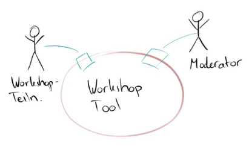
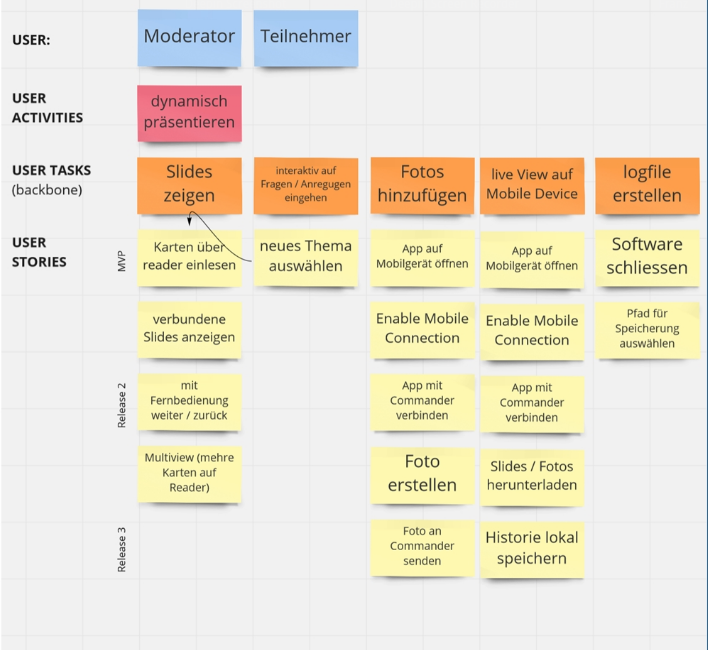

# User Story Mapping

Eine Story Map ist ein grafische, zweidimensionale Visualisierung des Produkt Backlogs. Jede Spalte ist ein Epic mit Überschrift und Stories, nach Priorität geordnet.

Entwickeln der Story Map:

## Beispiel TriHow

Entwicklung eines Workshop-Tools.

**Kontextdiagramm**:

**Stakeholdermap**:

**UC-Diagramm**:

**Story Map**:

