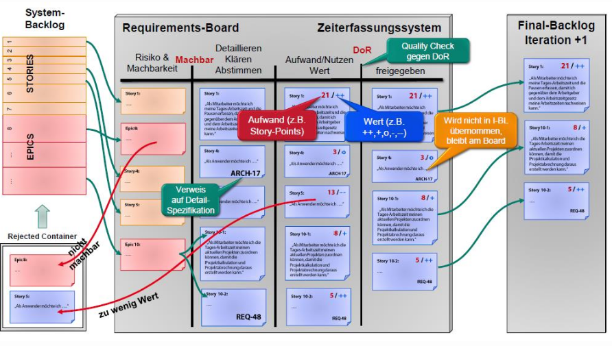

# Prüfen von Anforderungen

## Motivation, Kriterien & Prinzipien

Warum Anforderungen überprüfen?

1. **Juristisch**: Entwiklungsauftrag auf Basis eines Anforderungsdokuments. Wenn dieses falsch oder unvollständig ist, kann das zu Streitigkeiten führen.
2. **Fehlerfortpflanzung**: Fehler in den Anforderungen pflanzen sich in der Umsetzung (Code, Architektur, Tests) fort und verursachen dort hohe Kosten.

Das Ziel ist es, Fehler früh im Entwicklungsprozess zu entdecken. Fehler in diesem Zusammenhang sind _mehrdeutige_, _wiedersprüchliche_ oder _unvollständige_ Anforderungen.

**Anforderungsfreigabe**: Anhand vorher festgelegter Prüf- und Abnahmekriterien wird entschieden, ob auf dieser Basis die Entwicklung angegangen wird.

## Überpüfung von Anforderungen

Die Überprüfung von Anforderungen sollte analog zu den Zielen des Requirement Engineering die folgenenden Hauptziele beachten:

* **Inhalt**: Wurden alle relevanten Anforderungen ermittelt und im erforderlichen Detaillierungsgrad erfasst?
* **Dokumentation**: WUrden die Anforderungen gemäss der festgesetzten Dokumentations. Spezifikationsvorschriften dokumentiert?
* **Abgestimmtheit**: Stimmen alle Stakeholder mit den dokumentierten Anforderungen überein und sind alle bekannten Konflikte gelöst?

### Prüfkriterien "Inhalt"

* Vollständigkeit: Alle notwendigen Informationen für jede Anforderung
* Verfolgbarkeit: Alle relevanten Anforderungsquellen
* Korrektheit / Adäquatheit: Bedürfnisse der Stakeholder
* Keine Widersprüche bei den Anforderungen
* Keine vorzeitigen Entwurfsentscheidungen, Lösungen nicht vorwergnehmen
* Überprüfbarkeit: Abnahme und Prüfkriterien
* Notwendigkeit: Jede Anforderung trägt zur Zielerfüllung bei

### Prüfkriterien "Dokumentation"

* Konformität zum Dokumentationsformat und zur Dokumentenstruktur: Schablonen, Modelliersprache
* Verständlichkeit: Begriffe erklärt, Glossar
* Eindeutigkeit: Sprachlich eindeutig
* Konformität mit Dokumentationsregel: Syntax der Modelliersprache usw.

### Prüfkriterien "Abgestimmtheit"

Weil Stakeholder im Verlauf des RE-Prozesses neues Wissen über das geplante System erwerben, können sich auch bestimmte Anforderungen ändern-

* Abstimmung: Jede Anforderung mit allen relevanten Stakeholdern abstimmen
* Abstimmung nach Änderung: Erneute Zustimmung nach Änderung
* Konflikt: Alle bekannten Konflikte auflösen

## Prinzipien der Prüfung von Anforderungen

1.  Beteiligung der richtigen Stakeholder
2. Trennung von Fehlersuche und Fehlerkorrektur
3. Prüfung aus unterschiedlichen Sichten
4. Geeigneter Wechsel der Dokumentationsform
5. Konstruktion von Artefakten
6. Wiederholte Prüfung

# Reviews

Ein **Review** ist eine öffentliche, verbale, zwischenmenschliche Betrachtung eines Artefakts. (_=> Product Quality_)

Ein **Audit** ist eine unpersönliche Verifikation von Nachweisen des Prozesses wie beispielsweise eine Dokumentation (_=> Process Quality_)

Ein **Akzeptanztest** ist ein Black-Box-Test bei der Produktabnahme, in Scrum als fälschlicherweise "Sprint _Review_" bezeichnet. (_=> Validation_)

## Reviews nach Objekten

### Management Review

Betrifft **Prozesse**, z.B. Review des Projektmanagement-Plans.

### Technical Review

Betrifft das Produkt, z.B. Review der Systemspezifikation.

## Review Typen

* Inspektion
* Team Review
* Walkthrough
* Pair Programming
* Peer Deskcheck
* Passaround
* Ad Hoc Review

## Reviews im Projektzyklus

* Customer Requirements => Feasability Review
* Detailed Requrement => Requirements Review
* System Design => Prelim. Design Review, Critical Design Review
* Detailed Design => Source Code Review, Product Release Review

## Dauer und Zeitpunkt

Eine Review-Stizung sollte nicht nicht länger als ein bis maximal zwei Stunden dauern. Beim klassischen Projektverlauf sind Reviews eng an den Projektzyklus gekoppelt, und müssen dann angesetzt werden, wenn die zu überprüfenden Artefakte vorliegen.

Reviews bringen mehr, je früher man den Fehler entdeckt (besser bereits die Anforderungen und Konzepte reviewen als den Code und Detail-Design).

## Vorgehen

* Erfolg hängt von der persönlichen Dynamik ab, flexibel sein wer wessen Arbeit reviewed.
* Nicht wertend sein
* Fehler nicht an die grosse Glocke hängen, sondern lokal lösen§
* Artefakte einige Tage vorher zur Verfügung stellen
* Entdeckte Fehler und Probleme protokollieren

## Meilensteine

Ein geplanter Zeitpunkt im Projektverlauf an dem vorher festgelegte Zwischenergebnisse vorliegen, die es erlauben den Projektfortschritt zu messen.

Ein Meilenstein ist erreicht, wenn die geforderten Artefakte vorliegen und die Überprüfung (Reviews, Tests) erfolgreich war.

# Anforderungsüberprüfung in hybriden Projekten

Im Gegensatz zum klassischen Modell werden die Anforderungen im Produkt Backlog nur grob erfasst und erst im Rahmen der Sprintplanung präzisiert. Es gibt deshalb keinen einzelnen Zeitpunkt, an dem eine generelle Anforderungsüberprüfung möglich ist.

In Scrum unterstützen diese drei Institutionen die Anforderungsüberprüfung:

* **Backlog-Grooming**: Priorisierung der Anforderungen, gegenseitige Abhängigkeit
* **Retrospektive**: Qualität der Anforderungen
* **Sprint-Abnahme**: Laufende Ergänzung und neue Abstimmung

## Requirements Board / Backlog Grooming

