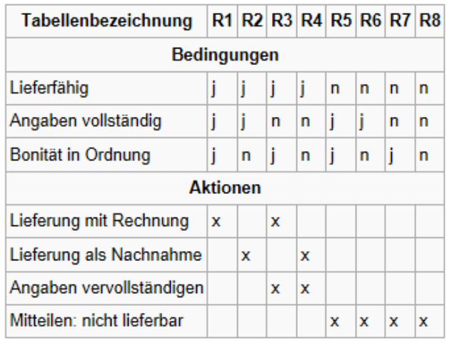
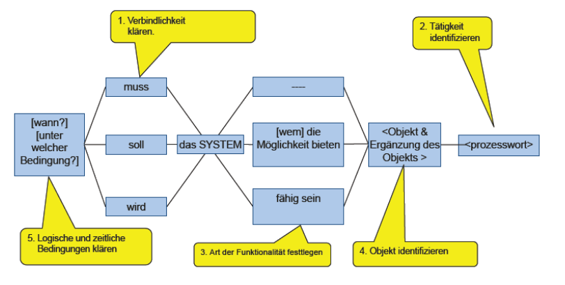
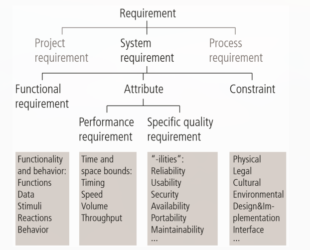

# Anforderungen in der Umgangssprache formulieren

* **Transformationsprozesse**: persönliches Wissen und Wahrnehmung sowie das Formulieren dieses Wissens in Sprache führen zur Wahrnehmungs- und Darstellungstransformation
* **Sprachlich Effekte**: Sprache ist mehrdeutig, am Entwicklungsprozess sind viele unterschiedliche Menschen mit beteiligt (Wissen, Kultur, soziale Prägung)
* **unterschiedliche Interpretation**

## Grundlegende Regeln

* Anforderungen in ganzen Sätzen
* Formulierungen im Aktiv
* Begriffe konsistent verwenden, keine Synonyme & Homonyme
* Glossar erstellen für verwendete Begriffe
* Prozesse durch Vollverben formulieren
* Keine Nominalisierungen (_Daten archivieren_ statt _Archivierung_)
* Spezifische Substanzive (_Bibliothekar_ statt _Benutzer_)
* Keine Universalquantoren (_die gespeicherten Registrierungsdaten_ statt _alle Benutzerdaten_)
* Vollständig spezifierte Bedingungen (Wenn ein _falls etwas_, dann auch ein _falls nicht_).
* Vollständig spezifizierte Prozesswörter (_Nicht zugelassene Kunden werden nicht angezeigt_ was, wannn wie und wem wird in diesem Fall etwas angezeigt?)

## Entscheidungstabelle

## Satzschablonen

Satzschablonen verwenden zur Fehlerminimierung:

## Arten von Aktivitäten

1. **Selbständige Systemaktivität**: Das Bibliotheksystem (BS) muss dem Bibliothekar (B) spezifische Kundendaten anzeigen
2.**Benutzerinteraktion**: Das BS muss dem B die Möglichkeit bieten, Kundendaten einzugeben
3. **Schnittstellenanforderung**: Das BS muss fähig sein, Ausleihdaten aus einer anderen Bibliothek zu empfangen

# Qualitätskriterien im RE

Ziel: Qualität im RE sicherstellen, qualitative / nichtfunktionale Anforderungen spezifizeren.

**Validierung**: Nachweis der Zweckmässigkeit von Anforderungen.

_Entwickle ich das richtige System?_

**Verifikation**: Nachweis von Korrektheit

_Entwickle ich das System richtig?_

**Mangel**: Fehlende Information, Anforderungslücke

**Fehler**: Falsche oder inkonsistente Information

# Anforderungsarten

