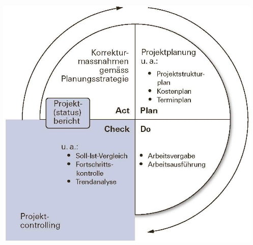

# Projektcontrolling

Controlling: **Kontrollieren** & **Steuern**, Regeln anhand von Abweichungsanalyse, SOLL/IST-Vergeichen, Datenerhebung etc.

* Zeit
* Budget
* Zielerreichung

Das Projektcontrolling dient zur Überwachung des Ist-Zustandes eines Projekts.

## Controlling im PDCA-Modell

* Plan
* Do
* Act
* Check

## Earned Value

        TODO
