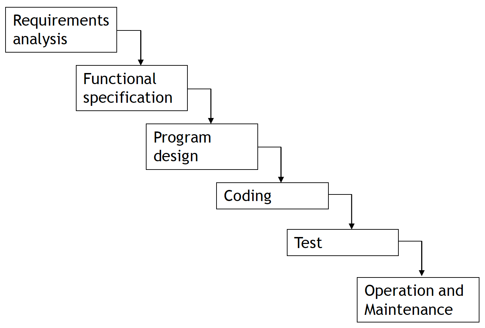
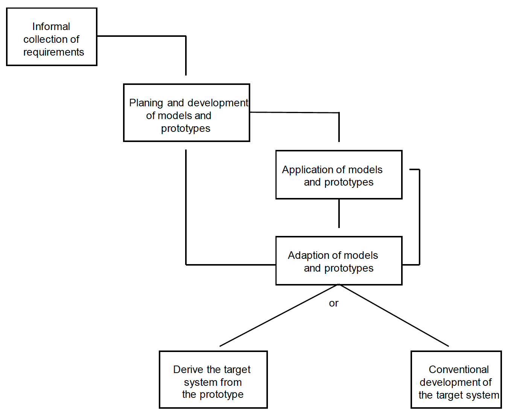
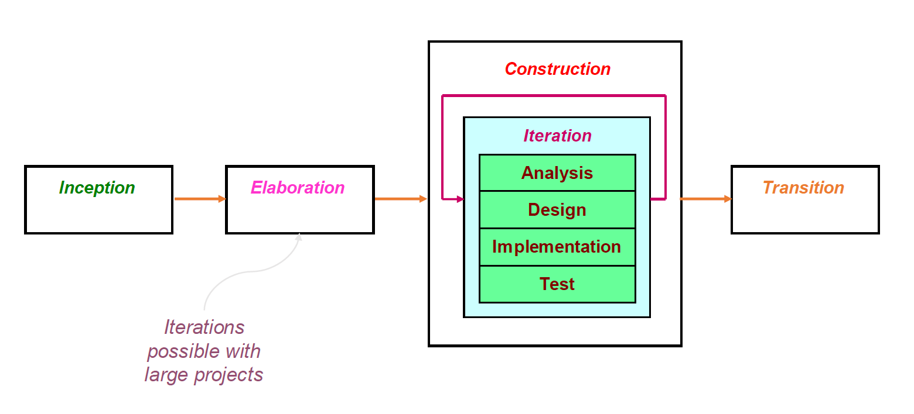
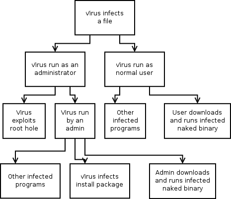

# Security Requirements

Was ist Sicherheit?

* **Safety**: Gefährliche Situationen vermeiden, Alarmierung (Flugzeugabsturz, Brand, etc.), Schutz von Menschen und Umgebung
* **Security**: Schutz von Computersystemen vor unerlaubtem Zugriff / Verwendung von Ressourcen.

Security *kann* Auswirkungen auf Safety haben.

## Perimeter Security

Schutz an den Systemgrenzen:

* *Firewall*
* *Access Control*
* *Antivirus Software*

Perimeter Security ist heute nicht mehr ausreichend, das die Systemgrenzen immer unklarer werden: viele Applikation mit direkter Verbindung nach Draussen.

Da Betriebssysteme tendenziell sicherer werden, sind Applikation in der Regel der einfachste Angriffspunkt:

* Security wird oft nicht sehr hoch gewichtet
* Softwareentwickler != Security Experte
* Fokus auf Funktionalität
* Zeitdruck
* Unfertige / unsichere Software wird released und anschliessend gepatcht
* Kunden haben keinen Einfluss auf die Sicherheitslücken in Applikationen und müssen sich auf Perimeter Security verlassen.

## Intrusions

1. *Infection*
2. *Exploit*
3. *Payload*

Eine _Infection_ geschieht grundsätzlich über den Input einer Appllikation. Damit sind alle Bitstrings gemeint, die das System erreichen, egal ob sie von einem externen User, einem internen User, einem externen Server oder als E-Mail Anhang in das System kommen.

Ein _Exploit_ ist ein Weg, eine Schwachstelle (*Vulnerability*) im System auszunutzen.

Vulnerabilities sind Programmierfehler, die ausgenutzt werden um die _Payload_ in das System zu bringen. Das können auch "indirekte" Fehler sein, wie beispielsweise falsches Memory Management.

Grundsätzlich enthält jedes System mit einer gewissen Komplexität Fehler. Durch saubere und intelligente Softwareentwicklung und die Berücksichtigung von Sicherheitsaspekten können Systeme aber _relativ_ sicher gemacht werden.

Trotzdem ist Security nicht nur ein Programmierproblem. Security muss von Anfang an und in allen Pahsen der Softwareentwicklung berücksichtigt werden und sollte nicht isoliert von Deployment und Operation betrachtet werden.

## Software Engineering & Security

Software Engineering befasst sich mit der _kosteneffizenten_ Entwicklung von Software mit _hoher Qualität_. Dies beinhaltet folgende Aspekte:

* Construction
* Control
* Rollout
* Operation & maintenance

Bei der *Kosteneffizient* sollte vor allem beachtet werden, dass ca. 80% der Gesamtkosten für den Unterhalt und nur etwa 20% für die Entwicklung aufgewendet werden müssen.

Bei der *Qualität* sollte vor allem beachtet werden, dass mehr als die Hälfte aller Bugs aus Missverständnissen / Ungenauigkeiten in der Spezifikation kommen und etwa 25% aus Design-Entscheiden. Besonders die Bugs auf fehlerhaften Spezifikatione sind sehr teuer zum Beheben.

# Process Models

* Waterfall
* Prototyping
* Unified Process
* Agile Development
* SCRUM
* Devops

## Wasserfall-Modell

Eigenschaften:

* Lineare Sequenz von Aktivitäten
* Einfache Definition von Meilensteinen
* Einfaches Projektmanagement
* Wenig Freiheit für Entwickler

Jedes dieser Modelle beschreibt einen Ablauf von Aktivitäten und hat im Bezug auf Security gewisse Stärken & Schwächen.

Das Problem des Wasserfall-Modells ist die fehlende Flexibilität, da vieles schon früh festgelegt werden muss und nachträglich nicht mehr geändert werden kann.

## Prototyping

Eigenschaften:

* Iteratives Vorgehen
  Felxible Reaktion auf Benutzeranfragen möglich
* Mehr Freiheit für Entwickler

Problem: Schwer zu managen, Meilensteine sind schwer zu definieren, quick-and-dirty Lösungen bleiben in der Regel bestehen.

## Unified Process
 
 Eigenschaften:

 * Kompromiss zwischen Wasserfall und Prototyping
 * Iterative Prozedur
 * Flexible Reaktion auf Benutzeranfragen möglich
 * Wenig Freiheit für Entwickler

Problem: In bestimmten Situationen zu schwerfällig.

## Scrum

Agile Manifesto:

> We value:
> 
> * **Individuals and interactions** over processes and tools
> * **Working software** over comprehensive documentation
> * **Customer collaboration** over contract negotiation
> * **Respondign to change** over following a plan

Der Hauptunterschied zu Unified Process ist, dass Scrum _Zeit-orientiert_ ist, und nicht _Funktions-orientiert_.

## Devops

Der Begriff *Devops* beschreibt agile Softwareentwicklung in enger Zusammenarbeit mit *IT Operations*. Ziel ist eine bereichsübergreifene, effiziente Zusammenarbeit durch die Verwendung und Abstimmung spezialisierter Werkzeuge, Tools & Infrastruktur.

# Security Development Lifecycle

Microsoft™ Security Development Lifecycle:

* Training
* Requirements
* Design
* Implementation
* Verifivcation
* Release
* Response

## Pre-SDL Requirements: Training

* Inhalte und Häufigkeit festlegen
* Mindestprozentsatz definieren
* Alle Softwareentwickler sollten in Sicherheit geschult sein

## Phase 1: Requirements

* Security von Anfang an berücksichtigen im Projekt
* Identifikation von Security und Privacy Requirements
* Document Security und Bug Bars

*Bug Bars* und *Quality Gates* werden verwenden, um ein akzeptables Minimum an Security und Privacy festzulegen.

* Beispiel Bugbar: "Keine *kritischen* Vulnerabilities beim Release."
* Beispiel Quality Gate: Keine Compiler Warnungen"

## Phase 2: Design

* Sicherheitsarchitektur
* Design-Techniken
* Applikationsspezische Sicherheitsanforderungen definieren
* Threat Modellling: Systematisches Review von Threats & Mitigations

## Phase 3: Implementation

* Spezifikation Build Tools
* Statische Analyse (SAST)
* Verbotene APIs
* OS-spezifische Sicherheitsmassnahmen

## Phase 4: Verification

* Security Response Planning
* Angriffsflächen reevaluieren
* Fuzz Testing

## Phase 5: Release

### Response Plan

* Support Policy definieren
* Sofware Security Incident Response Plan (SSIRP)
* Incident Response Team
* Kontaktinformationen von Entwicklern, Marketing, Management

### Final Security Review

* Final SEcurity Review (FSR): Independant review of security ship readiness

### Archive

* Kundendokumentation aktuell
* Archivierung von Source Code, Threat Models
* Final Signoff
* Release

## Post-SDL Requirement: Response

* Ausführung des Security Response Plans

# Modelle zum sicheren Programmieren

Sicheres Programmieren bedingt eine kontinuierliche Verbesserung der Prozesse, ein einfaches Suchen nach Bugs reicht nicht aus:

* Sicherheitsanforderungen am Anfang des Prozesses definieren
* Vulnerabilities verhindern, bevor sie entstehen
* Braucht Untersützung vom Management
* Braucht Training und Ausbildung
* Braucht Tools und Automatisierung

Es gibt verschiedene Modelle, die versuchen, das gleiche abzubilden:

* Microsoft SDL
* NIST SP800-64
* OWASP SAMM

Softwareentwicklung kann in 5 Phasen eingeteilt werden, welche unterschiedliche Massnahmen erforden:

1. Requirements
2. Design
3. Coding
4. Testing
5. Deployment

## Anforderungsanalyse

Spezifikation von Anforderungen, Modellierung der Applikation / Systems:

* _collect information_
* _select_
* _structure_
* _describe_

Die Modellierung (z.B. mit UML) soll helfen die Anforderungen, System, Design zu klären.

## Sicherheit in Analyse & Design

In der Analyse ist insbesondere zu beachten, dass Anforderungen funktional oder nicht-funktional sein können. Nicht-funktionale Anforderungen müssen entweder auf funktionale Anforderungen gemappt werden doer es müssen testbare Akzeptanzkriterien definert werden.

**Funktionale Anforderungen** sind Anforderungen, die eine Funktion beschreiben die das System / Applikation erfüllen muss. Input und Output sind definert, weshalb funktionale Anforderungen einfach testbar sind.

**Nicht-funktionale Anforderungen** beschreiben *wie* ein System seine Aufgaben erfüllt, und nicht was für Aufgaben das sind. Beispiele: Performance, Security, Reusability, Safety, Robustness, Fault tolerance...

Die _Core Values_ von Security:

* **C** - Confidentiality
* **I** _ Integrity
* **A** - Availability

Sicherheitsanforderungen können auf verschiedene Arten gefunden werden:

* Standardisierte Kataloge
  * _Common Criteria_
  * _OWASP_
  * _MS SDL_
  * _Rechtliche Anforderungen_
* Kontext der Applikation
* Threat Modeling
* Misuse Cases suchen

## Threat Modeling

Strukturierte Methode zur Analyse von Assets, Risiken und Angriffen. Bildet die Grundlage zur Festlegung von Gegenmassnahmen (_Mitigations_).

1. **Asset**
2. **Vulnerabilitiy**
3. **Threat**
4. **Exploit**
5. **Mitigate**

**Trust Boundaries**: Sing Systemgrenzen mit Datenflüssen die von einem System in ein anderes gehen.

## Risikoidentifikation (STRIDE)

1. **S** - Spoofing
2. **T** - Tampering
3. **R** - Repudiation
4. **I** - Information Disclosure
5. **D** - Denial of Service
6. **E** - Evation of Privilege

## Risikobewertung (DREAD)

Threat bewerten mit (3 - High, 2 - Medium,1 - Low)

- Damage
- Reproducibility (Immer, bestimmte Zeitfenster, schwer zu reproduzieren)
- Exploitability
- Affected users
- Discoverability

Probleme: qualitative, subjektive Analyse. Nicht quantifizierbar.

## Thread Modeling (OWASP)

- 4 x 4 Faktoren, mit 1 - 9 Punkten.
- Einteilung in Überkategorien (High, Medium, Low)

4 Überfaktoren:

- **Threat Agent**: Angreifer, Skill level, size, motive etc
- **Vulnerability**: easy of discovery / exploit, awareness, intrusion detection
- T**echnical Impact**: Loss of confidetiality / integrity / availability / accountability
- **Business Impact**: Financial, reputation, compliance, privacy violation

## Attack Tree

Besteht aus Nodes, verbunden mit AND oder OR. Jedem Node werden Kosten zugewiesen.

Damit sollen die Kosten für bestimmte Angriffe berechnet werden können. Verschiedene Möglichkeiten, die Knoten zu gewichten:

* Boolean: possible / impossible
* Kosten für Angriff
* Kosten für Verteidigung
* Zeitaufwand für Angriff
* Zeitaufwand für Verteidigung
* Erfolgswahrscheinlichkeit
* Wahrscheinlichkeit, das Angriff stattfindet

## Misuse & Mitigation Cases

Analog zu den UML _Use Cases_ können _Misuse Cases_ und _Mitigation Cases_ definiert werden:

* Misuse Case: exploit / threaten Use Cases
* Mitigation Case: Use Case to mitigate Misuse Case

Misuse Case Description:

* Misuse case name
* Misuser profile
* Description
* Basic path
* Alternative paths
* Triggers
* Assumptions
* Mitigation

# OWASP Top 10

Web Application vulnerabilities:

1. Injection
2. Broken Authentication
3. Sensitive Data Exposure
4. XML External Entities
5. Broken Access Control
6. Security Misconfiguration
7. Cross-Site Scripting (XSS)
8. Insecure Deserialization
9. Using Components with known vulnerabilities
10. Insufficient logging & monitoring

## Injections

Interfaces, die eine Kombination aus Befehlen und Parameter (Daten) entgegennehmen sind anfällig für Injections:

* SQL query
* OS command
* LDAP query
* XML / XML-basiertes DSL
* HTML / JavaScript

Kann oftmals durch Input Validation verhindert werden.

**In-Band Injection**: Angreifer erhält das Resultat der Injection auf dem gleichen Weg, wie die Injection abgesetzt wurde. Beispiel: SQL Injection mit HTTP GET.

**Out-of-Band Injection**: Angreifer erhält das Resultat auf einem anderen Kanal. Beispiel: HTTP POST Request an Notification Service mit Daten in Notification Email.

**Inferential / blind**: Angreifer erhält das Resultat der Injection nicht, kann aber Statusänderungen des Systems beobachten und daraus Schlüsse ziehen.

**Second Order Attack**: Payload wird nicht an das Ziel direkt geschickt, sondern an ein Zwischensystem.

### Gegenmassnahmen

* Input Sanitation: Gefährliche Zeichenketten eliminieren
* Input Validation: Syntaktische und semantische Korrektheit sicherstellen
* Sichere parameterisierte Interfaces verwenden
* Angriffsfläche reduzieren: Nicht-standard Funktionen disablen

## XSS and Client side injections

njection von JavaScript durch Ausnutzung von Vulnerabilities der Web Applikation. Wird genutzt zum:

* Download von Dateien
* Keylogging
* User Sessions stehlen
* Weiterleiten
* etc.

### Gegenmassnahmen

* Vailidate / sanitize input
* Escape output
* Content-Security-Policy headers
* Filter, Web applicaion firewall

## Broken Authentication

* Subject: User / entity interacting with system
* Principal: Indentifying information (username)
* Credential: Proof of identity (password)

**Weak authentication**: Typischerweise Passwort-basiert, normalerweise in vernünftiger Zeit knackbar.

**Strong authentication**: Multifaktor oder Zertifikat-basiert.

## Broken Access Control

* **DAC** - Discretionary: USers can change access control rules (social media, file system) 
* **MAC** - Mandatory: Users cannot change access control rules (unix root)
* **RBAC** - Role Based: Permissions are given to roles (OS)
* **ABAC** - Attribute Based: Decisions are made based upon proterties of subject and object
* **Policy Based**:  Rules are external

**Open Policy**: Permits acces unless explicit deny

**Closed Policy**:: Denies access unless explicit permit

Acess Control wird entweder komplett umgangen (unsichere Objektreferenzen) oder durch _Elevation of Privilege_ / Manipulation von Metadaten ausgehebelt.

# Handling untrusted input

Was muss beachtet werden, wenn Input validiert werden soll:

* Quelle: Legitimer User / System?
* Grösse: realistisch?
* Lexikalische Korrektheit (nur unterstützte Zeichen)
* Korrekte Syntax (korrektes Format, passt zu Schema)
* Semantisch korrekt (existiert dieses Konto / ...)

# Security Principles

* **Minimum Exposure**
  * Deploy / install only necessary components
  * Don't use serialization
  * Expose only necessary funtionality
* **Simplicity**
  * Reduce complexity
  * less LOC, libraries, interfaces etc.
* **Defense in depth**
  * Multiple controls
  * Redundancy within reason
* **Least privilege**
  * for users
  * for processes
* **Compartmentalization**
  * Segment according to function
  * Contain risky parts 
* **Minimum trust and maximum trustworthiness**
  * Do not just trust third parties
  * Validate all incoming data
  * Supply truswothi data
* **Treaceability and complete mediation**
  * Log all requests
  * Login attempts

