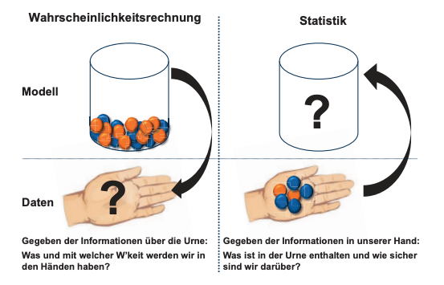
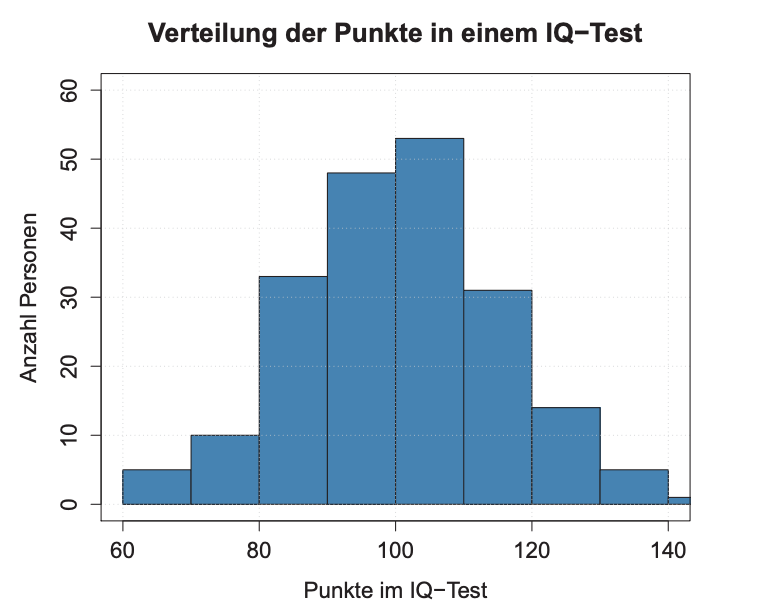
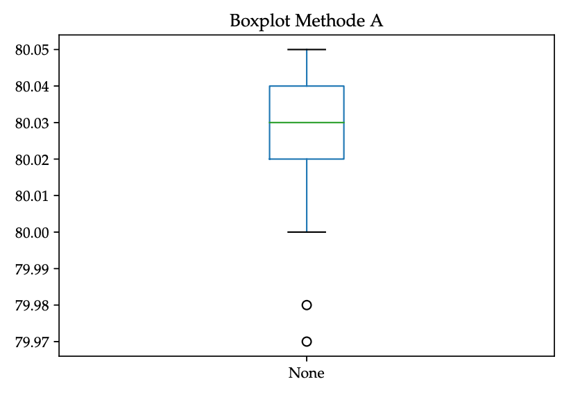
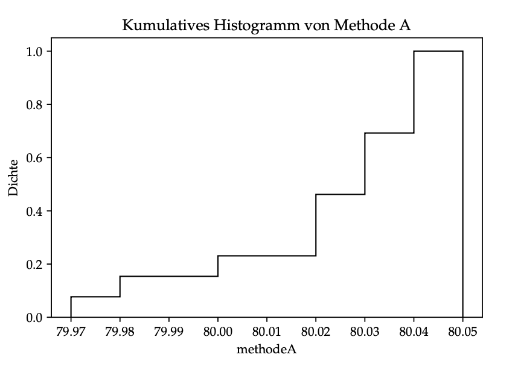
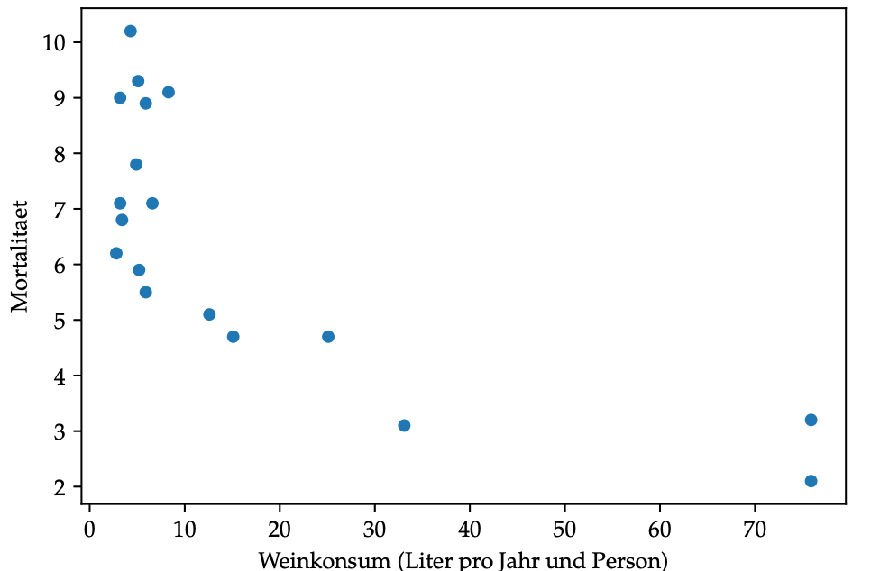
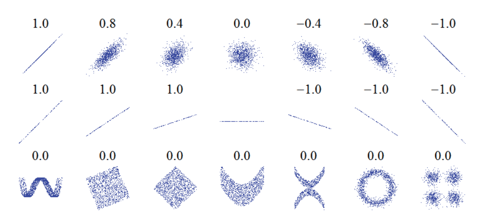
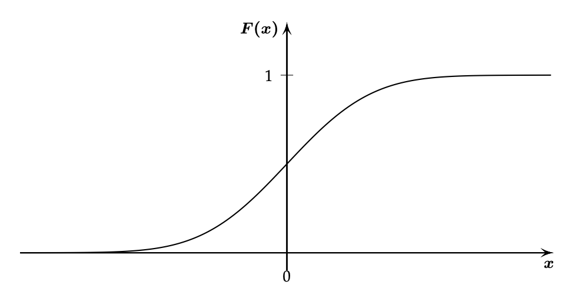
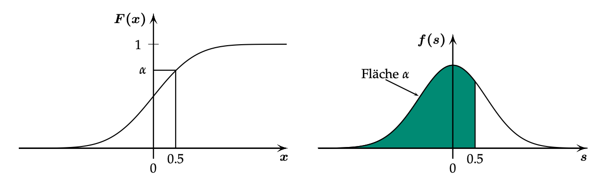
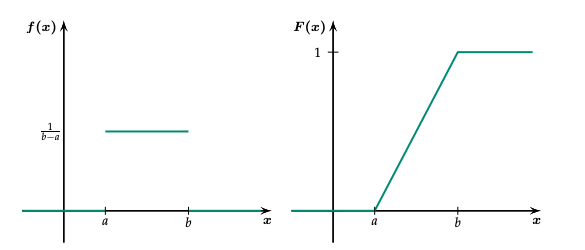

# Allgemeines

Zusammenfassung des Vorlesungsskripts FS19 zum Modul 'Statistics for Data Science' an der HSLU. Dieses Dokument beinhaltet den zusammengefassten Inhalt des Vorlesungsskripts für das FS 19, der Folien und Übungen.

## Konventionen bei der Klammernotation

Bei der Darstellung von Werte- und Definitionsbereichen gelten folgende Konventionen:

* Bei einer runden Klammer liegt der Wert ausserhalb des Bereiches
* Bei einer eckigen Klammer liegt innerhalb des Bereiches

Der Wertebereich $(a,b]$ beinhaltet also alle Punkte $x > a$ und $x <= b$.

## Darstellung von Messwerten

Relevant für die Darstellung von Messwerten sind vor allen die _Nachkommastellen_ und die _signifikanten Stellen_. Als signifikante Stellen bezeichnet man alle Stellen von der ersten, sich von Null unterscheidenden Stelle bis zur Rundungstelle. Als Nachkommastellen bezeichet man die Stellen rechts des Kommas.

| Zahl              | Signifikante Stellen  | Nachkommastellen  |
|                ---:|                    ---:|                ---:|
| $23.45$           |                     4 |                 2 |
| $0.0023$          |                     2 |                 2 |
| $1.12 \cdot 10^6$ |                     3 |                 2 |

Die beiden _Messzahlen_ $20$ und $20.00$ sind also nicht gleichbedeutend, da sie einen Unterschied in der Messgenauigkeit nahelegen.

Daraus ergeben sich folgende Regeln für das Rechnen mit Messzahlen:

1. Das Ergebnis einer Addition / Subtraktion hat gleich viele Nachkommastellen wie die Zahl mit den wenigsten Nachkommastellen.
2. Das Ergebnis einer Multiplikation / Division hat gleich viele signifikante Stellen, wie die Zahl mit den wenigsten signifikanten Stellen.
3. Rundungen sollten möglichst spät im Rechenvorgang gemacht werden. Für Zwischenresultate sollte mindestens eine Stelle mehr als im Endresultat angegeben werden.

# Was ist Statistik

_Wahrscheinlichkeiten_ werden in der Alltagssprache im Zusammenhang mit Vermutungen und Vorhersagen verwendet, bei denen man nur unvollständige Informationen hat.

In der Naturwissenschaft möchte man ein physikalisches System mit _unvollständigen Kenntnissen_ so allgemein wie möglich beschreiben. Diese Beschreibung ist aber auch nur eine Vermutung ($\rightarrow$ _Modell_). Kein System kann vollständig beschrieben werden, aber es gibt bessere und schlechtere Modelle. Die _Stochastik_ hilft uns dabei, bessere Vermutungen anzustellen.

> Die **Stochastik** (von lateinisch _ars conjectandi_, also ‚Kunst des Vermutens‘, ‚Ratekunst‘) ist ein Teilgebiet der Mathematik und fasst als Oberbegriff die Gebiete Wahrscheinlichkeitstheorie und Mathematische Statistik zusammen. Als stochastisch werden Ereignisse oder Ergebnisse bezeichnet, die bei Wiederholung desselben Vorgangs nur manchmal eintreten und deren Eintreten für den Einzelfall nicht vorhersagbar ist.

$\rightarrow$ _https://de.wikipedia.org/wiki/Stochastik_

## Beispiel Münzwurf

Wüsste man die exakte Masseverteilung, Anfangsposition und -geschwindikeit der Münze sowie die Position und Geschwindigkeit aller Luftmoleküle, könnte man vermutlich mit Hilfe der Mechanik berechnen auf welcher Seite die Münze landen wird.

Da wir nie alle Informationen haben können, treffen wir Annahmen (_"die Münze ist fair"_) und überprüfen, wie gut diese mit den Beobachtungen nach vielen Münzwürfen zusammenpasst. Mit Stochastik wird also die Plausibilität eines Modelles geprüft.

## Unterschiede zur Wahrscheinlichkeitsrechnung

Stochastik als Teilgebiet der Mathematik fasst als Oberbegriff die Gebiete Wahrscheinlichkeitsrechnung un d Statistik zusammen.

In der Wahrscheinlichkeitsrechnung ist in der Regel das Modell bekannt, während in der Statistik aufgrund vorhandener Daten versucht wird Rückschlüsse auf die Realität zu ziehen.

Eine typische Aufgabe der Wahrscheinlichkeitsrechnung ist beispielsweise die folgende:

> In einer Urne befinden sich drei rote und fünf blaue Kugeln. Wie gross ist die Wahrscheinlichkeit, eine blaue Kugel zu ziehen?

Unter der Annahme, dass jede Kugel mit gleicher Wahrscheinlichkeit gezogen wird, kommt man zum Schluss, dass die Wahrscheinlichkeit, eine blaue Kugel zu ziehen $\frac{5}{8}$ ist.

Dieses Modell kann überprüft werden, indem wir viele Male eine Kugel aus der Urne ziehen und wieder zurücklegen. Entsprechen die Resulate in etwa der Vermutung, gibt es keinen Grund, am Modell zu zweifeln.

Weichen die Resultate aber wesentlich von der Annahme ab, wird wohl etwas mit dem Modell nicht stimmen. So kann es beispielsweise sein, dass die blauen Kugeln immer an den Boden der Urne rutschen und deshalb weniger gezogen werden.



In der praxisorientierten Anwendungen ist das Modell in der Regel unbekannt. Durch wiederholtes Ziehen erstellt man eine Vermutung über das Verhältnis von roten und blauen Kugeln. Werden in hundert Versuchen beispielsweise 40 blaue Kugeln gezogen, könnte man vermuten, dass etwa 40% der Kugeln blau sind.

Die Statistik ist ein Hilfmittel zur Überprüfung, wie gut eine Beobachtung zu einer Vermutung (Modell) passt.

# Deskriptive Statistik

Die deskriptive Statistik befasst sich mit der Darstellung von Datensätzen, indem diese durch gewisse Zahlen (_Mittelwert_, _Median_ usw.) charakterisiert und, beispielsweise als Histogramm, grafisch dargestellt werden.

Ein Ziel der deskriptiven Statistik ist also das Zusammenfassen von Daten zu Kennzahlen, die wichtige Merkmale der Daten hervorheben.

## Kennzahlen

Um Datensätze numerisch zusammenzufassen, verwendet man meistens zwei Kenngrössen. Eine beschreibt die mittlere Lage der Messwerte, die andere die durchschnittliche Abweichung der Messwerte von der mittleren Lage.

### Arithmetisches Mittel

Die bekannteste Grösse für die mittlere Lage ist der _Durchschnitt_ oder das _arithmetische Mittel_:

$$ \bar{x} = \frac{x_1 + x_2 + \ldots + x_n}{n} = \frac{1}{n} \sum_{i=1}^{n}x_i = \bar{x_n}$$

Berechung in Python:

```python
import pandas as pd
data = pd.Series([33,12,42,11,76,34])
data.mean()
```

### Empirische Varianz und Standardabweichung

Das arithmetische Mittel beschreibt Datensätze nur unvollständig, weil damit keine Aussage über die Streuung der Werte um den Mittelwert gemacht werden kann. Diese Streuung wird durch die _empirische Varianz_ und die _empirische Standardabweichung_ ausgedrückt:

$$ Var(x) = \frac{(x_1 - \bar{x_n})^2 + (x_2 - \bar{x_n})^2 + \ldots + (x_n - \bar{x_n})^2}{n - 1} = \frac{1}{n-1}\sum_{i=1}^{n}(x_i - \bar{x_n})^2 $$

$$s_x = \sqrt{Var(x)} = \sqrt{\frac{1}{n-1}\sum_{i=1}^{n}(x_i - \bar{x_n})^2}$$

Bei der Varianz quadriert man, damit sich positive und negative Werte nicht gegenseitig aufheben können. Die Standardabweichung ist die Wurzel der Varianz. Der Wert der empirischen Varianz hat keine physikalische Bedeutung.

Berechung mit Python:

```python
# variance
data.var()
# standard deviation
data.std()
```

### Median

Der Median ist ein weiteres Lagemass für die mittlere Lage. Es handelt sich dabei um den Wert, bei dem die Hälfte der Messwerte unterhalb von diesem liegen. Bei einem sortierten Datensatz ist der Median der Wert der mittleren Beobachtung. Ist die Anzahl der Beobachtungen gerade, nimmt man den Mittelwert der beiden mittleren Beobachtungen.

Berechunung mit Python:

```python
data.median()
```

Ein Vorteil des Medians ist seine _Robustheit_, das heisst, dass er von Aussreissern weniger beeinflusst wird als das arithmetische Mittel.

### Quartile & Quantile

Das _untere Quartil_ ist der Wert, bei welchem (etwa) 25% aller Beobachtung kleiner oder gleich gross sind. Dementsprechend ist das _obere Quartil_ ist der Wert bei dem (etwa) 75% der Werte kleiner oder gleich gross sind.

```python
# 1. quartile
data.quantile(q=.25)
# 2. quartile (median)
data.quantile(q=.5)
```

Da die meisten Datensätze nicht genau durch vier teilbar sind, gibt es für die Quartile, je nach Definition, leicht unterschiedliche Werte. Mit der Option `interpolation` kann eine der folgenden Implementationen ausgewählt werden:

* `"linear"`
* `"lower"`
* `"higher"`
* `"midpoint"`
* `"nearest"`

```python
# 1. quartile
data.quantile(q=.25, interpolation="linear")
```

Die _Quartilsdifferenz_ ist ein weiteres Streuungsmass. Es misst die Länge des Intervalls, das die Hälfte der mittleren Beobachtungen enthält:

```python
q75, q25 = methodeA.quantile(q = [.75, .25])
# iterquartile range
iqr = q75 - q25
```

_Quantile_ sind eine Verallgemeinerung des Konzept der Quartile auf jede andere Prozentzahl. Der Median beispielsweise entspricht dem 50%-Quantil. Die exakte Definition für das empirische $\alpha$-Quantil lautet:

$$\frac{1}{2}(x_{\alpha n} + x_{(\alpha n+1)})\text{, falls $\alpha \cdot n$ eine natürliche Zahl ist},$$

$$x_{(k)} \text{ wobei $k$ die Zahl $\alpha \cdot n$ aufgerundet ist, falls } \alpha \cdot n \notin N.$$

```python
# 20%, 40%, 60%, 80% und 100% Quantil
import numpy as np
data.quantile(q = np.linspace(start=0.2, stop=1, num=5))
```

## Graphische Methoden

### Histogramm

Bei einem Histogramm werden sogenannte Klassen gebildet, die jeweils einen Ausschnitt des Beobachtungsbereiches darstellen.

Beispiel eines Histogramms von dem Ergebnis eines IQ-Tests von 200 Personen mit Klassenbreite 10:



Regeln für das Erstellen eines Histogramms:

* 5 bis 7 Klassen bei weniger als 50 Messungen
* 10 bis 20 Klassen bei mehr als 250 Messungen
* Die Anzahl Klassen kann auch mit der _Sturges-Regel_ berechnet werden:

$$ k = 1 + \log_{2} n = 1 + 3.3 \log_{10} n \text{ , wobei $n$ die Anzahl Messungen ist.}$$

Histogramm mit Python:

```python
import matplotlib.pyplot as plt

data.plot(kind="hist", edgecolor="black")
plt.title("Histogramm von Methode A")
plt.xlabel("methodeA")
plt.ylabel("Haeufigkeit")
plt.show()
```

Die `plot`-Funktion von `matplotlib` wählt standardmässig 10 Klassen. Dies kann mit der Option `bins` geändert werden:

```python
data.plot(kind="hist", bins=7, edgecolor="black")
```

Oft ist es übersichtlicher, die Balkenhöhe so zu wählen, dass die Balkenfläche dem prozentualen Anteil der jeweiligen Beobachtungen an der Gesamtzahl der Beobachtungen entspricht. Die Gesamtfläche aller Balken muss dann gleich eins sein.

```python
methodeA.plot(kind="hist", normed=True, edgecolor="black")
plt.title("Normiertes Histogramm von Methode A")
plt.xlabel("methodeA")
plt.ylabel("Dichte")
plt.show()
```

### Boxplot

Der Boxplot besteht aus

* einem Reckteck, dessen Höhe vom unteren und oberen Quartil begrenzt wird
* Linien vom Rechteck zum kleinsten / grössten _normalen_ Wert (maximal 1.5 mal die Quartilsdifferenz entfernt vom unteren / oberen Quartil entfernt)
* einem horizontalen Strich für den Median
* kleinen Kreisen, die Ausreisser markieren.

```python
data.plot(kind="box", title="Boxplot Methode A")
```



Mehrere Boxplots gleichzeitig darstellen:

```python
methode = DataFrame({
    "methodeA": methodeA,
    "methodeB": methodeB
})
methode.plot(kind="box", title="Boxplot von Methode A und B")
```

### Empirische kumulative Verteilungsfunktion

Die _empirische kumulative Verteilungsfunktion_ ist eine weitere graphische Darstellung von Daten. Es handelt sich dabei um eine Treppenfunktion, die wie folgt definiert ist:

$$F_n(a) = \frac{1}{n} \text{Anzahl}\{ i \mid x_i \le a\}$$

```python
methodeA.plot(kind="hist", cumulative=True, histtype="step",
normed=True, bins=8, edgecolor="black")
```



# Deskriptive Statistik zweidimensionaler Daten

Bei zweidimensionalen Daten werden an einem Versuchsobjekt jeweils zwei verschiedene Grössen gemessen.

## Graphische Darstellung mit einem Streudiagramm

Ein wichtiger Schritt bei der Untersuchung zweidimensionaler Daten ist die graphische Darstellung. Dies geschieht meistens mit einem _Streudiagramm_ (scatterplot).

Streudiagramm in Pyhon anhand des Beispiels "Weinkonsum und Mortalität in industrialisierten Ländern":

```python
import pandas as pd
from pandas import DataFrame, Series
import numpy as np
mort = DataFrame({
"wine": ([2.8, 3.2, 3.2, 3.4, 4.3, 4.9, 5.1, 5.2, 5.9, 5.9,
6.6, 8.3, 12.6, 15.1, 25.1, 33.1, 75.9, 75.9]),
"mor": ([6.2, 9.0, 7.1, 6.8, 10.2, 7.8, 9.3, 5.9, 8.9, 5.5,
7.1, 9.1, 5.1, 4.7, 4.7, 3.1, 3.2, 2.1])
})
mort.plot(kind="scatter", x="wine", y="mor")
plt.xlabel("Weinkonsum (Liter pro Jahr und Person)")
plt.ylabel("Mortalitaet")
plt.show()
```



## Einfache lineare Regression

Im vorherigen Beispiel haben wir eine negative Abhängigkeit zwischen Mortalität und Weinkonsum festgestellt. Oft wird angenommen, dass diese Anhängigkeit _linear_ ist:

$$y = a + bx$$

Es stellt sich also die Frage, wie man eine Gerade finden kann, die _möglichst gut_ zu allen Punkten passt.

Dazu gibt es verschiedene Ansätze:

### Methode der kleinsten Quadrate

Beispielsweise könnte man die Gerade so wählen, dass die Summe der vertikalen Differenzen aller Punkte zur Geraden möglichst klein ist. Die vertikale Differenz zwischen einem Beobachtungspunkt $(x_i,y_i)$ und dem Punkt auf der Geraden $(x_i,a+b_i)$ bezeichnen wir als _Residium_. 

$$r_i = y_i ' (a + bx_i) = y_i - a - bx_i$$

Damit sich in der Summe der Residuen die negativen und positiven Werte nicht gegenseitig aufheben, werden die Quadrate der Abweichungen aufsummiert:

$$r_1^2 + r_2^2 + \cdots + r_n^2 = \sum_ir_i^2$$

Gerade finden mit Python:

```python
b,a np.polyfit(x,y, deg=1)
```

Diese Gerade wird auch _Regressionsgerade_ genannt.

Ob eine Regressionsgerade aber wirklich aussagekräftig ist, erkennt man am besten beim Betrachen des Streudiagramms. Hierbei gilt es, folgende Punkte zu beachten:

- Folgen die Punkte scheinbar keiner Gesetzmässigkeit?
- Folgen die Punkte einer nichtlinearen Gesetzmässigkeit?

Besser als durch Betrachung des Streudiagramms ist es aber, den Zusammenhang numerisch zu beschreiben.

## Empirische Korrelation


Für die quantitative Zusammenfassung der linearen Abhängigkeit zweier Grössen ist die _empirische Korrelation_ ($r$ oder $\hat{\rho}$) als Kennzahl am gebräuchlichsten.

$$r = \frac { \sum _ { i = 1 } ^ { n } \left( x _ { i } - \overline { x } \right) \left( y _ { i } - \overline { y } \right) } { \sqrt { \left( \sum _ { i = 1 } ^ { n } \left( x _ { i } - \overline { x } \right) ^ { 2 } \right) \cdot \left( \sum _ { i = 1 } ^ { n } \left( y _ { i } - \overline { y } \right) ^ { 2 } \right) } }$$

Die empirische Korrelation ist eine dimensionslose Zahl zwischen $-1$ und $1$ und hat folgende Eigenschaften:

* Ist $r = 1$, dann liegen die Punkte auf einer Geraden $y = a + bx$ mit $b > 0$
- Ist $r = -1$, dann liegen die Punkte auf einer Geraden $y = a + bx$ mit $b < 0$
- Sind $x$ und $y$ unabhängig, dann ist $r = 0$

```python
data.corr().iloc[0,1]   # Korrelation
data.corr()             # Korrelationsmatrix
```

Verschiedene Streudiagramme mit den jeweiligen Korrelation:



# Datenbereinigung

Ein häufiges Problem der Datenanalyse sind fehlende Werte im Datensatz. Bevor man diesen Datensatz entfernt oder Werte extrapoliert, sollte man verstehen, _warum_ diese Datenwerte fehlen:

1. **MCAR** (_Missing Completely at Random_): Ursache für das Fehlen ist unsystematisch
2. **MAR** (_Missing at Random_): Eine gewisse Systematik ist vorhanden, hat mit der Studie aber nichts zu tun.
3. **MNAR** (_Missing not at Random_): Nichtzufälliger Grund, Abhängigkeit von einer anderen Variable

Nur in den ersten zwei Punkten ist das entfernen oder ersetzen der fehlenden Werten zulässig. Bei _MNAR_ führt dies zu einer Verzerrung des Modells und führt deshalb nicht zu besseren Resultaten.

## Entfernen von Datenpunkten

Das Entfernen von Datenpunkten kann grundsätzlich auf zwei Arten gemacht werden:

* Listenweise Datenentfernung
* Paarweises entfernen von Datenpunkten

Im Skript wird nur die listenweise Datenentfernung behandelt.

### Listenweise Datenentfernung

Alle Daten einer Beobachtung, die fehlende Werte hat, werden gelöscht:

```python 
import pandas as pd
import numpy as np
data = {
    'Name'  : ['Hans', 'Peter', 'Werner', np.NaN, np.NaN],
    'Age'   : [45, np.NaN, 55, 88, np.NaN],
    'Sex'   : ['M', np.NaN, np.NAN, 'Yes please', np.NaN] 
}

df = pd.DataFrame(data, columns=['Name', 'Age', 'Sex'])

# Alle Zeilen die NUR aus fehlenden Werten bestehen löschen
dropna(how = 'all')                 
# Alle Zeilen mit fehlenden Werten entfernen
df.dropna()                         
# Alle Spalten, die nur fehlende Werte enthalten entfernen
df.dropna(axis = 1, how = ’all’)    
# Schwellenwert für die Anzahl fehlender Beobachtungen festlegen
df.dropna(thresh = x)               
```

### Paarweises Entfernen von Datenpunkten

Das paarweise Enfernen von Datenpunkten wird nicht im Skript behandelt.

### Weglassen von Variablen

Falls mehr als 60% der Beobachtungen fehlen, kann eine Variable auch weggelassen werden, sofern sie nicht wichtig ist. Datenmanipulation ist dem Weglassen von Variablen in der Regel aber vorzuziehen.

## Data Imputation

Fehlen bei einer Messgrösse für bestimmte Beobachtungen Werte, so werden diese durch

* den Mittelwert oder Median bei numerischen Variablen
* den häufigsten Wert ($\to$_Modus_) bei kategorialen Variablen

der vorhandenen Werte der entsprechenden Messgrösse ersetzt. Das funktioniert gut, wenn die Werte völlig zufällig fehlen.

```python
import pandas as pd
import numpy as np
from sklearn.preprocessing import Imputer

data = {
    'Name'  : ['Hans', 'Peter', 'Werner', np.NaN, np.NaN],
    'Age'   : [45, np.NaN, 55, 88, np.NaN],
    'Sex'   : ['M', np.NaN, np.NAN, 'Yes please', np.NaN] 
}
df = pd.DataFrame(data, columns=['Name', 'Age', 'Sex'])
values = df[["Age","Goals","Assists","Value"]].values

imputer = Imputer(missing_values = 'NaN', strategy = 'mean', axis = 0, verbose = 0, copy = True)
transformed_values = imputer.fit_transform(values)
df_new = pd.DataFrame(transformed_values, columns=['Age'])
print(df_new)
# TODO: Fix code
```

Weitere API: `fancyimpute.SimpleFill()`

# Modelle für Messdaten

Häufig hat man nicht mit Zähldaten, sondern mit Messdaten zu tun. Diese können grundsätzlich Werte in einem bestimmten Messbereich annehmen und haben eine bestimmte Messgenauigkeit.

## Diskrete Wahrscheinlichkeitsverteilung

Eine Zufallsvariable $X$ ordnert jedem Zufallsexperiment genau eine Zahl zu. Wir können somit $X$ auch als Funktion auffassen.

**Beispiel Personen und Körpergrösse:**

Zufällige Person (Hubert) mit Grösse 173:

$$X(Hubert) = 173$$

Der Ausdruck  $X = 173$ beschreibt das _Ereignis_, eine Person mit Grösse 173 ausgewählt zu haben (Menge der Personen mit Grösse 173).

Der Ausdruck $x = 173$ beschreibt die _Realisierung_ von $X$ ($\to$ eine Zahl).

Diesem Ereignis können wir eine Wahrscheinlichkeit $P(X = 173)$ zuordnen. Dies kann für alle $x$ oder eine Teilmenge berechnet werden:

* P(X = x)
* P(X = 250) = 0
* P(X $\ge$ 180)

Zusammenfassend:

* $X$ ist eine Funktion
* $x$ ist eine konkreter Wert
* $P(x)$ ist eine Wahrscheinlichkeit
* Die Wahrscheinlichkeitsverteilung einer diskreten Zufallsvariable kann beschrieben werden, indem man die Punktwahrscheinlichkeiten $P(X = x)$ für alle möglichen Werte von $x$ im Wertebereich angibt.

## Stetige Verteilungen

Für stetige Zufallsvariablen gilt jedoch für jedes $x$:

$P(X = x) = 0$

Um die Wahrscheinlichkeit bei stetigen Werten angeben zu können, arbeitet man mit Intervallen:

$$P(172 < X ≤ 173)$$

Diese Wahrscheinlichkeit ist **nicht** Null.
Wenn man aber alle Punktwahrscheinlichkeiten zwischen $172$ und $173$ zusammenaddiert, erhält man als Summe Null.

Deshalb brauchen wir für Wahrscheinlichkeiten bei stetigen Verteilungen die sogenannte _Wahrscheinlichkeitsdichte_.

## Wahrscheinlichkeitesdichte

Die Wahrscheinlichkeitsverteilung  einer stetigen Zufallsvariablen $X$ kann beschrieben werden, indem man die Wahrscheinlichkeiten für alle Intervalle $(a,b]$ mit $a < b$ angibt:

$$P(X \in (a,b]) =  P(a < X \le b)$$

Dazu genügt es die kumulative Verteilfunktion 

$$F(x) =  P(X \le x)$$

anzugeben, denn es gilt

$$P(a < X \le b) = F(b) - F(a)$$

Weil für stetige Zufallsvariablen $P(X = a) = P(x = b) = 0$ gilt, spielt es keine Rolle, ob wir $<$ oder $\le$ schreiben.

Die Wahrscheinlichkeit, dass eine Person zwischen 165 cm und 175 cm gross ist, können wir also folgendermassen schreiben:

$$P(165 < X < 175) = P(X < 175) - P(X < 165)$$

Kumulative Verteilfunktionen $F(x) = P(X \le x)$ haben folgende Eigenschaften:

* Es handelt sich um eine Wahrscheinlichkeit, also $0 \le F(x) \le 1$
* Sie sind monoton wachsend: für $a < b$ gilt $F(a) \le F(b)$
* Für die Ableitung von $F(x)$ gilt: $F\prime(x) \ge 0$



**Zusammenfassend:**

- Die Wahrscheinlichkeitsverteilung einer stetigen Zufallsvariablen kann durch die kumulative Verteilfunktion beschrieben werden.
- Für stetige Zufallsvariablen kann ein zur Punktwahrscheinlichkeit analoger Beriff mit Hilfe der Ableitung der kumulativen Verteilfunktion gewonnen werden.

Die _Wahrscheinlichkeitsdichte_ $f$ ist definiert als die Ableitung der kumulativen Verteilfunktion:

$$f(x) = F\prime(x)$$

Aus der Dichte kann die kumulative Verteilung bestimmt werden:

$$F(x) = \int_{-\infty}^{x}f(s)ds$$

weil $f$ eine Stammfunktion von $F$ ist und $F(-\infty) = 0$.

Die Wahrscheinlichkeit das ein Wert zwischen $a$ und $b$ liegt, entspricht der Fläche unter der Dichtekurve zwischen $a$ und $b$:

$$P(a < X \le b) = F(b) - F(a) = \int_{a}^{b}f(x)dx$$

Die Wahrscheinlichkeit das _irgendein_ Wert gemessen wird, ist $1$.

$$\int_{-\infty}^{\infty}f(x)dx = 1$$

Beispiel: $P(X \le 0.5)$:



## Kennzahlen von stetigen Verteilungen

Der _Erwartungswert_ $E(x)$ und die Standardabweichung $\sigma_x$ haben bei stetigen Verteilungen die gleiche Bedeutung wie bei diskreten:

* Der Erwartungswert beschreibt die mittlere Lage der Verteilung
* Die Standardabweichung beschreibt die Streuung

Daraus ergeben sich folgen Formeln für den Erwartungswert und Varianz:

$$E(X) = \mu_x = \int_{-\infty}^{\infty}xf(x) dx$$

$$Var(X) = \mu_x^2 = E((X -E(X))^2) = \int_{-\infty}^{\infty} (x - E(X))^2 f(x) dx$$

Daraus ergibt sich:

$$Var(x) = E(X^2) - E(X)^2$$

Quantile $q(\alpha)$ sind wie folgt definiert:

$$P(X \le q(\alpha)) = \alpha$$

Das heisst, dass die Quantile die Umkehrung der kumulativen Verteilfunktion sind:

$$F(q(\alpha)) = \alpha \Leftrightarrow F^{-1}(\alpha)$$

## Wichtige stetige Verteilungen

### Uniforme Verteilung

Eine Zufallsvariable $X$ mit Wertebereich $W_X = [a,b]$ heisst Uniform verteilt, falls

$$f ( x ) = \left\{ \begin{array} { c l } { \frac { 1 } { b - a } } & { \text { falls } a \leq x \leq b } \\ { 0 } & { \text { sonst } } \end{array} \right.$$

Die zugehörige kumulative Verteilfunktion:

$$F ( x ) = \left\{ \begin{array} { l l } { 0 } & { \text { falls } x < a } \\ { \frac { x - a } { b - a } } & { \text { falls } a \leq x \leq b } \\ { 1 } & { \text { falls } x > b } \end{array} \right.$$



Erwartungswert:

$$E(X) = \frac{a + b}{2}$$

Varianz:

$$Var(X) = \frac{(b - a)^2}{12}$$

Standardabweichung:

$$\sigma_X = \frac{b - a}{\sqrt{12}}$$

### Exponentialverteilung

Die Exponentialverteilung ist das einfachste Modell für _Wartezeiten auf Ausfälle_, also für _Lebensdauer_.

Während die Poissonverteilung die _Anzahl_ Beobachtungen in einem festen Zeitintervall beschreibt, ermitteln wir mit der Exponentialverteilung die Wahrscheinlichkeit für eine Lebensdauer.

Die natürliche Exponentialfunktion $e^x$ schreiben wir oft in der Form:

$$exp(x) := e^x$$

Eine Zufallsvariable $X$ mit Wertebereich $W_X = \mathbb{R}^+ = [0,\infty)$ heisst _exponentialverteilt_ mit Parameter $\lambda \in \mathbb{R}^+$, falls

$$f(x) = \lambda \cdot exp(-\lambda x), \text{falls} \ x \ge 0 (\text{sonst 0})$$

