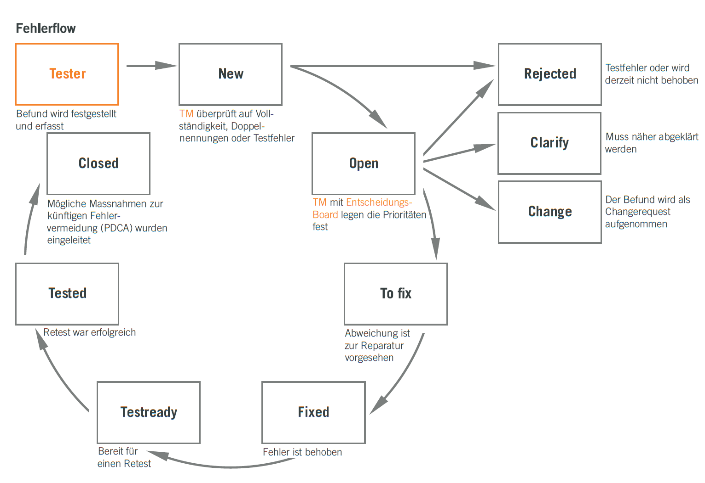
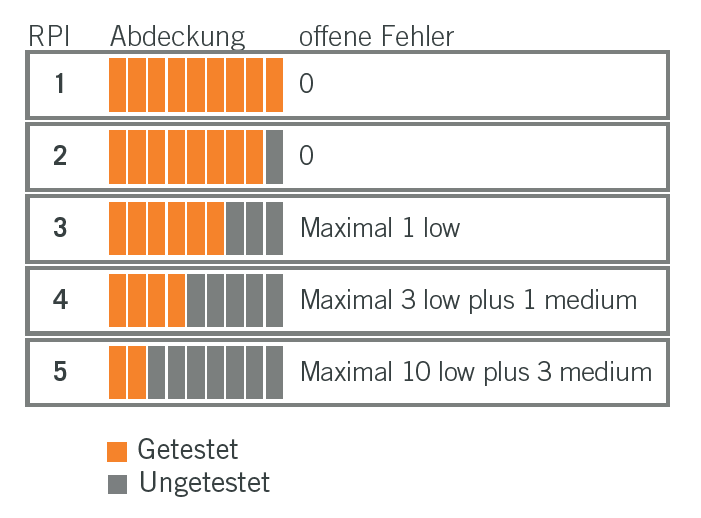
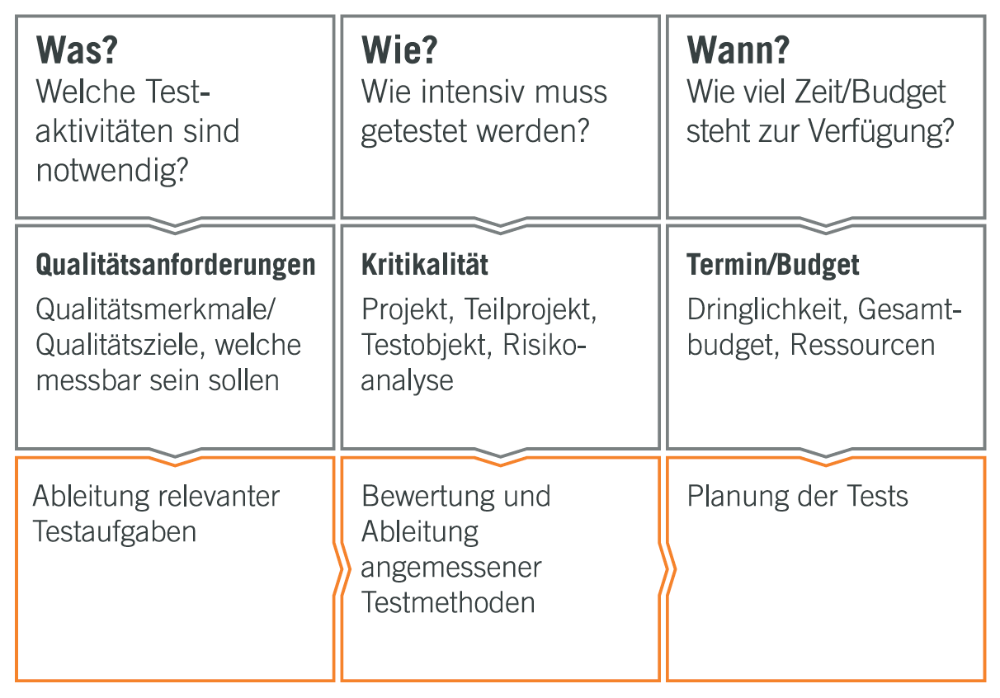
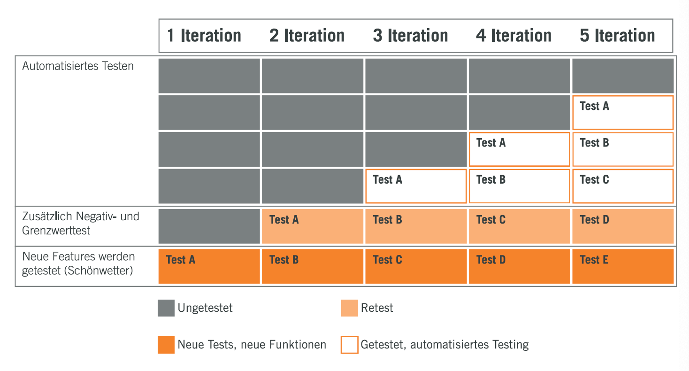
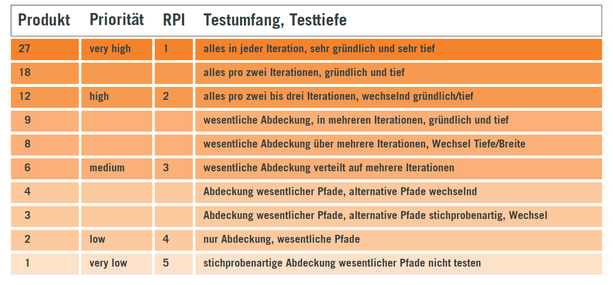

# Grundlagen Testing

Die wichtigsten Begriffe im Zusammenhang mit Testing sind die folgenden:

**_Testidee, Teststrategie & Testkonzept_**

* _Teststrategie_: Eine Dokumentation, die die generischen Anforderungen an das Testen in einem oder mehreren Projekten innerhalb einer Organisation beschreibt, einschließlich Details darüber, wie das Testen durchgeführt werden soll, und die an der Testrichtlinie ausgerichtet ist.
* _Testkonzept_: Die Dokumentation der Testziele sowie der Maßnahmen und Zeitplanung, um diese zu erreichen, zum Zweck der Koordination von Testaktivitäten.
* _Testidee_: `¯\_(ö)_/¯`

http://glossar.german-testing-board.info/v3.21/

Für Interessierte gibts dazu Lekture im _Internet_, für alle anderen die Noser-Broschüre bzw. diese Zusammenfassung davon.

- [ISO-Norm 29119](https://en.wikipedia.org/wiki/ISO/IEC_29119):
  1. **Concepts and definitions**
  2. **Test processes**
  3. **Test documentation**
  4. **Test techniques**
  5. **Keyword-driven testing**: build test automation based on keywords
- [ISTQB](https://en.wikipedia.org/wiki/International_Software_Testing_Qualifications_Board)

## Argumente fürs Testen

Das Testen hat einige Vorteile. Ein paar davon sind:

* Unerwartete Katastrophen (Personenschaden, Betriebsausfall) verhindern
* Haftung / Erfüllung von Sorgfaltspflicht
* Kontrolle: _Vertrauen ist gut, Kontrolle ist besser_
* Garantie: Abnahmetests
* Qualität: Schnellere Entwicklung, bessere Dokumentation
* Liefert Kennzahlen (KPI) zum Führen
* Gezielt & geplant: _Agieren statt Reagieren_

## Die drei Erfolgsfaktoren

Gemäss Broschüre gibt es genau drei Faktoren, die den Erfolg des Testens beeinflussen. Diese sind:

1. **Tools**:
  - Einfach zu bedienen, gut gepflegt
  - Verantwortlichkeiten klar
  - Akzeptiert von allen Beteiligten
  - Individuell pro Projekt
  - Offene & einfache Schnittstellen
2. **Prozess**: 
  - Einfach, verständlich, übersichtlich
  - gelebt & gepflegt
  - Verantwortlichkeiten klar
  - Akzeptiert von allen Beteiligten
  - Nötige Freiräume
  - Wichtige Details definert
  - Projekt unterstützen, nicht behindern
3. **Testmaster / Manager**:
  - Gute Ausbilgung in Fach und Entwicklung
  - Erfahrung in Projektleitung
  - Fundierte Testausbildung (ISTQB) & Erfahrung
  - Softskills, Kommunikation und Menschenkenntnis
  - Leidenschaft & Motivation

## Generischer Vier-Schritte-Ablauf

Die portmann'sche Variante des _Generischen Vier-Schritte-Ablaufs_ besteht aus folgenden Phasen:

1. Analysieren
2. Vorbereiten
3. Durchführen
4. Auswerten

# Die Vier Phasen

_Zur Repetition:_

Die vier Phasen des Testings sind:

1. Analysieren
2. Vorbereiten
3. Durchführen
4. Auswerten

## Analysieren

Beim Analysieren der Anforderungen müssen zwei wichtige Aussagen getroffen werden:

1. Kosten / Risiken: Wie viele Testszenarien (vorgegeben durch Testkonzept)
2. Abdeckung: Notwendige Testabdeckung (Grundlage für Anzahl Testfälle)

Je nach Bedarf kann die Abdeckung in drei Stufen gegliedert werden:

* **Schnell und grob**: Pro Anforderung (mind.) einen Testfall
* **Schnell und optimistisch**: $\text{Anzahl Anforderungen} \cdot 3$
* **Vorsichtig**: $\text{Anzahl Anforderungen} \cdot \frac{20}{RPI}$

Die Testabdeckung kann also **_einfach_** (_sind alle Anforderungen durch einen Testfall abgedeckt?_) oder **_genau_** (_ist die Abdeckung risikogerecht?_) beurteilt werden.

## Vorbereiten

Testbereitschaft untersuchen und dokumentieren. Folgendes sollte nachher klar sein:

* Wie viele Testszenarien / Testfälle?
* Wie viel Vorbereitungszeit?
* Ist die Testumgebung bereit?

**=> Sind wir bereit zum Testen?**

Besonders bei agilen Projekten ist es wichtig, das sämtliche Anforderungen der "Definition of Done" entsprechen. Test- und Review-Tasks müssen in der Planung berücksichtigt werden.

## Durchführen

Abläufe & Prozesse einhalten, damit Kennzahlen, Information usw. korrekt erhoben werden.

Es soll vor allen der _Fortschritt_ und der _Reifegrad_ gemessen werden:

* **Fortschritt**: Wie viele Tests sind erfolgreich, wie viele Tests müssen noch durchgeführt werden? Wie lange dauert es noch?
* **Reifegrad**: Summe aller Fehler pro Fehlerklasse, Anzahl erfolgreich getesteter Anforderungen

### Fehlerklassifizierung

**Auswirkung / Schweregrad**:

| Grad        | Beschreibung |
|---          |---  |
| 1 Low       | leichter Fehler, Funktion in Grunde gewährleistet |
| 2 Medium    |  Störend, Systemfunktion nicht beeinträchtigt |
| 3 High      | Schwerer Fehler, Funktion nicht gewährleistet |
| 4 Urgent    | Fataler Fehler, Auswirkung auf ganzes System |

**Beobachtungsgüte / Reproduzierbarkeit**:

| Grad | Beschreibung |
|---|---|
| A | Eindeutig festellbar, belegbar & reproduzierbar |
| B | Wiederholt auftretend |
| C | Nicht reproduzierbar |

### Incident Management

Die Abbildung "Incident Management" beschreibt das Incident Management mit den verschiedenen Zuständen eines Incidents.

## Auswerten

Vorhandene Testresultate in _management-tauglichen_ Report zusammenfassen, grafisch darstellen.

Dieser _Testreport_ dient als Entscheidungsgrundlage: **GO** oder **NO GO**.

# Projektmethodik und Testen

Die Wahl der Projektmethodik hat Einfluss auf den Stellenwert und Zeitpunkt vom Testeln innerhalb des Projekts:

1. **Wasserfall**:
   - Viel Zeit fürs Testen & Vorbereitung, eigene Phase
   - Stark von der Entwicklung getrennt
2. **RUP**:
   - Viel Zeit fürs Testen
   - Getrennt von der Entwicklung
3. **SCRUM**:
   - Kontinuierliches Testen, kommt oft zu kurz
   - Integriert in die Entwicklung

# Strategie und Konzept

- Die _Strategie_ bestimmt, wie weit das das Riskio durch Testen minimiert werden soll.
- Das _Testkonzept_ ermöglicht das Priorisieren und Gruppieren von Tests => Basis für erfolgreiches Testen.

## Bastelbogen Teststrategie

Es folgt eine Anleitung zum Erstellen einer Noser-konformen Teststratie in 15 Minuten. Man stelle sich zuerst folgende Fragen:

1. **WAS?**  => Qualitätsanforderungen
2. **WIE?**  => Kritikalität, wie intensiv
3. **WANN?** => Termin, Budget

Man befolge anschliessend folgende allgemeine Schritte:

* Akzeptierbares Risiko bestimmen
* Prioritäten festlegen
* Testobjekte definieren und abgrenzen
* Testvorgehen definieren
* Testarten / -typen pro Testobjekte definieren
* Erforderliche Testtiefe festlegen
* Führungskonzepte etablieren
* Testorganisation mit Verantwortlichkeiten

## Testziele

Testkonzept:

- Testdurchlaufzeit vs Tiefe
- Relevanz von Sicherheit, Performance
- Wichtigkeit von Ergonomie & Bedienbarkeit
- Worst Case
- Gesetzliche Vorschriften, Normen
- Lebensdauer des Produkts
  
### Qualitätsmerkmale nach ISO 25000

- **Funktionale Eignung**
  - Angemessenheit
  - Richtikeit
- **Zuverlässigkeit**
  - Reife
  - Fehlertoleranz
  - Wiederherstellbarkeit
- **Benutzbarkeit**
  - Verständlichkeit
  - Erlernbarkeit
  - Bedienbarkeit
- **Leistungseffizienz**
  - Zeitverhalten
  - Verbrauchsverhalten
- **Wartbarkeit**
  - Analysierbarkeit
  - Modifizierbarkeit
  - Stabilität
  - Prüfbarkeit
  - Anpassbarkeit
- **Übertragbarkeit**
  - Anpassparkeit
  - Installierbarkeit
  - Konformität
  - Austauschbarkeit
- **Sicherheit**
  - Zugriffssicherheit
  - Datenverschlüsselung
- **Kompatibilität**
  - Austauschbarkeit
  - Erweiterbarkeit
  - Abwärtskompatibilität

### Gruppierung von Testobjekten

Testobjekte können auf verschiedenene Arten gruppiert werden:

* Funktionale Aspekte
* Architektur-Layer
* Aspekte der Zuständigkeiten
* Abhängigkeiten von Umsystemen
* Verschiedene nichtfunktionale Tests
* Manuelle und automatische Tests
* Grenzwert- und Negativtests
* Quick- oder Smoketests

Testfälle sollten *ausgewogen* sein und *unabhängig* voneinander ausführbar.

### Testvielfalt

Folgende _Testaspekte_ müssen berücksichtigt werden und in die _Testplanung_ einfliessen:

* **Formale Eintrittskriterien**: Vorrausetzungen zum Starten der Tests (Vorbereitungen, Daten vorhanden)
* **Vitalität**: Einfache, schnelle Tests zum Prüfen ob das System "lebt", grundsätzlich prüfbar ist
* **Neue Funktionen**: Neue Funktionen / Technologien zeitnah testen
* **Gefixte Bugs**: Schnelle Rückmeldung bei gefixten Bugs
* **Retest / Regression**:  Regelmässige Regressionstests
* **"Nur leicht modifiziert"**: Sicherstellen, dass bereits getestete Funktionen stabil bleiben
* **Monkey-, Negativ-, Grenzwerttest**: Erweiterung der Schönwetter-Testfälle
* **Unvorhergesehenes**: Reserven einplanen

## Testaufwand

Mit jeder Iteration steigt der Testaufwand:

* Mit jeder Iteration kommen neue Features (+Tests) dazu
* Zusätzliche Tests für bestehende Features
* Wiederholung bestehender Tests
* Automatisierung von Test

## Risiko Prioritäts Index (RPI)

Der Testaufwand wächst _exponentiell_, deshalb ist es wichtig, die Testfälle richtig zu priorisieren. Bei der systematischen Priorisierung mit RPI werden Anforderungen nach drei Kriterien bewertet:

* **Business Relevanz**: Auswirkung im Fehlerfall (1-3)
* **Auffindbarkeit**: Wie offensichtlich und schnell (1-3)
* **Komplexität**:  Umsetzung & Realisierung (1-3)

Das Produkt dieser drei Kriterien ergeben den (_RisikoPrioritätsIndex_™). Dieses ausgeklügelte Führungsinstrument bildet die Grundlage für die Bestimmung der *Testtiefe*, des *Testumfangs* und *Testreihenfolge*.

# Testautomatisierung

Automatisierung ist ein breites Feld. Im Minimum sollte folgendes im Testkonzept geklärt sein:

* Ziel der Automatisierung
* Relevanz der Zeitersparnis / Testdurchlaufzeit
* Pflege Tools, Ergebnisse, Daten
* Return of Investment

# Testkonzept nach ISO 29119

Das _TESTKONZEPT®_ ist das Fundament für ein erfolgreiches Testprojekt. Die Struktur gemäss ISO-Norm 29119:

* **Einleitung**
  * Einleitung
  * Ziel und Zweck
  * Geltungsbereich
  * Geltende Dokumente / Referenzen
* **Testobjekte**
  * Scope: Welche Komponente / Umsysteme werden getestet
  * Constraint: Was ist explizit **nicht** Bestandteil
* **Testumfang**
  * Qualitätsmerkmale (Funktionalität, Zuverlässigkeit, Wartbarkeit...)
  * Qualitätskriterien (Richtigkeit, Angemessenheit, Stabilität, Performance...)
* **Kommunikationswege**
  * Mitglieder / Rollen
* **Risikobetrachtung**
  * Risiken nach Auffindbarkeit, Schweregrad, Komplexität
  * Adäquate Massnahmen
* **Teststufen**
  * Komponententests
  * Integrationstest
  * Systemtests
  * Abnahmetests
* **Lieferobjekte**
  * Notwendige Artefakte (Testkonzept, Testdaten, Reports...)
  * Verantwortlichkeiten bei den Artefakten
  * Empfänger der Artefakte
* **Komponenten- / Unit-Tests**
* **Planung**
  * Terminplanung
  * Zeitachse, GANT-Charts
* **Abnahmetest**
  * Durchführung & Freigabe
  * Abnahmeprotokolle
* **Testabbruch**
  * Kriterien
  * Wer veranlasst dies?
  * Tätigkeiten für Wiederaufnahme
* **Testaktivitäten**
  * Analyse, Vorbereitung, Durchführung, Auswertung, Abschluss
* **Personal**
  * Rollen (Testmanager, Tester, BUG(!)-Team)
* **Testdesigntechniken**
  * Wie werden Testfälle hergeleitet?
* **Testendkriterien**
  * Metriken
  * Status: "passed" / "failed"
* **Anforderungen an die Testdaten**
* **Anforderungen an die Testumgebung**
* **Regressionstests und Fehlernachtests**

