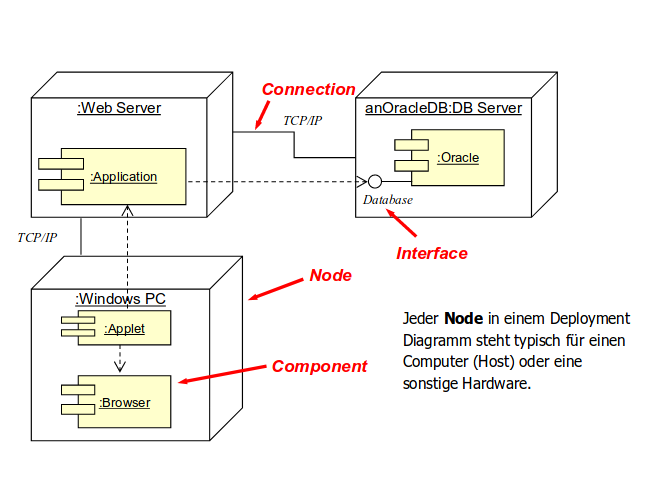
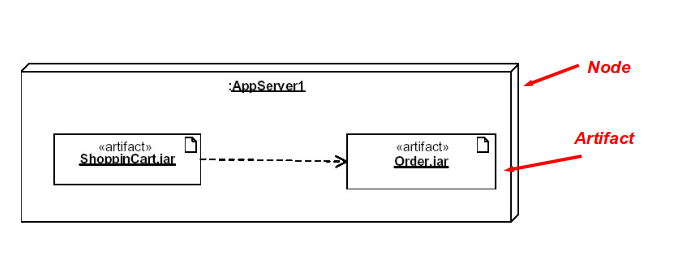
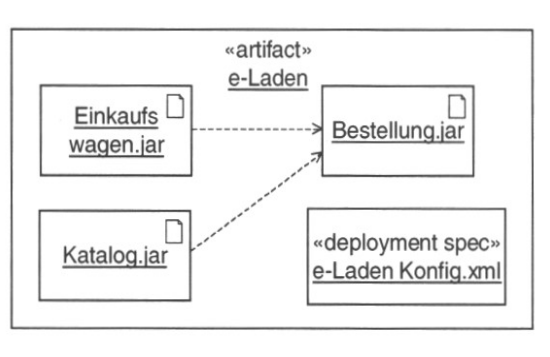
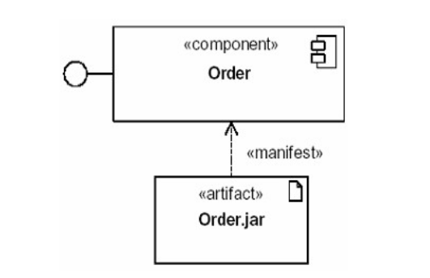

# Lernziele

* **Sie kennen die verschiedenen Aspekte die es beim Deployment zu beachten gilt.**
* **Sie verstehen einfache Deploymentdiagramme und können diese erstellen.**
* **Sie kennen das dreistellige Versionsschema nach "semantic versioning und können es anwenden.**
* **Sie kennen typische Deployment-Artefakte von Java**.
* **Sie kennen den Zweck eines Binär-Repositories und können dieses nutzen.**

# Übersicht

## Verteilung

* Versand von Datenträgern mit Programm und Dokumentation
* Download zur Verfügung stellen
* Automatische Installation

## Installation

* Kopieren benötigter Dateien an die vorgesehenen Orte
* Registrieren der Anwendung
* Hardware- und Betriebssystemanforderungen prüfen

## Konfiguration

* Einstellungen der Programme auf Benutzer, Netzwerkumgebung, Hardware etc.

### Organisation

* Information
* Schulung
* Support
* Planung
* Produktion

# Übersicht II

Deployment findet grundsätzlich am Ende des Projektes statt, aber aufgrund iterativer und agiler Entwicklungsmodelle findet Deployment auch früher, häufiger und wiederholend statt. _Continious Delivery_ erfordert auch _Continious Deployment_.

Einzelene Build-, Sprint- oder Iterationsergebnisse werden dabei laufend deployed, entweder auf eine interne Testumgebung oder direkt zum Kunden als _Alpha_, _Beta_ oder _Release Candidate_ etc.

* _Continious Delivery_ (CD): analog zum Testen (Continious Intergration).

* _Staging_: Deployment auf verschiedene Umgebungen (Entwicklung, Test, Integration, Vor-Produktion, Produktion).

# Umfang

Deployment-Dokumentation:

## Technische Aspekte

* Deployment-Diagramme (Zuordnung von Komponenten / Hardware)
* Installations- und Deinstallationsprogramme oder Skripte
* Konfiguration (Default~, Beispiel~ etc.)
* Installationsmedium
* Repositories (Ablage der Binaries)

## Organisatorische Aspekte

* Konfigurationsmanagement (Welche Komponenten bilden welchen Release?)
* Installations- und Bedienungsanleitung
* Erwartungsmanagement (Welche Funktionalität ist vorhanden?)
* Bereitstellung von Support (intern & extern, Levels)

# Deployment-Diagramme

## UML 1.x

## UML 2

* _Node_: Stellt Computer / Host / Hardware dar (identisch zu UML 1.x)
* _Artifact_: Stellt ein Binary / Skript dar, welches durch die Installation explizit einem Node zugeordnet wird.
Artefacts werden in der Deployment-Spezifikation detaillierter beschrieben.

### UML 2 Deployment-Spezifikation

Enthält zusätzliche Angaben über die Konstruktion einer Einsatzkonfiguration:

Das `manifest` verbindet ein Artefakt mit einer Komponente:

In diesem Beispiel wird die Komponente _Order_ durch _order.jar_ realisiert.

# Installation und Deinstallation

* Installation und Update einer Software sollten möglichst _automatisiert_ und damit auch reproduzierbar sein.
* Saubere Deinstallation
* Evt. vollautomatisierte Verteilung möglich (Software-Management)
* Unterschiedliche Bedürfnisse / Zielgruppen
	* _Endbenutzer_: GUI-Installer
	* _Administrator_: Skriptbasiert, parameterisiert und dadurch vollautomatische Installation möglich
	* _Entwicker & Tester_: Spezielle Distributionen, manuell oder über zentrale Repositories

## Konfiguration von Anwendungen

_Zielkonflikt_: Die Anwendung soll...

* out-of-the-box lauffähig sein
* sich an verschiedene vorhandene Systeme anpassen können

_Beispiel Datenbankanwendung_:

* Einsatz einer bestehenden DBMS-Umgebung
* Einsatz verschiedener Logging- und Audit-Mechanismen und Frameworks
* Authentifizierungs- und Autorisierungstechniken (LDAP, Kerberos etc.)

## Installationsquelle

## Klassisch (CD / DVD)

* Produktion brauch Vorlaufzeit

## Download von Server

* Bandbreite und Volumen beachten
* Authentifizierung, Zugang sichern
* Möglichkeit Cloud-Dienste zu nutzen

## USB-Sticks

* Normalerweise eine Ad-hoc Lösung für einzelne Nodes

# Konfigurationsmanagement

Mit der Zeit haben verschiedene Kunden

* unterschiedliche Versionen einer Software
* unterschiedliche Versionen von Umsysteme (z.B. Datenbank)
* unterschiedliche Hardware

Folgende Fragen müssen vom Konfigurationsmanagement geklärt werden:

* Welchen Einfluss hat das auf die Perfomance und  
* Ist ein Update von jeder existierenden Konfiguration möglich?
* Müssen bestimmte Abfolgen eingehalten werden?
* Wurden die unterschiedlichen Szenarien getestet?

# Manuals

Bestandteile der Deployment-Dokumentation:

## Installationsanleitung

* Installation möglichst automatisieren
* Varianten aufgrund unterschiedlicher Konfiguration beachten
* Abfolgen beachten

## Bedienungsanleitung (-> Release Notes)

* Neuer Funktionsumfang
* Neue Vorbedingungen
* Neue Datenformate oder Protokolle

# Support

Support sollte unbedingt bereitgestellt werden. Auch wenn alles getestet und dokumentiert ist, können Fehler eintreten:

* Bedienungs- und Anwenderfehler
* Unerwartete Konfigurationen
* Spezielle Datenbestände
* Software-Updates

# Releases und Versionierung

Deployment findet mit einem wohldefinierten Release statt. Eindeutige Bezeichnung und Version:

* Technische Version mit eindeutiger Identifikation
* 'Tagging' im Versionskontrollsystem
* Nicht das gleiche wie 'Marketing-Version'. Diese kann Ergänzung sein

## Semantic Versioning

https://semver.org:

`MAJOR.MINOR.PATCH` 

	MAJOR version when you make incompatible API changes,
	MINOR version when you add functionality in a backwards-compatible manner, and
	PATCH version when you make backwards-compatible bug fixes.

## Time-Based Release Versioning

Fixer Release-Rhythmus, beispielsweise bei Ubuntu: **16.04**, **16.10**, **17.04**

**=> Versionierung mit Vernunft, Marketing-Version und technische Version trennen!**

