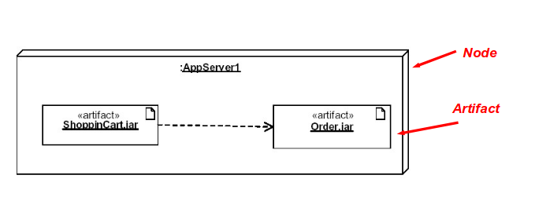

# Zusammenfassung VSK

Modul HSLU.I VSK (Verteilte Systeme und Komponenten)

Gestohlen vom [Pädi](https://github.com/patrickbucher/inf-stud-hslu/blob/master/vsk/zusammenfassung/vsk.pdf) und aus den Folien VSK.

Link zum Projekt (Source und Doku): https://github.com/patrickbucher/vsk-team5

# Komponenten

Eine Software-Komponente ist ein Teil einer Software, der gemäss den Regeln eines _Komponentenmodell_ zusammenwirken kann und ohne Änderungen mit anderen Komponenten verknüpft und ausgeführt werden kann.

Eine Komponente ist also ein Element einer komponentenbasieren Anwendung
mit definierten Schnittstellen zur Verbindung mit anderen Komponenten.

Darstellung im UML:


Komponentenmodelle definieren die strukturellen Anforderungen im Bezug auf die Verknüpfung von Komponenten und implementieren Mechanismen wie Verteilung, Persistenz, Nachrichtenaustausch und Versionierung.

Komponentenmodelle legen die Eigenschaften und die Form einer Komponente fest sowie die Kommunikation zwischen Komoponenten  über Schnittstellen. Beispiele für Komponentenmodelle:

- Microsoft .NET
- DCOM
- Enterprise Java Beans

## Vorteile von Komponenten

* Reduktion der Komplexität durch Aufteilen
* Wiederverwendbarkeit
* Konsistenz durch Verwendung von Standardkomponenten
* Verbesserte Wartbarkeit durch Kapselung
* Parallele und verteilte Entwicklung möglich

Aufgrund steigender Komplexität werden Eigenentwicklungen weniger wirtschaftlich und unsicherer. Software wird vermehrt aus bestehenden Komponenten zusammengesetzt.

Weil die Kommunikation nur über spezifizierte Schnittstellen erfolgt, muss man nur diese kennen, um eine Komponente einsetzen zu können. Komponenten mit gleichen Schnittstellen sich deshalb austauschbar.

## Schnittstellen

Schnittstellen sind Verbindungsstellen, die sicherstellen das zwei Komponenten kombiniert werden können, indem sie Methodensignaturen vorgeben. Sie sollten aus _wenigen Methoden_ mit _wenigen Überschneidungen_ und _wenigen Parametern_ bestehen. Ausserdem sollten sie gut dokumentiert und einfach verständlich sein.

## Modularisierung

Ein Modul ist ein in sich geschlossener Teil des Programmcodes.

* **Kopplung** (Kommunikation zwischen Modulen) sollte möglichst klein gehalten werden.
* **Kohäsion** (Kommunikation innerhalb eines Moduls) maximieren.

Arten von Modulen:

* **Bibliotheken**: Sammlungen thematisch zusammengehörender Funktionen (Mathematik-Modul, Datums-Modul)
* **Abstrakte Datentypen**: Implementierung eines neuen Datentyps mit dazugehörigen Operationen (verkettete Liste, Hashtabelle)
* **Physische Systeme**: Hardwaremodul (Anzeigemodul, Sensormodul)
* **Logisch-konzeptionelles System**: Modellierung von Funktionalität auf hoher Abstraktionsebene (Datenbankmodul, Bildverarbeitungsmodul)

Entwurfskriterien:

* **Zerlegbarkeit**: Probleme (rekursiv) in weniger komplexe Teilprobleme, die unabhängig gelöst werden können
* **Kombinierbarkeit**: Module sind unabhängig voneinander wiederverwendbar und frei kombinerbar
* **Verständlichkeit**: Module sollten unabhängig voneinander verständlich und wartbar sein.
* **Stetigkeit**: Änderungen der Anforderungen sollten sich nur auf ein Teilsystem auswirken

Entwurfsprinzipien:

* **Lose Koppelung**, schlanke Schnittstellen, nur nötigstes austauschen
* **Starke Kohäsion**, hoher Zusammenhalt innerhalb des Moduls
* **Wenige Schnittstellen**
* **explizite Schnittstellen**, Aufrufe und gemeinsam genutzte Daten sind im Code ersichtlich

Vorgehen bei der Modularisierung:

* **Basikonzepte**: Kopplung & Kohäsion
* **Kriterien**: Zerlegbarkeit, Kombinierbarkeit, Verständlichkeit, Stetigkeit
* **Modularten**: Bibliotheken, abstrakte Datentypen, physische und logische Systeme
* **Prinzipien**: geringe Kopplung, hohe Kohäsion, Geheimnisprinzip, wenige & logische Schnittstellen

**Layer**: öffentliche Methoden eines tieferen Layers dürfen vom höherstehenden Layer benutzt werden.

* _call_-Beziehung: höherer Layer verwendet Funktionalität von tieferem Layer
* _use_-Beziehung: korrektes Verhalten vom höherstehenden hängt von der korrekten Implementierung des tieferen Layers ab (Initialsierung eines Devices, Netzewerkverbindung, erstellte Datei)

**Tier**:

* Presentation Tier
* Business Logic (Tier)
* Data Tier

**Packages**: Implementierung des Layer-Konzepts, abstrakt mit UML und konkret mit Java-Packages.

## Parnas: On the Criteria to be Used in Decomposing Systems into Modules (1972)

Ziele der Modularisierung:

* Verbesserung von Flexibilität & Verständlichkeit
* die Verkürzung der Enwicklungszeit

Voraussetzungen für modulares Programmieren:

* Module können mit wenig Kenntnis von anderen Modulen geschrieben werden
* Module können frei kombiniert und ersetzt werden

Nutzen der Modularisierung:

* Verkürzte Entwicklungszeit durch Aufteilung der Arbeit
* Erhöhte Flexibilität, weil Module unabhängig voneinander geändert werden können
* Bessere Verständlichkeit, weil Programme stückweise analysiert werden können

Ansätze der Modularisierung:

* Flowchart-Analyse (Klassisch): Jeder grosse Verarbeitungschritt wird als Modul implementiert
* Information Hiding (neuer Ansatz): Jede Design-Entscheidung wird in einem Modul versteckt

# Entwicklungsprozess

## Versionskontrolle

**Source Code Management (SCM)**:

* Zugriff auf frühere Revisionen
* Ermöglicht Zusammenarbeit
* Automatisches Zusammenführen (Merging)
* zentrale und/oder verteilte Datenhaltung
* Änderungen nachvollziehbar

In ein Repository gehören:

* Quellcode
* Konfigurationsdatein
* Dokumentation

Nicht in ein Repo gehören Kompilate und generierte Dokumente.

Unterscheidungsmerkamle von SCM:

* zentral / verteilt
* optimistisches / pessimistisches Lockverfahren
* Versionierung von Datei / Verzeichnisstruktur / Changeset
* mit / ohne Transaktionsuntertützung
* weitere Features: Zugriffsprotokolle, Sicherheitsmassnahmen, Webserver-Integration

Beispiele:

* **CVS**: zentral, robust, stabil, alt
* **Subversion**: zentral, transaktionsorientiert, Versionierung auf Verzeichnisebene
* **git**: dezentral, skalierbar, weit verbreitet


Grundsätzliche Operationen:

* **checkout**: lokale Arbeitskopie von Repository erstellen erstellen
* **update**: Änderungen des Repository in lokaler Kopie aktualisieren
* **log**: Revisionen ansehen
* **diff**: Zwei Revisionen eines Artefakts vergleichen
* **commit**: Änderungen in das Repository schreiben

Operationen verteiler SCM:

* **clone**: lokale Kopie eines entfernten Repos erstellen
* **fetch**: Änderungen des entfernten Repos herunterladen
* **pull**: Änderungen des entfernten Repos einpflegen
* **push**: lokale Anderungen in entferntes Repo schreiben

**Branching**: Erstellen unabhängiger Entwicklungszweige (Tests, Prototypen, Bugfixing, neue Features ...), die später wieder mit dem Hauptzweig zusammengeführt werden können.

## Buildautomatisierung

**Buildprozess**: aus Quellartefakten ein fertiges Produkt erstellen (kompilieren, generieren, testen, packen, JavaDoc erzeugen etc).

* Manuell: abhängig von der IDE, mühsam und fehleranfällig
* Script: automatisiert, reproduzierbar, unabhängig von der IDE, unflexibel, abhängig von Shell / OS, aufwändige Wartung und Erweiterung
* Build-Werkzeug: vereinfachte Handhabung von Ressourcen, automatische Prüfung von Abhängigkeiten, plattformunabhäning durch Abstraktionsebene

Beispiele für Build-Werkzeuge:

* make: alt, vor allem für C/C++, sehr flexibel
* Ant: alt, für Java, mit XML
* Maven: etabliert, für Java, mit XML
* Gradle: jung, mit Groovy-Script und DSL

### Build Tool: Apache Maven

Deklaratives Build-Tool für Java, weit verbreitet:

* schlank, zusätzliche Funktionalität mit Plugins
* zentrales Repository zum einbinden von Libraries
* Project Object Model: pom.xml, deklarierte Metainformationen (Targets, Plugins, Dependencies) für ein Projekt
* Build-Phasen: validate, compile, test, package, verify (Integrationstests), install, deploy

## Dependency Management

Organisation und Techniken für dem Umgang mit Abhängigkeiten zu anderen Modulen.

**Abhängigkeiten** sind oft in Binärform, können _intern_ (Module im selben Projekt) oder _extern_ (Module aus anderen Projekten / von anderen Organisationen) sein.

Merkmale von **Dependency-Management-Software**:

* zentrale Ablage
* standardisiertes Paketformat
* zusätzliche Metainformationen
* definierte Abhängigkeiten
* Konsistenzsicherung mit Prüfsummen
* Suchfunktionen und andere Hilfswerkzeuge

Beispiele für Dependency-Management-Software:

- _apt_
- _pip_
- _npm_

Dependency-Management in Java:

* Binäre Module
* Keine Definition von Abhängigkeiten
* ab 2001: Dependency Management mit Maven

### Dependency Management mit Apache Maven

* Maven Repository: öffentliche Repositories (Maven Central), interne Repositories bei professionellen Organisationen
* Weltweit eindeutige Identifikation:


    reverse-domain-name:project-name:version
    ch.hslu.vsk.g05:logger-server:1.1.3

* Dependency Scopes: compile, test, runtime
* Transitive Abhängigkeiten, automatische Erkennung und Lösung von Konfliken und zyklischen Abhängigkeiten
* Versionierung und Snapshots: Angaben zur Kompatibilität, automatische Aktualisierung, nachvollziehbarkeit

### Buildserver

Serversoftware zur Erstellung von Builds:

* automatisch aufgrund von Änderungen im SCM
* automatisch zu bestimmten Zeitpunkten
* manuell durch den Anwender

Vorteile von Build-Servern:

* Entlastung von Entwicklern und ihrer Rechner
* regelmässige Verifikation
* statistische Informationen zu Projektzustand / Entwicklungsprozess

Produkte und Dienste:

* Jenkins / Hudson: sehr verbreitet, Open Source
* Continuum: speziell für Maven-Projekte, Open Source
* Bamboo: mit JIRA verknüpft
* Gitlab: Kombination von SCI, CI und Cloud
* Travis: Komibinerbar mit Github u.a.

Konfiguration:

* Klassisch: Vom Projekt getrennt, vom Server vorgegeben
* DevOps-Ansatz: Konfiguration durch Entwickler im Projekt (.yml-Datei)

Voraussetzungen:

* Automatisierung des Build-Prozesse (Maven, Ant, Gradle)
* Einsatz eines Versionsverwaltungssystems (Git, Subversion, CVS)

Aufgabentrennung im CI-Prozess:

* Wann wird ein Build durchgeführt: Buildserver, Benutzer
* Was wird gebaut: Versionskontrollsysteme
* Wie wird gebaut: Buildautomatisierung (nicht Buildserver!)
* Wohin gelangen die Artefakte: Binary-Repo, Testsystem

Verschiedene Buildszenarien:

* Continuous Build
* Nightly Build: Zeitlich gesteuert, meistens nachts
* Release Build: manuell für auslieferbares Produkt

Integration und Verknüpfung von Buildservern

* Buildtool
* Versionskontrollsysteme
* Kommunikationstechnologien für Notifikation
* Auswertung und Visualisierung
* Issue-Tracking, Code-Review-Systeme

## Continuous Integration

Ziele:

* immer ein Lauffähiges Produkt vorhanden, kontinuierliche Tests möglich
* schnelleres Feedback bei Fehlern
* parallele Entwicklung im Team
* agile Software-Entwicklung ermöglichen

Zehn Praktiken der Continuous Integration:

1. **Einsatz eines zentralen SCM**, sinnvolle Commit-Kommentare, Referenz auf Issue
2. **Automatisierter Buildprozess**, auf einer kontrollierten, stabilen Umgebung
3. **Automatisierte Testfälle**, möglichst hohe Abdeckung durch automatisierte Tests, ständige Performance-Tests
4. **Änderungen des Quellcodes auf dem Hauptzweig**, Feature-Branches oft mergen
5. **Automatischer Build bei Änderungen**, Änderungen im SCM per  push (Hook) oder polling ermitteln und Build starten, Ergebnisse kommunizieren
6. **Schneller Build-Prozess**, schnelles Feedback, nicht alle Tests werden lokal vor dem Commit ausgeführt
7. **Test auf Produktivumgebung** oder auf einer Kopie davon, Testumgebung möglichst gleich wie Produktivumgebung
8. **Einfacher Zugriff auf Buildartefakte**, Bereitstellung von Buildresultaten, Archivierung von Build-Artefakten, Deployment in binäres Repository
9. **Offensive Informationen über den aktuellen Zustand**, Änderungen nachvollziehbar
10. **Automatisches Deployment**, Buildergebnisse auf Zielsysteme verteilen

## Integrations- und Systemtesting

Zu jeder Disziplin gibt es eine Art von Test:


* **Unit Test**: Überprüfung konkreter Implementierungen
* **Integrationstest**: Zusammenspiel der Implementierungen
* **Systemtest**: Zusammenarbeit verschiedener Systemkomponenten
* **Akzeptanztest**: Wurde das entwickelt, was verlangt wurde

Vollständiges Testen ist nicht machbar, es gilt eine optimales Verhältnis zwischen Aufwand und entdeckten Fehlern zu finden.

### Integrationstest

Integrationstests prüfen die Schnittstellen und das Zusammenspiel von Systemkomponenten.

* Ziel: stabiles System, stabile Teilsysteme
* Komponenten sollten bereits getestet sein mit Unit-Tests
* gewisse Fehler können nur statistisch ermittelt werden (Race Conditions, Performance)

Integrationsstrategien:

* Bottom-Up: Integration kleinerer Teilsysteme
* Top-Down: Integration aufwändiger Kontrollstrukturen
* Bing-Bang
* Continuous Integration: iterativ-inkrementelle Entwicklung

Noch nicht vorhandene Komponenten werden mit Test Doubles ersetzt:

* Stubs: Identisches Interface, statisches Verhalten
* Mocks: Intelligenter Stub mit zusätzlicher Logik

### Systemtests

Systemtests prüfen die gesamte Wirkungskette im Softwareprodukt.

* Ziel: potentiell auslieferbares Produkt nach jedem Sprint
* Lauffähig ausserhalb der Entwicklungsumgebung
* Interaktion imit anderen Systemen möglich

Systemtests sollten in einer möglichst realitätsnahen Testumgebung ausgeführt werden. und mit verschiedenen Konfigurationen ausgeführt werden.

Systemtest zum Testen nicht funktionaler Anforderungen wie Performance, Sicherheit, Robustheit

### Regressionstests

Wiederholtes Ausführen bestehender Testfälle zur einem späteren Zeitpunkt, um sicherzustellen, dass keine Funkktionalität durch Neuentwicklungen beeinträchtigt wurde.

## Agiles Testing

Die vier Quadranten des agilen Testens:

1. **Automatisierte Unit- & Komponententests**: Vertrauen in den Code, Verifikation, Test durch Team erstellt und im SCM. Werkeuge: JUnit, Stubs, Mocks
2. **Funktionale Tests** (automatisch und manuell): Nach jedem Sprint, durch Team und Product Owner. Werkzeuge: Prototypen, Mockups
3. **Abnahmetests** (manuell): Bei der Abnahme durch den Kunden durch Product Owner und Team, Werkzeuge: Testdaten, Logs
4. **Performance-, Last-, Sicherheitstests**: Stabilität und Leistung prüfen

### Testing in SoDa

Testplanung und Organisation:

* Abnahmetests am Ende des Sprints
* Einplanung von Tests zu jeder User Story
* Durchführung von Regressionstests

Testaufgaben im Scrum-Team:

* Planning-Meeting: Aufwandabschätzung für Testing
* Sprint: Tests möglichst bald ausführen
* Sprint-Abnahme: Demonstration getesteter Features
* Retrospektive: Stolpersteine ermitteln, Verbesserungsvorschläge erarbeiten

# Entwurfsmuster

Design Pattern: bewährte Schablone für wiederkehrende Entwurfsprobleme.

Wiederverwendung von bewährter Lösungen, Klassen zur Reduktion der Entwicklungszeit und Fehlerrate. Die Wiederverwendung von Code ist schwierig, da der Kontext, Technologien und Designkonzepte verschieden sind. Stattdessen: Wiederverwendung von Konzepten: diese sind gut erprobt, unabhängig von Sprache und Implementierung und ändern sich selten.

## Klassifizierung von Entwurfsmustern

**Creational Patterns**: Erzeugung von Objekten abstrahieren, delegieren, Details auslagern:

* Abstract Factory
* Builder
* Factory Method
* Prototype
* Singleton

**Structural Patterns**: Objekte / Klassen zu neuen Strukturen zusammenfassen, verschiedene Strukturen aneinander anpassen und verbinden:

* Adapter
* Bridge
* Composite
* Decorator
* Facade
* Flyweight
* Proxy

**Behavioral Patterns**: Interakton zwischen Objekten beschreiben, Kontrollflüsse festlegen, Zuständigkeiten und Kontrolle delegieren:

* Chain of Responsibility
* Interpreter
* Iterator
* Mediator
* Memento
* Observer
* State
* Template Method
* Visitor

Zusätzlich können Entwurfsmuster auch in **Klassenmuster** (Beziehung zu Kompilierzeit festgelegt) und **Objektmuster** (Beziehung zur Laufzeit dynamisch veränderbar) eingeteilt werden.

### Singleton

Objektbasiertes Erzeugungsmuster.

Ein Singleton (Einzelstück) gewährleistet, dass es von einer Klasse nur eine Instanz geben kann und stelle einen globalen Zugriffspunkt bereit.

**Merkmale**:

* Eine Objektinstanz wird als privates, statisches Attribut abgespeichert
* Ein privater Konstruktor verhindert die Neuinstanziierung von aussen
* Zugriff auf Instanz über öffentliche, statische Methode

Nachteil: Dies führt zu einer starken Kopplung und lässt sich schwer austauschen.

**UML**:


**Implementierung**:

```java

public class Singleton {
  private static final Singleton instance = new Singleton();
  private Singleton() {  }
  public static Singleton getInstance() {
    return instance;
  }
  public void operation() {
    // ...
  }
}
```

### Facade

Objektbasiertes Strukturmuster.

**Merkmale**:

Bietet ein einheitliche Schnittstelle für eine Reihe von Schnittstellen in einem Untersystem an. Definiert eine Schnittsttelle auf einer höheren Abstraktionsstufe, welche die Handhabung des Untersystems einfacher macht.

Problem: Sollte weder zum reinen Durchlauferhitzer verkommen noch wesentliche Logik beinhalten.

**UML**:


**Implementierung**:

```java
public class BuildFacade {
  private Compiler compiler = new Compiler();
  pricate TestExecutor TestExecutor = new TestExecutor();
  private DocumentationGenerator documentationGenerator = new DocumentationGenerator();
  public void quickBuild() {
    compiler.compileSources();
    testExecutor.runUnitTests();
  }
  public void fullBuild() {
    quickBuild();
    testExecutor.runIntegrationTests();
    documentationGenerator.createJavaDoc();
  }
  public void releaseBuild() {
    fullBuild();
    documentationGenerator.createSysSpec();
    documentationGenerator.createClassDiagrams();
  }
  // ...
}
```

### Strategy

Objektbasiertes Verhaltensmuster.

Definiert eine Familie von Algorithmen, kapsel jeden davon und macht sie austauschbar. Mit einer Strategie kann der Algorithmus unabhängig von Client, der ihn verwendet, ausgetauscht werden.

**Merkmale**: Bietet unterschiedliche Varianten / Implementierungen von Algorithmen an. Fasst Klassen mit gleichem Interface zusammen, die sich in ihrem Verhalten unterscheiden und erlaubt das Hinzufügen weiterer Implementierungen ohne Änderungen am bestehenden Code.

**Problem**: Der oftmals lohnende Einsatz bei kleinen Methoden wird gerne übersehen.

**UML**:


**Implementierung**:

```java
public interface SortingStrategy {
  public <T> void sort(List<T> items);
}
public class QuickSort implements SortingStrategy {
  public <T> void sort(List<T> items) { /* ... */ }
}
public class MergeSort implements SortingStrategy {
  public <T> void sort(List<T> items) { /* ... */ }
}
public class BubbleSort implements SortingStrategy {
  public <T> void sort(List<T> items) { /* ... */ }
}
```

### Observer

Objektbasiertes Verhaltensmuster.

Definiert eine 1:m-Abhängigkeit zwischen Objekten, damit bei der Änderung des Zustands des einen Objekts alle von ihm abhängigen Objekte automatisch benachrichtigt und aktualisiert werden.

**Merkmale**: Realisiert eine lose Kopplung zwischen einem Subjekt und einer beliebigen Anzahl Beobachtern. Erlaubt Kommunikation entgegen der Abhängigkeitsrichtung, bildet die Grundlage fpr das MVC-Pattern und das Event-Handling in Java-GUI-Frameworks.

**Problem**: Eine enge funktionale Kopplung von Subjekt und Beobachter führt zu grossen Schnittstellen.


**Implementierung**:

```java
public interface Observable {
  public void subscribe(Observer observer);
  public void unsubscribe(Observer observer);
}
public interface Observer {
  public void update(Object state);
}
public class Subject implements Observable {
  private List<Observer> subscribers = new ArrayList<Observer>;
  private Object state = null;
  pubic void subscribe(Observer observer) {
    subscribers.add(observer);
  }
  public void unsubscribe(Observer observer) {
    subscribers.remove(observer);
  }
  public void setState(Object state) {
    this.state = state;
    notifySubscribers();
  }
  public Object getState() {
    return state;
  }
  private void notifySubscribers() {
    subscribers.stream().forEach(s -> s.update(state));
  }
}
public class SUbscriber implements Observer {
public void update(Object state) { /* ... */ }
}
```

### Adapter

Klassen- oder objektbasiertes Strukturmuster.

Konvertiert die Schnittstelle einer Klasse in eine andere Schnittstelle, die von einem Client erwartet wird. Ein Adapter lässt Klassen zusammenarbeiten, die es ansonsten aufgrund von inkompatiblen Schnittstellen nicht könnten.

**Merkmale**: Erlaubt Wiederverwendung bestehender Klassen trotz inkompatibler Schnittstellen. Erlaubt die Definition einer möglichst allgemeinen Schnittstelle und die spätere Anpassung für die Bedürfnisse unterschiedlicher Clients.

**Problem**: Ein Adapter ist kein Ersatz für sinnvolle Schnittstellen und sollte vor allem im Umgang mit APIs von Dritten verwendet werden.

**UML**:


```java
public interface MessageStore {
  public void store(Message message);
}
public interface KeyValueStore {
  public void put(String id, String message);
}
public class MessageStoreAdapter implements MessageStore {
  private KeyValueStore keyValueStore = KeyValueStore.getInstance("messages");
  public void store (Message message) {
    keyValueStore.put(message.getId(), message.getPayload());
  }
}
```

### Factory Method

Klassenbasiertes Erzeugungsmuster.

**Merkmale**: Erlaubt das Erstellen von Instanzen der Klassen einer bestehenden Klassenhierarchie, stellt eine einheitliche Schnittstelle zur Erzeugung dieser Klassen zur Verfügung, Delegiert die Details der Objekterzeugung and ide Implementierungen.

**Problem**: Bei einer Erweiterung der Klassenhierarchie muss auch die Hierarchie der Factory-Klassen erweitert werden. Erweiterungen wirken sich auf mehrere Stellen im Code aus.

**UML**:


**Implementierung**:

```java
publich interface Document {
  public String getMimeType();
  public String getExtension();
}
public class JsonDocument implements Document {
  public String getMimeType() { return "application/json"; }
  public String getExtension() { return ".json"; }
}
public class XmlDocument implements Document {
  public String getMimeType() { return "application/xml"; }
  public String getExtension() { return ".xml"; }
}
public interface DocumentCreator {
  public Document createDocument();
}
public class JsonCreator {
  public Document createDocument() { return new JsonDocument(); }
}
public class XmlDocumentCreator {
  public Document createDocument() { return new XmlDocument();}
}
```

### Prototype

Objektbasiertes Erzeugungsmuster.

Entkoppelt die Objekterzeugung von eigentlichen System und gibt die Möglichkeit, komplexe Prototypen aus einzelnen, einfachen Prototymen zusammenzubauen.

**Merkmale**: Erlaubt die Erzeugung neuer Objekte aufgrund bereits existierender Objekte, indem diese kopiert und nicht komplett neu gebaut werden.

**UML**:


**Implementierung**:

```java
public interface MessagePrototype {
  public String getPayload();
  public MessagePrototype clone();
}
public class TextMessage implements MessagePrototype {
  public String getPayload() { return payload; }
  public MessagePrototype clone() { return super.clone(); }
}
public class EmailMessage implements MessagePrototype {
  public String getPayload() { return payload; }
  public MessagePrototype clone() { return super.clone(); }
}
public MessageClient() {
  // provide new instances of MessagePrototype by cloning the existing ones
}
```

## Einsatz von Entwurfsmustern

Zuerst muss man Entwurfsmuster

* **verstehen**: [GoF - Design Patterns](http://www.uml.org.cn/c++/pdf/DesignPatterns.pdf), Interwebz
* **auswählen**: Erzeugung/Struktur/Verhalten, Vor- und Nachteile abwägen
* **abwägen**: Macht der Einsatz eines Entwurfsmuster den Code besser und verständlicher oder nur aufgebläht und unflexibel

Im Zweifelsfall sollte man auf den Einsatz eines Entwurfsmusters besser verzichten, und vielleicht sogar ab und zu die alte Denkrübe benutzen.

Der Vorteil von Entwurfsmustern liegt nicht nur in besser strukturiertem Code, sondern auch darin, dass Entwickler eine _gemeinsame Sprache_ für schwer verständliche Konzepte haben

# Automatisches Testing

Testen wird oft vernachlässigt:

* Entwickler wollen lieber programmieren als testen
* Entwickler glauben, sie machen keine Fehler
* Projektleiter sehen das Testen als unnötig und ohne Mehrwert

Beim Testen wird oft ein falscher Ansatz verwendet:

* Getestet wird am Schluss, Suche nach Fehlern
* Es wird schlecht getestet, Fehler werden verschwiegen
* Entwickler verhalten sich defensiv

Deshalb sollte **kontiniuerlich getestet** werden, nicht nur um Fehler zu finden sondern auch um sicherzustellen, dass alles funktioniert.

Test-First-Ansatz (Test Driven Development):

* Fehler finden, bevor sie gemacht werden
* Fehler korrigieren, bevor sie implementiert werden

Testfälle zuerst schreiben, dann den produktiven Code. Dadurch kann sofort automatisch getestet werden, sobald der produktive Code geschrieben werden.

## Unit- und Integrationstests

### Unit-Tests

Unit-Tests (Komponenten-, Modul- oder Entwicklertests) sind funktionale Tests einzelner, in sich geschlossener Einheiten wie beispielsweise Klassen, Komponenten und Module.

Unit-Tests sind

* schnell
* einfach ausführbar
* selbstvalidierend (Assertions)
* automatisiert

und können in der Entwicklungsumgebung durch den Entwickler und in der CI-Umgebung während des Buildprozesses ausgeführt werden.

**Probleme**:

* Für GUI-Komponenten aufwändig
* Qualitätssicherung und Nachvollziehbarkeit sind zeitaufwändig
* können nicht alles abdecken

**JUnit** ist das am häufigsten eingesetzte Test-Framework in Java. JUnit Namenskonvention: Suffix `Test` für Unit-Tests.

### Integrationstests

Integrationstests testen das Zusammenspiel verschiedener Komponenten. Die Abgrenzung zu Unit-Tests ist nicht immer eindeutig. Die Verwendung von Umgebungsressourcen (Netzwerk, Dateisystem) und immer wenn das Fehlschlagen aufgrund von Fremdeinflüssen möglich ist, handelt es sich um einen Integrationstest.

JUnit Namenskonvention: Suffix `IT` für Integrationstests.

## Codeabdeckung

Das Ziel ist es, mit möglichst wenig Aufwand möglichst umfassende Tests zu erreichen. Dazu helfen das Messen von Codeabdeckung und damit eine gezielte Entwicklung von Tests.

Messtechniken:

* Line Coverage (Welche Zeilen / Statements wurden ausgeführt)
* Branch Coverage (Welche Verzweigungen wurden genommen)
* Decision Coverage (Welche Bedingungen wurden evaluiert)
* Path Coverage (Programmlaufpfade)
* Function Coverage
* Race Coverage (Welche stellen laufen parallel)

# Dependency Injections

Komponenten sind aufgrund hoher Kopplung schlechter testbar, weil Unit-Tests auch die Abhängigkeiten benötigen.

Mit **Dependency Injection** werden die Komponenten nicht mehr verdrahtet (A instanziert B, B instanziert C) sondern werden über einen zusätzlichen Konstruktor mitgegeben werden, was die Kopplung reduziert. Die Testbarkeit wird erhöht, erfordert aber die Entwicklung von _Test-Doubles_, die als abhängige Komponenten eingesetzt werden können.

# Test Doubles

Test-Doubles müssen das gleiche Interface implementieren wie die Produktivkomponente, die sie imitieren. Zur Laufzeit kann mittels _Dependency Injection_ die Komponente gewechselt werden. Es muss sichergestellt werden, dass die Test-Doubles nicht in der Produktivumgebung verwendet werden können.

* **Dummy**: Funktionslose Attrappe, häufig eine "leere" Implementierung des Interfaces
* **Stub**: Implementierung eines Interfaces mit vordefinierten, statischen Rückgabewerten
* **Spy**: Alternative Implementierung, die dynamische Werte zurückliefert und sich Methodenaufrufe merkt (Anzahl, Häufigkeit, Parameter, Zeitpunkt, Exceptions)
* **Mock**: Spezialisierung von _Spy_, kann Verifikation der gesammelten Daten selber vornehmen.
* **Fake**: Vollständige und korrekte, aber einfachere Implementierung einer Komponente

**Einsatzzweck**:

* _Dummies_ und _Stubs_ helfen, eine bessere Testisolation zu erreichen.
* _Spies_ und _Mocks_ sind ein universeller Ansatz zur Durchführung von Behaviour-Testing.
* _Fakes_ sind aufwändige Implemtierungen zur vollständigen Entkopplung vom Original.

# Review

Ein **Review** ist eine _öffentliche_, _verbale_, _zwischenmenschliche_ Untersuchung eines Artefakts.

Ein **Audit** ist eine _unpersönliche_ Überprüfung eines konkreten Belegs für einen Prozess (z.B. eine Dokumentation).

Ein **Acceptance Test** ist die Validierung einer Anforderung mittels Black-Box-Tests auf einem System vor einer Übergabe. In Scrum werden diese missverständlicherweise als _Reviews_ bezeichnet.

## Arten von Reviews

**Management Review**: Aspekte, die das Projektmanagement, den Projektverlauf, die Planung etc. betreffen.

**Technisches Review**:  Review von technischen Dokumenten, Source, Design, Anforderungen an die Architektur, Systemspezifikation.

**Scrum-Review**: Untersuchung des Produkt-Inkrements, im Sprint erledigte Aufgaben,  Anpassungen am Produkt-Backlog. Im _SoDA als _Sprint-Abnahme_ bezeichnet, da es kein Review in engeren Sinne ist.

Artem von Reviews nach absteigender Formalität:

* **Inspection**: strenger, wohldefinierter Prozess
* **Team Review**: geplant und strukturiert, weniger formal
* **Walkthrough**: Autor stellt sein Artefakt einer Gruppe von Fachollegen vor
* **Pair Programming**: Gemeinsames, gleichzeitiges Arbeiten am selben Artefakt
* **Peer Deskcheck**: Überprüfung des Arbeitsergebnisses durch andere Person
* **Passaround**: Kopien werden versandt und Feedbacks eingeholt
* **Ad Hoc Review**: Bestandteil der täglichen Teamarbeit

| Review Type | Planning | Preparation | Meeting | Correction | Verification |
|---|---|---|---|---|---|
| Inspection | Yes | Yes | Yes | Yes | Yes |
| Team Review | Yes | Yes | Yes | Yes | No |
| Walkthrough | Yes | No | Yes | Yes | No |
| Pair Programming | Yes | No | Continuous | Yes | Yes |
| Peer Review | No | Yes | Perhaps | Yes | No |
| Passaround | No | Yes | No | Yes | No |
| Ad Hoc Review | No | No | Yes | Yes | No |

Reviews helfen, Fehler zu entdecken und reduzieren dadurch den Nachbearbeitungsaufwand in der Produktentwicklung.

# Konfigurationsmanagement

Konfigurations-Items (Hardware, Firmware, Software und die dazugehörigen Einstellungen) sind ständigen Änderungen unterworfen. Nicht alle Versionen aller Komponenten funktionieren korrekt zusammen. Deshalb ist bei Systemen mit mehreren Komponenten ein Funktionsmanagement nötig.

Darin werden die einzelnen Systemkonfigurationen zu verschiedenen Zeitpunkten identifiziert und eine kontrollierte Durchführung von Konfigurationsänderungen unter Sicherstellung von Integrität und Rückverfolgung ermöglicht.

Konfigurationsmanagent ist eine Führungsaufgabe:

* Identifikation und Dokumentation der Eigenschaften jedes Configuration Items
* Steuerung der nötigen Änderungen dieser Eigenschaften
* Erfassung des Umsetzungsstandes von Änderungen
* Überprüfung der Einhaltung festgelegter Anforderungen
* Organisation von Zuständigkeiten, Ressourcen und Terminplänen
* Auswahl von Werkzeugen und Implementierungen
* Überwachung der Lieferanten und Schnittstellen
* SCMP

## Software Configuration Management Plan (SCMP)

**Software Configuration Management Plan**: Festhalten der Erkenntnisse und Ergebnisse:

* Einführung: _Zweck, Gültigkeitsbereich, Begriffsdefinitionen_
* SCM-Management: _Wer?_
* SCM-Tätigkeiten: _Was?_
* SCM-Termine: _Wann?_
* SCM-Ressourcen: _Wie/Womit?_
* SCM-Aktualisierung: _Sicherstellung der Nachführung_

**Software Configuration Items**: Gruppierungen von Software, die im Konfigurationsmanagementprozess als Einheit betrachtet werden:

* Quellcode
* Pläne
* Libraries
* Daten und Datenkataloge
* Anleitungen für Installation, Wartung, Betrieb

**Version**: Spezifisches, identifizerbares Artefakt auf einem bestimmten Entwicklungsstand.

**Revision**: Neue Version eines Artefakts zur Ablösung einer älteren Version

**Baseline**: Satz von Revisionen, Momentaufnahme der Konfiguration

**Release**: Getestete und freigegebene Baseline

# Deployment

Deployment ist die Bereitstellung / Auslieferung von Software und findet am Ende eines Projektes statt, oder bei iterativen Modellen kontinuierlich (_Continuous Delivery_ erfordert Continuous Deployment).

* __Continuous Delivery_: Analog zum Testen (Continuous Integration)
*_Staging_: Deployment auf verschiedene Umgebungen (Entwicklung, Test, Integration, Vor-Produktion, Produktion)

Aspekte von Deployment:

* **Verteilung** von Software und Dokumentation per Datenträger oder Web
* **Installation**: Software auf Zielsystem kopieren
* **Konfiguration**: Einstellung der Software auf jeweilige Anforderungen
* **Organisation**: Information, Schulung, Support, Planung, Produktion

Die **Deployment-Dokumentation** umfasst:

* **Technische Aspekte**
  * Deploymentdiagramme (Zuordnung der Komponenten zu Systemen / Hardware)
  * Installations- und Deinstallationsprogramme bzw. -skripte
  * Konfigurationen (Standard, Beispiele, kundenspezifisch usw.)
  * Installationsmedium / Bezugsquelle
  * Repositories zur Ablage der Binaries
* **Organisatorische Aspekte**
  * Konfigurationsmanagement
  * Installations- und Bedienungsanleitung
  * Erwartungsmanagement: Welche Funktionalität ist vorhanden?
  * Bereitstellung von Support


## Aspekte des Deployments

### Verteilung

Versand von Programm und Dokumentation

* Auf Datenträger
* Download-Link
* AUtomatische Installation

### Installation und Deinstallation

* Möglichst automatisierbar und dadurch reproduzierbar
* Vollständige und saubere Deinstallation muss möglich sein
* Vollautomatische Softwareverteilung
* Unterschiedliche Bedürfnisse: Wizard für Endbenutzer, Automatisierbarkeit für Administrator

### Konfiguration von Anwendungen

* Zielkonflikt: Muss out-of-the-box laufen und auf die eigenen Bedürfnisse anpassbar sein
* Konfigurationsmanagement: Versionen, Lizenzen, Umgebungen: Lauffähige Kombinationen, welche Update-Schritte sind lauffähig, welche Szenarien wurden getestet?

### Organisation

* Information
* Schulung
* Support
* Planung
* Produktion

## Deployment-Diagramme

### UML 1.x


### UML 2



* _Node_: Stellt Computer / Host / Hardware dar (identisch zu UML 1.x)
* _Artifact_: Stellt ein Binary / Skript dar, welches durch die Installation explizit einem Node zugeordnet wird.

Artefacts werden in der Deployment-Spezifikation detaillierter beschrieben.

### UML 2 Deployment-Spezifikation

Enthält zusätzliche Angaben über die Konstruktion einer Einsatzkonfiguration:


Das `manifest` verbindet ein Artefakt mit einer Komponente:


In diesem Beispiel wird die Komponente _Order_ durch _order.jar_ realisiert.

### Deployment-Manuals

* Installationsanleitung
* Bedienungsanleitung (+ Release Notes)

### Deployment Support

Muss in jedem Fall erbracht werden.

### Release und Versionierung

Eindeutige Versionsbezeichnung:

* Technische Version
* Tag im Versionskontrollsystem
* Evt. zusätzliche "Marketing-Versionierung"

Semantic Versioning:

    Major.Minor.Patch

* Major: Inkompatible Änderungen
* Minor: Rückwärtskompatible FUnktionalität hinzugefügt
* Patch: Fehlerkorrekturen

Alternativ: Zeitbasierte Modelle (Ubuntu)

## Deployment in Java

* Verteilung einzelner `.class`-Files ist fehleranfällig und deshalb inakzeptabel.
* Die Verteilung von `.jar`-Archiven (gezippte `.class`-Files mit zusätzlichen Ressourcen und Metadaten)


# Code-Qualität

## Kommentare

Schlechter oder schlecht verständlicher Code sollte nicht kommentiert, sondern wenn möglich umgeschrieben werden:

* Kommentare werden oft als Ausrede für schlechten Code verwendet
* Selbsterklärender Code ist besser als jeder Kommentar
* GUte Namensgebung kann viele Kommentare ersparen

Kommentare sind kein Qualitätsmerkmal, sondern oft ein notwendiges Übel:

* Code wird geändert, ohne dass der Kommentar angepasst wird
* Kommentare können lügen, Code nicht

Akzeptable Kommentare:

* Copyright, Lizenzbedingungen
* temporäre Einträge (`TODO`, `FIXME`)
* Zur Hervorhebung besonders wichtiger, aber unauffälliger Dinge
* Zusätzliche Erklärungen zur Absicht des Codes
* Warnungen

Schlechte Kommentare:

* Redundante Kommentare: `file.save(); // save the file`
* Irreführende Kommentare: `extension = ".xml" // txt file`
* erzungene Kommentare: JavaDoc für Getter und Setter
* Tagebuch und Changelog-Kommentare: Versionskontrolle verwenden
* Positionsbezeichnungen und Banner `// 3) noew save the changes`
* Zuschreibungen und Nebenbemerkungen `// created by XYZ (xyz@foo.com)`
* Auskommentierter Code: kann dank Versionskontrolle gelöscht werden.
* HTML-Kommentare: Im Code schlecht lesbar
* Zu viele und unnötige Informationen `// written on my balcony at 5:00 am`

## Namensgebung

Namen, besonders von Klassen und Interfaces, sollten gut überlegt sein. Kriterien für gute Namen sind:

* zweckbeschreibend
* korrekt und ohne Fehlinformationen
* differenzierend
  * `int a; float b;` → `int factor; float sum;`
* gut aussprechbar und suchbar, Sonderzeichen vermeiden
  * `String достопримечательность;` → `String attraction;`
  * `int n_pâtés_mangées;` → `int pates_eaten;`
  * `double schnäderegägs;` → `double babble;`
* Möglichst keine Codierungen:
  * `range_0x00_0xff;` → `rangeFirstByte`
  * `clr00ff00` → `rgbGreen`

Heuristiken zur Namensgebung:

1. Beschreibende Namen wählen
2. Namen passend zur Abstraktionsebene wählen
3. Standardnomenklatur verwenden
4. Eindeutige Namen wählen
5. Codierungen vermeiden
6. Nebeneffekte in Namen miteinbeziehen

## Funktionen

Funktionen sollten klein sein:

*  Dadurch sind Funktionen schneller verständlich.
* Die Konsequenz davon ist, dass es mehr Funktionen und evt. auch mehr Klassen, da Klassen ebenfalls nicht zu lange sein sollten.
* Dies wiederum wirkt sich positiv auf die Testbarkeit aus.
* _Faustregel_: Man sollte (mit einer vernünftigen Schriftgrösse) in einer Funktion nicht scrollen müssen.

Jede Funktion hat nur eine Aufgabe, welche sie gut erledigt (Unix-Philosophie):

* Finden der Aufgabe mit 'to'-Satz: "to sort an array", "to establish a connection"
* Abschnitte in Funktionen deuten auf die Verletzung dieses Prinzips hin.

Jede Funktion arbeitet auf nur einer Abstraktionsebene (_Single Level of Abstraction_):

* Eine Funktion, die Zeilen zählt, sollte sich nicht auch noch mit Encodings befassen
* Eine Funktion, die Zahlen rundet, sollte sich nicht mit Little- und Big-Endian kümmern

Die `switch`-Anweisung sollte vermieden werden:

* deutet auf mehrere Aufgaben hin (verletzt _Single Responsibility Principle_)
* muss bei jeder Erweiterung angepasst werden (verletzt _Open-Closed Principle_)
* treten of im Code mehrmals auf (verletzt _Dont Repeat Yourself Principle_)
* Lösung Polymorphe Konstrukte (z.B. Stategy-Pattern, Funktionsreferenz)

Die Anzahl der Funktionsargumente sollte klein gehalten werden:

* Vertauschungsgefahr bereits bei zwei Argumenten
* Lesbarkeit verschlechtert sich mit Anzahl Funktionsargumente (Zeilenumbrüche, horizontales Scrolling)
* Je mehr Funktionsargumente übergeben werden müssen, desto eher wird eines falsch gesetzt
  * Ausprobieren von Kombinationen ist die Folge
  * Dokumentation muss konsultiert werden

Aber: Die eindimensionale Lösung aus _Clean Code_ ("Je weniger Funktionsargumente, desto besser") ist mit Vorsicht zu geniessen:

* `summe = addiere(summand1, summand2)` → strukturierte / funktionale Lösung
* `summe = summand1.addiere(summand2)` → objektorientierte Lösung
* `summierer.a = summand1; summierer.b = summand2; summe = summierer.summiere();`

Die dritte Variante hat keine Funktionsargumente, ist aber die denkbar schlechteste, da sie einen bestimmten Kontext voraussetzt.

Ausserdem gibt es Funktionen die aus _fachlicher Sicht_ viele Parameter benötigen:

* `Point p = new Point(12, 33);`
* `Color translucentSalmon = new RGBA(255, 153, 153, 0.5);`

Namensgebung von Parametern: Die Funktion soll unter Beibehaltung der Parametertypen und Weglassung der Namen noch verständlich sein:

*  Gut: `createPoint3D(int _, int _, int _);`
* Schlecht: `createFile(String _, int _, boolean _);`

Auf Flag-Argumente sollte verzichtet werden. Besser mehrere Funktionen mit sprechenden Namen:

* Schlecht: `openFile("foo.txt", true)`
* Besser: `openFileCreateIfNotExists("foo.txt");`

Auf ungewollte Nebeneffekte sollte verzichtet werden. Die Funktion sollte keine zusätzliche, verborgene Aufgabe ausführen (verletzt das _Single Responsibility Principle).

* Schlecht: `checkPassword(username, password); // creates Session if successful`
* Besser `tryLogin(username, password);`

Output-Argumente sollen vermieden werden. Der Rückgabewert ist für das Ergebnis der Funktion vorbehalten. Exceptions sind Fehlercodes vorzuziehen. Das ermöglicht die Trennung von Programmablauf und Fehlerbehandlung.

Lage Namen sind sprechender, aber mühsamer in der Handhabung. Die Länge des Namens sollte deshalb dem Gültigkeitsbereich angepasst werden:

* `absolutePathToFileSystemTableFile` OK für globalen Scope
* `i` für den Arrayindex und `n` für die Anzahl Elemente in einem Loop (ausrechend, da konventionell)

## Unit-Tests

Definition Unit Test:

> «A unit test is an automated piece of code that invokes a unit of work in the system and then checks a single assumption about the behaviour of that unit of work.»

* Unit-Tests geben schnelles Feedback, ob etwas grundsätzlich funktioniert.
* Unit-Tests als Basis für Refactoring: Was vorher funktioniert hat, muss auch nacher funktionieren.
* Test-Code ist kein "Wegwerfcode" und sollte gleich hohe Qualität haben, wie der getestete Code (Namensgebung, Struktur, Verständlichkeit).
* Testcode muss gut lesbar sein (Klarheit, Einfachheit, Ausdrucksdichte)
* Test Driven Development: Tests und Produktivcode unmittelbar nacheinander schreiben
  * Zuerst Unit-Test schreiben
  * Test sollte fehlerfrei kompilieren, aber scheitern
  * Produktiver Code implementieren so implementieren, dass der Test erfolgreich durchläuft
* Aussagekräftige Namen bei Assert-Methoden
* Pro Testfall eine Assertion
* Pro Testfall nur eine Sache testen
* BOC-Pattern
  * Build: Testdaten erstellen
  * Operate: Testdaten manipulieren
  * Check: Ergebnisse verifizieren
* AAA-Pattern
  * Arrange: Ausgangssituation schaffen
  * Act: Aktion ausführen
  * Assert: Ergebnis überprüfen
* FIRST-Prinzip
  * Fast: Tests sollen schnell sein
  * Indipendent: Tests sollen unabhängig voneinander ausführbar sein
  * Repeatable: Tests sollen immer auf jeder Umgebung ausführbar sein
  * Self-Validatng: Das Testergebnis muss sofort ersichtlich sein (failure/success)
  * Timely: Tests sollen rechtzeitig und möglichst vor dem Produktivcode geschrieben werden

Test-Heuristiken von Clean Code:
1. Unzureichende Tests vermeiden, möglichst hohe Testabdeckung anstreben
2. Coverage-Werkzeug verwenden: Nicht abgedeckte Codeteile ermitteln
3. Triviale Tests umsetzen: Nichts ist zu trivial, um getestet zu werden
4. Ignorieren von Tests: Nur temporär, mit `@ignore` statt auskommentieren
5. Grenzbedingungen testen: der ganze Wertebereich soll abgedeckt werden
6. Fehler-Nachbarschaft testen: wo ein Fehler ist, ist oft auch ein zweiter
7. Muster des Scheiterns analysieren: Anhand von Gemeinsamkeiten auf Ursachen schliessen
8. Coverage im Fehlerfall analysieren: Branch möglicherweise aufgrund von Tippfehler verpasst
9. Schnelle Tests, damit sie oft und gerne ausgeführt werden

## Weitere Massnahmen

Reviews:

* Effizienteste Methode zur Verbesserung der Code-Qualität
* Zu Beginn alleine oder in kleineren Teams, später mit mehreren Teilnehmern
* In vertrauensvoller Atmosphäre, nicht als QS-Massnahme oder in Verbindung mit KPIs

Weitergabe von Erfahrungen im informellen Austausch:

* Mit Snacks als Anreiz, vor/nach Pause

Bemühungen für sauberen Code als Motivation und zur Erinnerung optisch präsent halten

Werkzeuge: Checkstyle, PMD, Findbugs, SonarQube etc.

Pfadfinderregel: Den Code sauberer zurücklassen, als man ihn angetroffen hat.

# Verteilte Systeme

## Socket-Kommunikation

Netwerkschichten:

* Application Layer: HTTP, SMTP, FTP, DNS
* Transport Layer: TCP, UDP
* Internet Layer: IP
* Network Layer: Ethernet, WLAN, DSL, UMTS, LTE

Begriffe:

* Host: Ein Computer im Netzwerk
* Socket: Kommunikationsendpunkt, definert durch IP-Adresse und Port
* Server: Dienstleister, stellt Daten / Ressourcen zur Verfügung
* Client: Kunde / Dienstnehmer, der Dienste vom Server verwendet

Socket-Lebenszyklus:

1. Server: Socket erzeugen und an lokalen Port binden
2. Server: Mit `accept()` auf eingehende Verbindung warten
3. Client: Verbindung mit Server herstellen
4. Client/Server: Daten über Socket lesen/schreiben
5. Client: Verbindung schliessen
6. Server: Socket schliessen

### Java Sockets

Package: `java.net.*` mit den Klassen:

* `InetAddres`:
  * `static InetAddress getByName(String host)`
  * `String getHostName()`
  * `String getHostAddress()`
  * `String getCanonicalHostNAme()` (fully qualified domain name)
  * `boolean isReachable(int msec)`
  * `static InetAddress getLocalHost()`
  * `boolean isSiteLocalAddress()`
* `Socket`
  * `Socket(String host, int port)` Socketverbindung
  * `OutputStream getOutputStream()` für schreibenden Zugriff
  * `InputStream getInputStream()` für lesenden Zugriff
* `ServerSocket`
  * `ServerSocket(int port)` Socket, der auf `port` hört
  * `ServerSocket(int port, int backlog, InetAddress addr)` mit Grösse Warteschlange und spezifischer IP-Adresse
  * `Socket accept()` Verbindung entgegennehmend (blockierend)
* `NetworkInterface`
  * `static Enumeration<NetworkInterface> getNetworkInterfaces()`
  * `String getDisplayName()`
  * `Enumeration<InetAddress> get InetAddresses()`

## Serialisierung

Ablauf und Umfang des Java-Serialisierungsverfahrens:

1. Metadaten (fully qualifizierter Klassenname, Signatur, Versionsnummer) in den Bytestrom schreiben
2. Rekursive Serialisierung nicht-statischer, nicht-transienter Attribute (`private`, `protected`, `public`) und aus Oberklassen geerbte Attribute
3. Zusammenfassen der entstandenen Byteströme zu einem bestimmten Format:

**Objektserialisierung in Java**:

- JOS (Java Object Serialization): binäres Format
- JBP (Java Bean Persistence): Abspeicherung von Java Beans als XML
- JAXB (Java Architecture for XML Binding): Abbilden von Objektstrukturne auf XML

**Standard-Serialisierung (Klassen, Interface, Methoden)**:

* Idee: Dekoration eines Input- oder Output-Streams (`FileInputStream`, `BufferedOutputSteam`)


* Interface `java.io.ObjectOutput`, Klasse `java.io.ObjectOutputStream`
  - `void ObjectOutputStream.writeObject(Object obj)`: rekursives Abarbeiten des Objekt-Parameters
* Interface `java.io.ObjectInput`, Klasse `java.io.ObjectInputStream`
  - `Object ObjectInputStream.readObject()` Aufbauen der Objekthierarchie aus Bytestrom (Cast notwendig)


* Marker-Interface `java.io.Serializable` (keine Methoden): Muss implementiert werden, damit Objekte serialisert werden können
  - Automatische Serialisierbarkeit von erbenden Klassen


* spezielle Methoden auf dem jeweiligen Objekt


* `Object readResolve()`: erlaubt Manipulation des deserialisierten Objekts
  * zur Wiederherstellung transienter Eigenschaften
  * zum Garantieren der Eindeutigkeit bie Singleton-Objekten


* `void writeObject(final ObjectOutputStream oos)`
  * eigens definierte Serialisierung anhand des Bytestroms
  * Aufruf von `oos.defaultWriteObject()` zum Erweitern der Serialisierung
* `void readObject(final ObjectInputStream ois)`
  * eingens definierte Deserialisierung anhand des Bytestroms
  * Aufruf von `ois.defaultReadObject()` zum Erweitern der Serialisierung


* Klonen von beliebigen Objekten per Serialisierungund anschliessender Deserialisierung
  * `ByteArrayOutputSteam` → `ObjectOutputStream` → `ByteArrayInputStream` → `ObjectInputStream`


* Transiente Attribute: für berechnete, zwischengespeicherte Felder
  * Schlüsselwort `transient`: `private transient STring fullName;`
  * Deserialisierung: Implementierung der Methode `readResolve()`


* Serialisierung und Vererbung
  * private Felder nicht-serialisierbarer Oberklassen werden nicht serialisiert
  * Deserialisierung: Suche und Aufruf des parameterlosen Konstruktors der ersten nicht-serialisierbaren Oberklasse: es muss ein solcher existieren
  * Implementierung von `readObject()` und `writeObject()` muss sich um Zustand der Oberklasse kümmern
  * Verhinderung von Serialisierung bei Unterklassen durch Überschreibung von `writeObject()` und `readObject()` möglich


* Versionierung: aufgrund langer Zeitspannen zwischen Serialisierung und Deserialisierung mit wechselnden Umgebungen (Laufzeit, Softwareversion) unbedingt nötig
  * Angabe über Attribut: `public static long serialVersionUID = ...;`
  * Andernfalls automatische Berechnung eines Hash-Werts zur Laufzeit anhand verschiedener Klassenparameter (nicht empfohlen)
  * Neuerstellung der `serialVersionUID` bei inkompatiblen Änderungen der Klasse$
  * Ein Objekt kann nur deserialisiert werden, wenn seine Klasse die gleiche Version hat, wie sie die grundlegende Klasse des serialisierten Objekts bei der Serialisierung hatte


## Message Passing

Message Passing: Kommunikationsparadigma zum Versenden einer Nachricht von einem Sender zu einem oder zu mehreren Empfängern.

### Arten von Nachrichten

* (Remote) Method Invocation
* Signale
* Datenpakete

### Designentscheide bei der Entwicklung eines _Message-Passing-Systems_:

1. Nachrichtenübertragung:
	* _zuverlässig_
	* _unzuverlässig_
2. Übertragungsreihenfolge:
	* _garantiert_
	* _beliebig_
3. Sender-Empfanger-Beziehung:
	* _Unicast_: ein Sender, ein Empfänger
	* _Multicast/Broadcast_: ein Sender, mehrere Empfänger
	* _Client-Server_: mehrere Sender, ein Empfänger
	* _All-to-all_: mehrere Sender, mehrere Empfänger
4. Kommunikation:
	* _synchron_: Sender blockiert, bis Empfänger die Nachricht entgegengenommen hat (Telefonie, Instant Messaging)
	* _asynchron_: Sender führt seine Aufgabe nach Versendne einer NAchricht fort (E-Mail, Diskussionsforum)
5. Kommunikation:
	* _persistent_: Nachrichten bis zur Bereitschaft des Empfängers zwischenspeichern (E-Mail)
	* _transient_: Nachricht während Ausführung von sendender und empfangender Applikation zwischengespeichert (Router, Socket)

### Beispiele Kommunikationsformen

Nachricht A → B

#### Persistent und asynchron (HTTP/REST)

1. A sendet eine Nachricht und wird fortgesetzt
2. B läuft nicht
3. B wird gestartet und empfängt die Nachricht
4. A ist fertig

#### Persitent und synchron (E-Mail)

1. A sendet Nachricht und wartet, bis diese akzeptiert wurde
2. B speichert die Nachricht für spätere Auslieferung ab
3. B meldet A, dass die Nachricht akzeptiert wurde
4. B wird gestartet und empfängt die Nachricht

#### Tranisent und asynchron, empfangsbasiert (UDP)

1. A sendet eine Nachricht und wird fortgesetzt
2. B muss laufen, damit die Nachricht gesendet werden kann
3. B empfängt die Nachricht

#### Transient und synchron (TCP)

1. A sendet eine Nachricht und wartet auf die Empfangsbestätigung
2. B läuft, macht aber gerade etwas anderes
3. B nimmt die Nachrig _während anderer Tätigkeit_ entgegen und bestätigt dies A
4. B verarbeitet die Nachricht nach Abschluss der anderen Tätigkeit

#### Transient und synchron, auslieferungsbasiert (asynchroner RPC)

1. A sendet eine Nachricht und wartet, bis diese akzeptiert wurde
2. B empfängt die Nachricht, macht aber, gerade etwas anderes
3. B bestätigt die Annahme der Nachricht _nach Abschluss der anderen Tätigkeit_.
4. B verarbeitet die Nachricht

#### Transient und synchron, antwortbasiert: RMI

1. A sendet eine Nachricht und wartet auf eine Antwort
2. B läuft, macht aber gerade etwas anderes
3. B nimmt die Nachricht entgegen
4. B verarbeitet die Nachricht entgegen

### MPI

Message Passage Interface: Standard für den Nachrichtenaustausch: definiert eine API, ist kein konkretes Protokoll und keine Implementierung.

## Nachrichtenverarbeitung

Eigenschaften von Nachrichten:

* werden über einen _Kommunikationskannal_ gesendet
* enthalten eine Anzahl Elemente eines bestimmten Datentyps
	* ID: nicht immer nötig
	* Argumente: einfache Datentypen oder mit zusätzlichen Informationen/Instruktionen versehen

Solche Nachrichten sind Protokollen wie HTTP, RMI usw. vorzuziehen, wenn:

* Kommunikation und zu übertragende Datenstrukturen simpel sind
* Transaktionsdurchsatz kritisch ist (Echtzeit-Anwendung)
* die Entwicklungsressourcen limitiert sind
* spezielle Protokolle benötigt werden
* andere Protokolle nicht verfügbar sind

**Prinzipien der Nachrichtenverarbeitung**:

* Trennung von Kommunikations- und Applikationsdetails
* Kommunikation scheint auf Applikationsebene vonstatten zu gehen (untere Layer sind transparent)

## Protokollarten

**Fixe Protokolle**: Prarameter zu Beginn der Sitzung bekannt, keine Änderung während der Kommunikation

**Adaptive Protokolle**: Parameter können während einer Sitzung ändern (Länge Argumentliste, Argumenttypen, Nachrichtentypen)

* Änderungen per anpassbarem _Message Handler_ zur Laufzeit
* Kann mit dem _Prototyp-Design-Pattern_ umgesetzt werden: Neue Nachrichten nicht als Klassen, sondern als Erweiterung vom Prototyp-Objekt
* Liste bekannter Nachrichtentypen wird zur Laufzeit erweitert

# Verteilung & Kommunikation: RMI

**Verteiltes System**: System, in dem sich Hardware- und Softwarekomponenten auf vernetzten Computern befinden und miteinander über den Austausch von Nachrichten kommunizieren.

**Verteilte Anwendung**: Anwendung, die ein verteiltes System als Kommunikationsinfrastruktur für ihre verteilten Komponenten nutzt.

## Middleware

Middleware: anwendungsneutrale Vermittlungssoftware, die zwischen Anwendungen vermittelt, und dabei den Anwendungen ihre Komplexität und diejenige der Infrastruktur verbirgt.

### Arten von Middleware:

* _Kommunikationsorientierte Middleware_: abstrahierte Netzwerkprogrammierung (RMI)
* _Nachrichtenorientierte Middleware_: arbeitet über den Austausch von Nachrichten (messages) mithilfe von Warteschlangen (queues): JMS, SOAP
* _Anwendungsorientierte Middleware_: unterstützt verteilte Anwendungen: JEE, .NET

### Transparenz von Middleware

* _Ortstransparenz_: Der Benutzer braucht nicht zu wissen, wo sich ein Dienst oder eine Ressource befindet
* _Zugriffstransparenz_: Der Zugriff erfolgt immer gleich, egal von welchem Netzwerk aus (lokal, remote)
* _Nebenläufigkeitstransparenz_: Mehrere Benutzer können gleichzeitig auf die Dienste und Ressourcen zugreifen. das System ermöglicht exklusive Zugriffe, Synchronisation und Replikation von Daten.
* _Fehler- und Ausfalltransparenz_: Fehler, die durch die Verteilung auftreten können (Übertragungsfehler, Komponentenausfall) bleiben der Anwendung weitgehend verborgen
* _Sprachtransparenz_: DIe Kommunikation zwischen Komponenten ist nicht von deren Implementationssprache abhängig
* _Replikationstransparenz_: Ressourcen werden bei Bedarf automatisch repliziert, um die benötigte Performance bieten zu können.

### Architekturmodelle

_Client-Server vs. Peer-to-Peer_:

* Client-Server: langlebiger Serverprozess, kurzlebige Client-Prozesse
* Peer-to-Peer: Austausch zwischen gleichberechtigten Prozessen

_Fat- vs. Thin-Client_:

* Fat-Client: enthält Verarbeitungslogik und Benutzeroberfläche
* Thin-Client: bezieht Verarbeitungslogik und Benutzeroberfläche von einem Server
* Kombination: Fat-Client & Thin-Server, Thin-Client & Fat-Server

_2-, 3-, n-Tier_:

* 2-Tier: Datenhaltung von Präsentation/Anwendungslogik getrennt
* 3-Tier: Je ein Tier für Datenhaltung, Präsentation und Anwendungslogik
* n-Tier: Weitere Verteilung von Datenhaltung und Anwendungslogik

## Remote Method Invocation (RMI)


Arbeitsweise von RMI:

1. Remote-Interface: Methode(n) zur Bereitstellung als Dienst
2. Server-Klasse: Implementiert Remote-Interface
3. Registry: Registrierung der Remote-Objekte unter eindeutigem Namen
4. Suche: Client findet Remote-Objekt über dessen Namen
5. Aufruf: Verteilung für Client (Parameterübergabe) und Server (Rückgabe) transparent

Technische Umsetzung von RMI:

* Client- und Server-Stub: Stellvertreterobjekte, die das Remote-Interface implementeren
* Kommunikation über Remote Method Protocol auf Basis on TCP/IP-Verbindungen
* RMI-Transportschicht erfolgt über Stubs (Server-Stub kennt Remote-Objekt)
* Parameterübergabe: primitive Datentypen und serialisierbare Objekte (call by value)
* Übergabe von Verweisen auf Remote-Objekte ohne Serialisierung (call by reference)

Vorgehen bei der Entwicklung von RMI-Anwendungen:

1. Definition des Remote-Interfaces (grundsätzlich ein normales Java-Interace):
	* Muss von Interface `Remote` erben
	* Jede Methode soll eine `RemoteException` werfen können
	* Parameter und Rückgabewert: primitive Datentypen oder serialisierbare Klassen
2. Implementierung des Remote-Interfaces:
	* Ableitung von `UnicastRemoteObject` oder Export per `UnicastRemoteObject.exportObject()`
3. Aufstarten der RMI-Registry: `rmiregistriy`, Standardport 1099
	* per automatisch generierter URL
	* programmatischer Zugriff mittels `java.rmi.registry`-Paket
	* Server kann (aus Sicherheitsgründen) nur eine Registry manipulieren, die auf dem gleichen Rechner läuft
	* Registry unterstützt keine hierarchische Namensräume oder dynamische Namen
4. Erzeugung und Registrierung von Remote-Objekten:
	* `Naming.bind(url, remoteObject)`
	* URL: `rmi://localhost:1099/calcSum`
	* Dynamisches Laden von Klassen erfordert einen `SecurityManager`
5. Implementierung des Clients, Remote-Objekt finden und aufrufen:
	* `Naming.lookup(url)`mit entsprechendem Cast liefert Referenz auf Remote-Objekt

**Codebase**: Unter Einsatz eines Security Managers kann Code auf einem entfernten Rechner geladen werden. Die Codebase wird über das JVM-Propperty `java.rmi.codebase` definiert, welches beim Aufstarten der Anwendung oder im Code derselben gesetzt werden kann.

* `java -Djava.rmi.server.codebase=http://localhost:8080  -jar  anwen-
dung.jar`
* `System.setProperty("java.rmi.server.codebase", "http://localhsot:8080")`
* Der Code muss per HTTP zur Verfügung gestellt werden (`tool.jar` vom JDK)
	* `java -jar tool.jar -port 8080 -dir anwendung/`

**Security Manager**: Einschränkungen von Code, der aus dem Netzwerk geladen wir (Netzwerkverbindungen, Dateisystemzugriff, Lesen/Schreiben von Properties, Ausführen externen Programme, Nachladen von Libraries usw.)

* `Djava.security.manager` : Beim Aufstarten der Anwendung
*  `get-SecurityManager()` : Im Code, prüfen ob Security Manager bereits aktiviert ist
* `System.setSecurityManager(new SecurityManager());` : im Code
* Definition der Sicherheitsrichtlinie in `policy`-Datei
	* `-Djava.security.policy=my.policy` : per Kommandozeile
	* `System.setProperty("java.security.policy", "my.policy");` : im Code
	* `my.policy` muss im aktuellen Arbeitsverzeichnis vorliegen
	* Gewährung und Berechtigung per `grant`
* Zusätzliche Angaben (optional):
	* Codebase: Rechte von Klassen aus bestimmten Quellen
	* Signierung: Rechte werden nur für signierten Code ausgewählt
	* Principal: Sonderrechte für authentifizierte Benutzer


### Beispiele Security-Policies

Security-Policy, die für alle Berechtigunen gewährt (für Testzwecke):

```
grant {
	permission java.security.AllPermission;
};
```

Security-Policy für Sockets (ausgehende Verbindung zu `localhost:1099` und eingehende Verbindungen auf Prot 1024 erlauben):

```
grant {
	permission java.net.SocketPermission "localhost:1099", "connect,resolve";
	permission java.net.SocketPermission "*:1024", "accept,resolve";
};
```

### RMI Codebeispiel

**Remote-Interace**:

```java
public interface RemoteSUm extends Remote {
	public int sum(int a, int b) throws RemoteException;
}
```

**Implementierung des Remote-Interfaces**:

```java
public class RemoteSumImpl extends UnicastRemoteObject implements RemoteSum {
	@Override
	public int sum(inta, int b) throws RemoteException {
		return a + b;
	}
}
```

**Erzeugung der Registry**:

```java
public class RegistrySetup {
	public statuc void main(String[] args)
			throws RemoteException, InterruptedException {
		Registry registry = LocalRegistry.createRegistry(
			Registry.REGISTRY_PORT); // 1099
		synchronized (reg) {
			reg.wait(); // interaktiver Wartezustand, nicht terminieren!
		}
	}
}
```

**Implementierung des Clients**:

```java
public class SumClient {
	public class SumClient {
		try {
			int a = 65;
			int b = 23;
			String url = "rmi://localhost:1099/sum";
			RemoteSum sum (RemoteSum) Naming.lookup(url);
			int result = sum.sum(a, b); // 88
		} catch (RemoteException | NotBoundException | MalformedURLException e) {
			e.printStackTrace();
		}
	}
}
```

## Push-Prinzip

Umsetzung des Push-Prinzips mit RMI:

1. Registrierung der Services
	* Der Server bietet einen Dienst an, auf welchem sich Clients für Notifikationen registrieren können.
	* Der Client bietet einen Dienst an, welchen der Server für die Notifikation aufrufen kann. Jeder Client registriert sein Remote-Objekt unter einem eindeutigen Namen.
2. Vorbereiten der Push-Kommunikation
	* Der Client findet den serverseitigen Service für die Registrierung
	* Der Client registriert sich beim Server, um Notifikationen zu erhalten. er übergibt dem Server den eindeutigen Namen, unter dem sein Remote-Objekt auf der Registry zu finden ist.
	* Der Server findet den clientseitigen Service für die Notifikationen anhand des zuvor übergebenen eindeutigen Namens.
3. Notifizierung des Clients
	* Auf dem Server tritt ein Ereignis ein, das für die Clients von Interesse ist
	* Der Server notifiziert alle Clients über deren Notifikationsservice

Mit dieser Architektur lassen sich verteilte Observer und Callback-Aufrufe realisieren.

# Uhrensynchronisation

Uhren müssnen synchronisiert werden, damit man sich an Zeiten halten kann. Durch unterschiedliche Uhrzeiten auf verschiedenen Systemen kann die Kausalität verloren gehen.

**Timer**: Elektronische Schaltung im Computer auf Basis schwingender Quarzkristalle, welche die Schwingungen zählt und in regelmässigen Abständen Interrupts erzeugt.

**Uhr-Tick**: Durch den Timer erzeugter Interrupt. Beispiel: `H = 60` 60 Interrupts pro Sekunde.

**Uhr-Asymmetrie**: Zeitwerte von annfangs synchronisierten Uhren laufen aufgrund unterschiedlicher Frequenz schwingender Kristalle auseinander.

## Algorithmen

Uhren in verteilten system abgleichen:

### Algorithmus von Cristian

Prozess _P_ synchronisieren sich mit Zeitserver _S_:

1. _P_ fragt _S_ zum Zeitpunkt _t<sub>0</sub>_ nach der Zeit
2. _S_ verarbeitet die Anfrage in Zeitspanne _I_
3. _P_ empfängt die Antwort _C<sub>M</sub>(t<sub>1</sub>)_
4. _P_ setzt Zeit auf _C<sub>M</sub>(t<sub>1</sub>)_ + _RTT/2_
	* _RTT = (t<sub>1</sub> - t<sub>0</sub>)_ falls _I_ unbekannt
	* _RTT = (t<sub>1</sub> - t<sub>0</sub>) - I_ falls _I_ bekannt

Für genauere Werte werden Messungen durchgeführt, Ausreisser ignoriert, Mittelwerte berechnet etc.

Problem: Geht die Uhr vor, kann sie nicht einfach zurückgedreht werden (inkonsistente Zustände). Deshalb wird die Uhr verlangsamt, bis sie wieder synchron ist.

### Berkeley-Algorithmus

Ermittlung der Durchschnittszeit aller Rechner:

1. Ein Zeitserver fragt die lokale Zeit aller Clients in regelmässigen Abständen ab
2. Die tatsächliche Zeit wird unter Berücksichtigung der Latenzzeit (siehe _Cristian_)
3. Der Zeitserver ermittelt einen Mittelwert aller Clients und seiner Zeit
4. Zeitserver meldet den Client die korrekte Zeit
5. Uhren auf Clients laufen schneller oder langsamer, bis sie mit der errechneten zentralen Zeit übereinstimmen

### Network Time Protocol (NTP)

Synchronisierung der Rechneruhren im Internet

* NTP-Daemon auf allen gängigen Rechnerplattformen verfügbar
* Genauigkeit: WAN ~10ms, LAN < 1ms
* Stratum 1 (primärer Zeitgeber), Stratum (empfängt Zeit von S1), ..., Stratum (n) NTP-Clients


## Logische Uhren

> Es genügt, wenn sich die Rechner innerhalb eines verteilten Systems über eine
Uhrzeit einig sind; eine Übereinstimmung mit der (tatsächlichen) Uhrzeit ausserhalb des Systems ist nicht nötig.

-- Leslie Lamport (1978)


**Logische Uhr**: Gibt Ereignissen eindeutige Zeitstempel (monoton steigende Werte), sodass eine kausale Ordnung der Ereignisse erkennbar ist.

**Lamport-Zeitstempel**: bei kausalen Zusammenhängen, wird der Zeitstempel korrigiert, indem er um eins hochgezählt wird:

* Senden der Nachricht: Zeitpunk `t`
* Empfangen der Nachrint: Zeitpunkt `t + 1`

Dadurch ist die schwache Uhrenbedingung (Erhaltung der Kausalität) gegeben.

# Verteilung: Data Grid

## CAP-Theorem (Brewers Theorem)

> In einem verteilten System ist es nicht möglich, gleichzeitig folgende drei Eigenschaften zu garantieren:
>
> * Consistency: alle Kopien manipulierter Daten sind aktualisiert
> * Availability: akzeptable Antwortzeiten
> * Partition Tolerance: Ausfalltoleranz bei Verlust von Nachrichten, Netzknoten, Partitionen

## Topologien von Data Grids

* Embedded: Für die Anwendung mit asynchroner Ausführung von Tasks, Nodes erhalten
* Client/Server: Cluster von skalierbaren Server-Knoten mit Client-Kommunikation

## In-Memory Data Grid (IMDG)

* Daten in Memory des Knotens
* Punkt-zu-Punkt.Verbindung (Sockets), kein Master-Slave-System
* Redundanz: Daten auf verschiedenen Knoten
* Skalierbarkeit: Nodes können während des Betriebs hinzugefügt oder entfernt werden
* Persistenz: Speicherung der Daten in relationalen oder NoSQL-Datenbanken

## Datenpartionierung

	TODO
